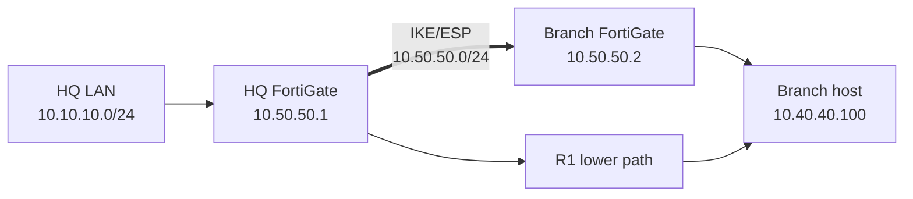

# FortiGate 7.6 Security Lab

Hands-on FortiGate lab built in EVE-NG alongside the FortiOS 7.6 Administrator course. The repository is developed incrementally: each lesson starts from a known-good state, adds one administration or network-security capability, validates it from the client/data plane and FortiGate control plane where the environment permits, and records the engineering decisions, limitations, and troubleshooting behind the result.

> This is an independent educational lab. It is not official Fortinet course material.

## Current state

**Current milestone: Lesson 09 - Route-Based Site-to-Site IPsec VPN (Complete, bidirectionally validated)**

Lesson 09 replaces the Lesson 03 upper-path router with a second FortiGate and converts that segment into a route-based site-to-site VPN. HQ `10.10.10.0/24` and Branch `10.40.40.0/24` now communicate through mirrored IKEv1/ESP tunnel-mode configuration, VPN-interface routes, explicit directional policies, and traffic-triggered Phase 2 establishment. Earlier security-profile and ECMP lessons remain valid historical milestones; the current integrated state is the two-FortiGate transport lab.

| Component | Current documented state |
| --- | --- |
| Platform | EVE-NG / QEMU-KVM |
| Appliances | Two FortiGate-VM64-KVM instances: HQ and Branch |
| FortiOS | `v7.6.7 build 3704` |
| vCPU / RAM | `1 vCPU / 2048 MB` |
| Evaluation limits used by this design | Per VM: maximum `3` interfaces, `3` firewall policies, and `3` routes; low-encryption mode |
| HQ `port2` | Alias `LAB-LAN`, `10.10.10.1/24`; GUI/client access |
| LAB-LAN DHCP | `10.10.10.100-10.10.10.150` |
| Kali | `10.10.10.100/24` |
| Metasploitable | `10.10.10.101/24` |
| HQ `port3` | Alias `TRANSIT-R1`, `10.30.30.1/24` |
| R1 | Gi0/1 `10.30.30.2/24`; Gi0/0 `10.20.20.1/24` |
| Alpine | eth1 `10.20.20.100/24`; eth2 `10.40.40.100/24`; route to HQ LAN via Branch `10.40.40.1` |
| HQ `port1` | Alias `To-Branch`, `10.50.50.1/24`; IPsec underlay |
| Branch `port1` | Alias `ToForti`, `10.50.50.2/24`; IPsec underlay |
| Branch `port2` | Branch LAN gateway `10.40.40.1/24` |
| Branch `port3` | DHCP/default route for evaluation registration only; outside the protected path |
| Architecture delta | R2 and the active ECMP/shared-loopback continuation were removed; R1 remains connected but is not the VPN return path |
| Phase 1 | `HQ-to-Branch` / `Branch-to-HQ`; IKEv1 Main Mode; PSK; `DES-SHA1`; DH14; DPD on-idle; NAT-T off |
| Phase 2 | `HQ-BR-P2` / `BR-HQ-P2`; ESP tunnel mode; mirrored `/24` selectors; `DES-SHA1`; PFS/DH14; replay enabled |
| Negotiation behavior | Auto-negotiate and Autokey Keep Alive disabled; interesting traffic establishes the SAs |
| Protected routes | HQ `10.40.40.0/24` via `HQ-to-Branch`; Branch `10.10.10.0/24` via `Branch-to-HQ` |
| Firewall policies | Two per FortiGate so either site can initiate; PING/HTTP; logging enabled; NAT and UTM disabled |
| IPsec validation | First Kali echo lost during negotiation; later Kali-to-Alpine traffic passed; Alpine-to-Kali returned 3/3 |
| Control-plane proof | `get vpn ipsec tunnel summary` reported `1/1` selector up; Branch GUI reported tunnel `Up` |
| Troubleshooting | GUI `-61` creation failure recovered through CLI; physical-interface route drafts corrected to VPN-interface routes |
| Lesson 05 AV controls | `L05-AV-FLOW` and `L05-AV-PROXY`; HTTP block action validated with benign/EICAR controls |
| AV readiness boundary | AV Engine `7.00054`; base/extended definitions `1.00000` dated 2018; suitable for EICAR only, not current-threat claims |
| Protocol Options experiment | `L05-PROTO-1MB`; oversized logging/blocking at `1 MB`; deliberately restrictive test object |
| Archive inspection | benign ZIP allowed; EICAR ZIP blocked |
| Lesson 06 HTTP controls | `allowed.html` unmatched/allowed; `monitored.html` allowed and logged; `blocked.html` denied by local URL filter |
| Lesson 06 Web Filter profiles | `L06-WF-FLOW` and `L06-WF-PROXY`; identical Simple Block and Monitor intentions validated sequentially |
| Latest UTM validation milestone | Lesson 08: AV/Web Filter/IPS/Application Control on the former identity-aware continuation; retained as historical evidence |
| FortiGuard rating status | `diagnose debug rating` and `get webfilter status` reported Web-filter `Disable`; local URL filtering remains functional |
| Lesson 07 certificate roles | `Fortinet_CA_SSL` for normal inspection signing; `Fortinet_CA_Untrusted` for preserving origin warnings; `Fortinet_GUI_Server` for management HTTPS |
| Lesson 07 inspection profiles | `L07-CERT-INSPECTION`, customized `custom-deep-inspection`, and studied `L07-PROTECT-SERVER` context |
| Lesson 07 deep-inspection scope | HTTPS/TCP 443 only; HTTP/3 and DNS over QUIC blocked; invalid-certificate actions explicit; SSL exemptions studied |
| Lesson 07 policy checkpoint | Policy ID `3` retained flow AV/Web Filter profiles and selected `custom-deep-inspection`; decrypted traffic mirror off |
| Lesson 07 validation boundary | Configuration and public-CA export only; no endpoint trust, TLS decryption, HTTPS UTM, SSL-log, QUIC/ECH-fallback, or protected-server validation |
| Lesson 08 database boundary | IPS/Application/Proxy Application DB `6.00741` dated 2015; deterministic EICAR and BitTorrent controls only |
| Lesson 08 IPS sensor | `L08-IPS-MONITOR`; exact EICAR signature `29844` Block; packet logging enabled; no exemption; botnet C&C Monitor; malicious-URL blocking disabled |
| IPS validation | EICAR Monitor delivered 68 bytes and logged Accept; Block denied the same transfer while benign HTTP remained `200`; response-direction exemption was proved and removed |
| Lesson 08 Application Control | `L08-APP-MONITOR`; all categories Monitor; temporary exact overrides removed; non-default-port blocking and NPE disabled in final state |
| Application validation | Firefox and BitTorrent identified; BitTorrent detected on TCP/80, then denied by exact override and non-default-port enforcement; Firefox received the HTTP replacement page |
| IPS health / failure decision | Light-load sample: 100% idle CPU, 53.2% memory; `ipsengine`/`ipshelper` sleeping; global `fail-open disable` |
| Current management decision | HQ administration continues through port2/LAB-LAN; `port1` is the VPN underlay |
| FortiCare / FortiGuard subscriptions | Not included with the free evaluation |

The relevant current route state is intentionally small:

```text
HQ:
C 10.10.10.0/24 directly connected, port2
C 10.30.30.0/24 directly connected, port3
C 10.50.50.0/24 directly connected, port1
S 10.20.20.0/24 via 10.30.30.2, port3
S 10.40.40.0/24 via HQ-to-Branch

Branch:
C 10.40.40.0/24 directly connected, port2
C 10.50.50.0/24 directly connected, port1
S 10.10.10.0/24 via Branch-to-HQ
S 0.0.0.0/0 via the port3 DHCP gateway
```

The protected-subnet routes have no physical next-hop gateway. Their VPN interfaces identify the encrypted path; the Phase 1 `remote-gw` values identify the directly connected IKE peers.

## Latest validated physical topology



The IPsec test is deterministic: Alpine routes HQ LAN through Branch, while R1 remains available as inherited routing context. Lesson 03 preserves the earlier ECMP topology and proof as its own historical stage.

## Lessons

| Level | Status | Main outcome |
| --- | --- | --- |
| [00 - Environment Setup and Licensing](lessons/00-environment-setup/README.md) | Complete | Operational FortiGate 7.6.7 VM in EVE-NG with permanent evaluation licensing |
| [01 - System, Network, and Administrative Access Foundations](lessons/01-system-network-admin-access/README.md) | Complete | Internal LAB-LAN, DHCP, persistent Kali client, management protocols, and Trusted Hosts positive/negative validation |
| [02 - Firewall Policies and NAT](lessons/02-firewall-policies-nat/README.md) | Complete | Stateful policy behavior, matching/order/logging, SNAT/IP pools, VIP DNAT, and port forwarding |
| [03 - Routing, Static Routes, and ECMP](lessons/03-routing-static-routes-ecmp/README.md) | Complete | Route lookup and attributes, Cisco/Alpine return routing, route-versus-policy behavior, dual routed paths, Alpine ECMP, shared loopback, and FortiGate source-IP ECMP proof |
| [04 - Firewall Authentication](lessons/04-firewall-authentication/README.md) | Complete | Local active authentication, identity-aware policy enforcement, HTTP-triggered login, mapping reuse by PING, timeout, and user monitoring; remote authentication and 2FA retained as theory |
| [05 - Antivirus and Inspection Modes](lessons/05-antivirus-inspection/README.md) | Complete | Benign/EICAR controls, flow/proxy AV comparison, block page, log correlation, oversized-file enforcement, and compressed archive inspection |
| [06 - Web Filtering](lessons/06-web-filtering/README.md) | Complete | Unmatched allow plus explicit local Monitor/Block behavior, flow/proxy profiles, replacement page, exact-match troubleshooting, and Web Filter log proof; FortiGuard categories and HTTPS inspection retained as theory |
| [07 - SSL and Certificate Inspection](lessons/07-ssl-certificate-inspection/README.md) | Complete (configuration-led) | Certificate roles and stores, certificate/deep inspection comparison, validation actions, exemptions, modern TLS compatibility, CA export, and policy attachment; no decryption claim under the low-encryption evaluation |
| [08 - Intrusion Prevention and Application Control](lessons/08-ips-application-control/README.md) | Complete | EICAR Monitor/Block/exemption controls, packet-log correlation, Firefox/BitTorrent identification, exact overrides, replacement behavior, port/protocol correlation, and IPS health/fail-open analysis |
| [09 - Route-Based Site-to-Site IPsec VPN](lessons/09-site-to-site-ipsec-vpn/README.md) | Complete | Two-FortiGate IKEv1/ESP tunnel, mirrored selectors, VPN-interface routing, directional policies, on-demand SA establishment, and bidirectional proof |
| 10+ | Planned | Added one level at a time as the FortiOS 7.6 Administrator course progresses |

The repository root describes the currently integrated project. Each lesson preserves the detailed implementation and its validated historical stages.

## Repository layout

```text
.
├── README.md
├── CHANGELOG.md
├── REPOSITORY_STRUCTURE.md
├── UPLOAD_MANIFEST.md
├── .gitignore
└── lessons/
    ├── _template/
    │   └── README.md
    ├── 00-environment-setup/
    │   ├── README.md
    │   └── evidence/
    ├── 01-system-network-admin-access/
    │   ├── README.md
    │   └── evidence/
    ├── 02-firewall-policies-nat/
    │   ├── README.md
    │   └── evidence/
    ├── 03-routing-static-routes-ecmp/
    │   ├── README.md
    │   └── evidence/
    │       ├── README.md
    │       ├── 19-final-dual-path-topology.png
    │       └── curated routing, policy, and ECMP proof artifacts
    ├── 04-firewall-authentication/
    │   ├── README.md
    │   └── evidence/
    │       ├── README.md
    │       └── curated authentication, timeout, and monitoring proof
    ├── 05-antivirus-inspection/
    │   ├── README.md
    │   ├── lab-files/
    │   │   ├── README.md
    │   │   └── benign.txt
    │   └── evidence/
    │       ├── README.md
    │       └── curated AV, inspection-mode, log, size, and archive proof
    ├── 06-web-filtering/
    │   ├── README.md
    │   ├── lab-files/
    │   │   ├── README.md
    │   │   ├── allowed.html
    │   │   ├── blocked.html
    │   │   └── monitored.html
    │   └── evidence/
    │       ├── README.md
    │       └── curated Web Filter configuration, behavior, log, and troubleshooting proof
    ├── 07-ssl-certificate-inspection/
    │   ├── README.md
    │   └── evidence/
    │       ├── README.md
    │       └── 12 curated certificate, SSL-profile, exemption, policy, and CA-export artifacts
    ├── 08-ips-application-control/
    │   ├── README.md
    │   ├── lab-files/
    │   │   ├── README.md
    │   │   ├── baseline.html
    │   │   └── bittorrent-responder.py
    │   └── evidence/
    │       ├── README.md
    │       └── 23 curated IPS, Application Control, client, log, and health artifacts
    └── 09-site-to-site-ipsec-vpn/
        ├── README.md
        ├── configs/
        │   ├── README.md
        │   ├── hq-fortigate.conf
        │   ├── branch-fortigate.conf
        │   └── supporting-routing.txt
        └── evidence/
            ├── README.md
            └── 7 curated routing, negotiation, traffic, status, and troubleshooting artifacts
```

## Project methodology

The Fortinet course is the curriculum, not a list of GUI screens to reproduce.

The working sequence is:

1. Understand the lesson objective and translate it into observable behavior.
2. Extend the existing topology instead of building an unrelated mini-lab.
3. Preserve established endpoint identities when a transit-network redesign is sufficient.
4. Validate interfaces and same-subnet adjacency before adding remote routes.
5. Configure both forward and return routing.
6. Prove FortiGate-originated routing separately from client transit policy.
7. Change one control at a time and keep useful negative results.
8. Correlate GUI configuration with CLI tables, endpoint behavior, and packet capture.
9. State evaluation-license object reuse and sequential states honestly.
10. Commit only curated, sanitized evidence.

Lesson 03 adds several important methodology rules:

- A route answers **where traffic goes**; a policy answers **whether transit is allowed**.
- A successful FortiGate-local ping does not prove a client forwarding policy.
- ECMP requires equivalent routes to the same destination prefix, not merely two reachable paths.
- Packet direction matters: `port1 in` is not evidence of `port1 out`.
- Different devices can make independent ECMP decisions, producing an asymmetric return path.
- A saved configuration is the test state; an unsaved GUI editor is not.

Lesson 04 adds identity-specific rules:

- Authentication identifies a user; the firewall policy still performs authorization.
- Source address and user/group are simultaneous match conditions, not alternatives.
- Establish the protected service before adding authentication so application failure is not confused with policy failure.
- A broad unauthenticated policy can bypass a narrower authentication design.
- PING cannot present a login form but can reuse an active mapping created through HTTP.
- Theory-only LDAP, RADIUS, 2FA, passive authentication, and HTTPS hardening are not represented as deployed capabilities.

Lesson 05 adds content-inspection rules:

- Establish benign and known-detectable controls before enabling AV.
- A firewall-policy accept and a later UTM deny are different decisions and should be correlated in separate logs.
- Flow/proxy describes policy processing; stream/legacy describes AV file handling.
- Oversized-file blocking is a resource/inspection-boundary decision, not a malware verdict.
- Archive inspection is proven with paired benign and EICAR archives.
- Old evaluation signatures support deterministic EICAR testing only, not a production-security claim.

Lesson 06 adds URL-control rules:

- A policy accept and a later Web Filter block are separate decisions.
- Local static URL filtering can be validated independently of FortiGuard category ratings.
- An unmatched URL is the negative control; Monitor permits and logs; Block denies.
- Flow/proxy Web Filter profiles must match the policy inspection architecture.
- `Simple` URL entries are deterministic, so exact host/path characters matter.
- Disabled FortiGuard rating status is documented instead of representing category actions as deployed.
- Certificate inspection, deep inspection, and HTTPS path visibility remain theory when no trusted TLS design is implemented.

Lesson 07 adds TLS trust and configuration-boundary rules:

- Certificate inspection reads handshake/certificate metadata; deep inspection terminates and rebuilds TLS.
- `Fortinet_CA_SSL`, `Fortinet_CA_Untrusted`, and `Fortinet_GUI_Server` represent different trust and warning contexts.
- A managed endpoint may trust the public inspection CA, but the appliance private signing key must never be distributed.
- HSTS does not inherently defeat a correctly trusted inspection design; certificate pinning can reject the replacement identity independently.
- Mutual TLS, QUIC/HTTP/3, DNS over QUIC, and ECH require explicit compatibility decisions.
- An exemption preserves end-to-end TLS at the cost of decrypted-payload visibility.
- A saved GUI profile and policy attachment are configuration proof, not data-plane decryption proof.
- Low-encryption and PKI limits are recorded instead of representing SSL logs or HTTPS inspection as validated.

Lesson 08 adds intrusion- and application-inspection rules:

- A firewall-policy accept and a later IPS/Application Control deny are separate decisions.
- Monitor-before-Block establishes a data-plane baseline before enforcement.
- A sensor name is descriptive; the configured entry action controls behavior.
- IPS exemptions follow the packet direction in which the signature matches.
- Firewall service selection is port-based, while Application Control is payload-based.
- Exact application overrides are more specific than filter overrides and category actions.
- HTTP replacement messages require HTTP behavior, not only TCP/80.
- Application identity, non-default-port use, and protocol/service conformance are related but distinct checks.
- Old application/IPS databases support deterministic controls only, not current production coverage.
- IPS performance and fail-open conclusions remain bounded to observed load and configuration.

Lesson 09 adds route-based IPsec rules:

- Underlay peer reachability is proved before IKE is introduced.
- The route chooses a VPN virtual interface; the Phase 1 `remote-gw` identifies the peer.
- Phase 1 protects IKE negotiation, while Phase 2 creates the ESP data-plane SAs and selectors.
- A bidirectional IKE SA and two unidirectional IPsec SAs are different objects.
- Firewall policy, route lookup, and Phase 2 selector matching are separate gates.
- Stateful replies do not replace the reverse policy required when the other site initiates a new session.
- Auto-negotiate/keepalive behavior is proved through the first-packet loss and later success.
- Low-encryption `DES-SHA1` is documented as an evaluation limitation, not a production recommendation.

## Evidence standard

Where applicable, use three layers of proof:

1. **Configuration proof** - the intended interface, route, policy, or algorithm exists.
2. **Data-plane/client proof** - the endpoint succeeds or fails as expected.
3. **Control-plane/diagnostic proof** - routing tables, route lookup, logs, or packet captures explain why.

Lesson 03 examples:

```text
Route-versus-policy test
FortiGate -> Alpine succeeds
Kali -> Alpine fails without a matching policy
Kali -> Alpine succeeds after policy restoration
```

```text
Correct ECMP test
same destination: 10.60.60.100/32
member 1: via 10.30.30.2 on port3
member 2: via 10.50.50.2 on port1
```

```text
Packet-level member proof
source 10.10.10.100 -> port3 out
source 10.10.10.110 -> port1 out
```

```text
Firewall-authentication proof
before login -> PING denied and HTTP intercepted
after login -> Alpine HTTP and PING allowed
after five idle minutes -> login required again
GUI monitor == diagnose firewall auth list
```

```text
Antivirus/content-inspection proof
before AV -> benign and EICAR both download
flow AV -> benign passes; EICAR stream is reset/denied
proxy AV -> benign passes; EICAR receives FortiGate 403/block page
AV event -> infected EICAR verdict
Forward Traffic -> authenticated user, Policy ID 3, NAT noop, selected ECMP egress
protocol controls -> 2 MiB file passes by default and is blocked at the test 1 MiB threshold
archive controls -> benign ZIP passes; EICAR ZIP is blocked
```

```text
Web Filtering proof
allowed URL -> HTTP 200 with no explicit local match
Monitor URL -> HTTP 200 plus passthrough/UTM-allowed Web Filter event
Block URL -> HTTP 403/FortiGate replacement page
event details -> exact URL, profile, table index, and Local URLfilter Block source
proxy repeat -> same Monitor and Block intention under L06-WF-PROXY
```

```text
SSL/certificate configuration evidence
certificate store -> CA and local-certificate roles identified
certificate inspection -> handshake/certificate controls configured
deep inspection -> HTTPS mapping, validation actions, and exemptions configured
policy checkpoint -> custom-deep-inspection selected on Policy ID 3
CA export -> public Fortinet_CA_SSL certificate downloaded but not trusted on Kali
data plane -> deliberately not claimed under the low-encryption/no-PKI boundary
```

```text
IPS/Application Control proof
benign HTTP -> 200 before and after EICAR enforcement
EICAR Monitor -> 68 bytes delivered plus IPS Accept event
EICAR Block -> transfer denied plus IPS Deny event
IPS exemption -> request direction fails; response direction allows; removal restores blocking
Firefox Monitor -> HTTP.BROWSER_Firefox identified and accepted
BitTorrent on TCP/80 -> firewall service HTTP, application BitTorrent/P2P
exact override/non-default-port -> BitTorrent denied
health -> light-load baseline plus fail-open disable configuration
```

```text
Route-based IPsec proof
before VPN -> Kali receives Destination Net Unreachable for Branch LAN
route configuration -> protected subnet points to the named VPN interface
before traffic -> VPN route is known but inactive
first interesting packet -> starts IKE/Phase 2; first echo is lost
later traffic -> Kali reaches Alpine
control plane -> selector total/up is 1/1; GUI tunnel is Up
reverse initiation -> Alpine reaches Kali through the explicit reverse policies
```

## Evaluation-license constraint

The permanent evaluation license used in this lab is intentionally restricted. The FortiGate reported:

- Maximum `1` CPU and `2 GiB` memory
- Maximum `3` interfaces
- Maximum `3` firewall policies
- Maximum `3` routes
- Low-encryption operation only
- No FortiCare support
- No FortiGuard support

These limits directly shaped Lessons 03-09. Port1 was first repurposed for the R2/ECMP experiment, then retained as the HQ-to-Branch IPsec underlay. Lesson 09 replaced R2 with a separately licensed Branch FortiGate, removed the live shared-loopback ECMP continuation, reused HQ Policy ID `3`, and kept each FortiGate within its own policy/route/interface ceiling. The low-encryption limit forced `DES-SHA1`; the documentation explicitly rejects that proposal for production use.

## Historical Lesson 02 publication objects

The Lesson 02 VIP demonstrations remain valid evidence for that lesson:

- Static VIP `10.20.20.220 -> 10.10.10.101`
- Port-forward VIP `10.20.20.221:8080 -> 10.10.10.101:80`

They were not revalidated after port3 changed from the directly connected `10.20.20.0/24` outside network to the `10.30.30.0/24` R1 transit network. They must therefore be treated as historical Lesson 02 state, not current integrated-state publication claims.

## Persistence and cleanup notes

- The temporary Kali alias `10.10.10.110/24` was only an ECMP hash probe and should be removed after testing.
- Because `.110` is inside the LAB-LAN DHCP scope, it must be confirmed unused/reserved before any repeat test.
- Alpine `ip addr` and `ip route` commands configure the live system and require separate persistent-network configuration or a preserved node state to survive reboot.
- The Lesson 04 Python HTTP process on Alpine must also be restarted after node reboot unless made persistent.
- Lesson 05's generated EICAR, large-file, and ZIP controls live under `/var/www/lesson04` and may disappear with node replacement; only the harmless control is committed.
- `L05-PROTO-1MB` is a deliberately low test threshold. Restore `default` Protocol Options before ordinary continuation unless one-MiB blocking is explicitly desired.
- Lesson 06's three harmless HTML controls live under `/var/www/lesson04/lesson06`; repository copies are retained under `lab-files/`.
- `L06-WF-PROXY` remains as a validated sequential object; normal continuation returns Policy ID `3` to `L06-WF-FLOW` and `L05-AV-FLOW`.
- Lesson 07's explicit `ALPINE-LOOPBACK` SSL exemption was temporary; leaving the target exempt would contradict a deep-inspection test design.
- Keep the canonical `ALPINE-LOOPBACK` object and remove the accidental unused `alpineLoopBack` duplicate after confirming zero references.
- `Fortinet_CA_SSL.cer` was examined locally but is not committed or installed into Kali's trusted-root store.
- On the low-encryption evaluation VM, use `no-inspection` for ordinary encrypted traffic and attach the Lesson 07 profiles only for configuration study unless a supported trust/test design is introduced.
- Lesson 08's harmless baseline and BitTorrent responder are retained under `lab-files/`; the EICAR control must be generated only inside the isolated lab.
- `L08-IPS-MONITOR` is a sequentially reused object: its final EICAR action is Block despite the descriptive name.
- The temporary IPS exemption, exact Application Control overrides, and non-default-port block were removed after validation.
- Normal Lesson 08 continuation keeps `L08-APP-MONITOR` category actions on Monitor, NPE off, and IPS `fail-open disable`.
- Lesson 09 replaces the current ECMP continuation with deterministic Branch routing; Lesson 03 still preserves the complete ECMP implementation as historical evidence.
- Both IPsec peers must receive the same replacement PSK if the sanitized configuration files are reapplied.
- Branch port3/default routing exists for evaluation registration only and must not be used as the protected-subnet path.
- Cisco running configurations require `copy running-config startup-config` if restart persistence is desired.
- A production continuation should retain directional, explicit, least-privilege policies and a trusted HTTPS authentication portal.

## Security and sanitization

Never commit:

- FortiCare/FortiCloud account credentials
- FortiGate administrator passwords
- VM license data
- private keys
- reusable tokens or cookies
- screenshots containing reusable passwords
- unsanitized appliance configuration backups

Use placeholders for credentials and keep evidence limited to what proves the technical claim.
