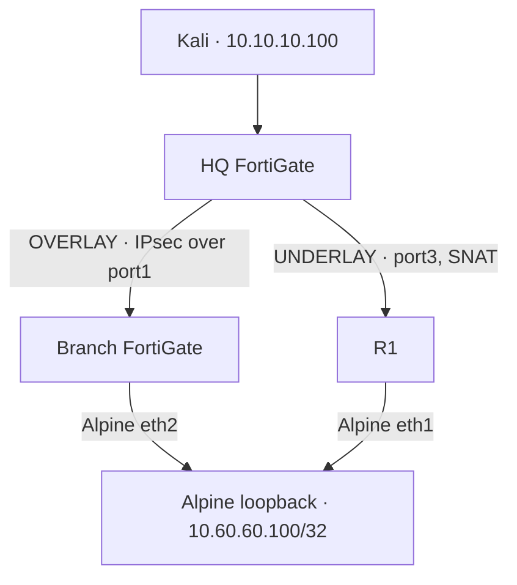

# FortiGate 7.6 Security Lab

An evidence-led network-security lab in EVE-NG: build a capability, explain the engineering decision, and follow the packet to prove the result.

**FortiOS 7.6.7 · EVE-NG / KVM · 11 lessons · Final case study: SD-WAN**

[Read the final lesson](lessons/10-sd-wan/README.md) · [Browse the lessons](#lesson-index) · [Explore the evidence](lessons/10-sd-wan/evidence/README.md)

## What this project demonstrates

The project progresses from a single firewall and client to identity-aware security inspection, routed networks, a two-FortiGate IPsec VPN, and SD-WAN path selection. It is a sequence of documented engineering checkpoints, not a claim that every historical configuration runs simultaneously.

- **Build deliberately:** explain why a route, policy, selector, or inspection setting exists.
- **Change one variable:** compare the same destination or test object before and after a configuration change.
- **Prove the behavior:** correlate client results with routes, policies, packet captures, and FortiGate telemetry.
- **Separate observation from inference:** a successful ping proves reachability; the interfaces and addresses in its capture explain the path.

GUI workflows make the configuration readable. Sanitized CLI references make the important settings and verification steps reproducible.

## Final case study: one destination, two paths

Kali reaches Alpine's `10.60.60.100/32` loopback through either a route-based IPsec tunnel or a routed R1 path. HQ SD-WAN selects between the two members; distinct firewall policies preserve the intended NAT behavior.

The final lesson connects three useful findings:

1. **Routing and SD-WAN cooperate.** Routes provide reachable candidates; a manual rule chooses the preferred eligible member. An SD-WAN zone is a logical grouping, not another encapsulation layer.
2. **The return path matters.** SNAT on the R1 path lets Alpine return translated traffic through R1 while routing original HQ addresses through Branch.
3. **Evidence needs context.** The overlay test showed an initial missing echo consistent with on-demand IPsec establishment. The routed-path test returned 5/5, and the SLA view recorded port3 latency, jitter, and packet loss.

[Packet lifecycle and interface relationships](lessons/10-sd-wan/README.md#packet-lifecycle) · [Configuration references](lessons/10-sd-wan/configs/README.md)

## Lesson index

| Lesson | Focus | Documented outcome |
| --- | --- | --- |
| [00](lessons/00-environment-setup/README.md) | Environment and licensing | FortiGate VM deployment and evaluation baseline |
| [01](lessons/01-system-network-admin-access/README.md) | System, network, admin access | LAB-LAN, DHCP, client setup, and management-access controls |
| [02](lessons/02-firewall-policies-nat/README.md) | Firewall policies and NAT | Stateful policy matching, SNAT, IP pools, VIPs, and port forwarding |
| [03](lessons/03-routing-static-routes-ecmp/README.md) | Routing and ECMP | Route selection, return routing, dual paths, and shared-loopback testing |
| [04](lessons/04-firewall-authentication/README.md) | Firewall authentication | Local authentication and identity-aware policy behavior |
| [05](lessons/05-antivirus-inspection/README.md) | Antivirus | Benign/EICAR controls, flow/proxy inspection, archives, and file-size controls |
| [06](lessons/06-web-filtering/README.md) | Web filtering | Local HTTP allow, monitor, and block behavior with log correlation |
| [07](lessons/07-ssl-certificate-inspection/README.md) | SSL and certificates | Certificate roles, inspection-profile configuration, and CA export |
| [08](lessons/08-ips-application-control/README.md) | IPS and Application Control | Deterministic signature controls, application identification, and enforcement |
| [09](lessons/09-site-to-site-ipsec-vpn/README.md) | Site-to-site IPsec | Mirrored selectors, tunnel routing, and bidirectional VPN traffic |
| [10](lessons/10-sd-wan/README.md) | SD-WAN — final lesson | Overlay/routed-path selection, NAT-aware captures, and performance SLA telemetry |

## Environment and responsible use

The lab uses FortiGate-VM64-KVM on FortiOS `7.6.7 build 3704`, with `1 vCPU / 2 GB RAM` per firewall. Its evaluation constraints shaped the compact interface, route, and policy design. Kali, Alpine Linux, and Cisco virtual routing provide the test endpoints and transit network.

This is an isolated educational environment, not a production deployment template. The documented VPN uses legacy `DES-SHA1` under low-encryption evaluation constraints; those algorithms are unsuitable for production. Test only systems you own or are authorized to assess.

Published artifacts exclude reusable credentials, private keys, license files, and full appliance backups. Evidence indexes explain any sanitization.

## Repository guide

[Structure and reading paths](REPOSITORY_STRUCTURE.md) · [Milestone history](CHANGELOG.md) · [Latest update manifest](UPLOAD_MANIFEST.md)

Independent hands-on work alongside the FortiOS 7.6 Administrator course; not official Fortinet training material.
