# Lesson 01 - System, Network, and Administrative Access Foundations

> Lab status: `Complete`  
> Documentation status: `Reviewed`  
> Date completed: `2026-08-09`  
> Depends on: `Lesson 00 - Environment Setup and Licensing`

## 1. Scope

### Objective

Extend the operational FortiGate 7.6.7 base from Lesson 00 into a controlled internal administration lab without disturbing the existing upstream management path.

This lesson adds a stable LAN on `port2`, FortiGate-provided DHCP, a reusable Kali workstation, selected administrative protocols, and a separate administrator whose access is restricted by Trusted Hosts.

The course is used as the curriculum, but the repository records only meaningful lab behavior. Conceptual material is not converted into artificial configuration.

### In scope

- Manual IPv4 addressing on `port2`
- Interface alias and role
- FortiGate DHCP server on the internal LAN
- DHCP client and gateway validation from Kali
- Observation of the existing upstream default route
- HTTPS, SSH, and PING administrative access on `port2`
- Separate local administrator for access-control testing
- Trusted Hosts positive and negative validation
- Preservation of the original `port1` management/uplink path

### Out of scope

- Firewall policy and NAT configuration
- Security profiles
- VPN
- HA
- Production licensing
- FortiGuard subscription services
- Replacing the DHCP-learned upstream route with a redundant manual route
- Converting `port2` into a dedicated management port

### Completion criteria

- [x] `port2` is configured as `10.10.10.1/24`.
- [x] `port2` has alias `LAB-LAN` and role `LAN`.
- [x] FortiGate DHCP serves `10.10.10.100-10.10.10.150` on `LAB-LAN`.
- [x] Kali receives `10.10.10.100/24` dynamically and installs `10.10.10.1` as its default gateway.
- [x] The existing upstream default route on `port1` is observed and preserved.
- [x] HTTPS, SSH, and PING are reachable on `10.10.10.1` from Kali.
- [x] A separate `trusted-admin` account is used for access-control testing.
- [x] Matching Trusted Host source permits login.
- [x] Mismatched Trusted Host source denies login.
- [x] The original `admin` account and `port1` management path remain untouched.
- [x] No reusable credential is committed.

---

## 2. Starting state

Lesson 00 ended with a working FortiGate-VM64-KVM v7.6.7 appliance in EVE-NG. `port1` was connected to an upstream EVE network/bridge that supplied DHCP, DNS, Internet access, and a default route. `port2` and `port3` were available for later lab work.

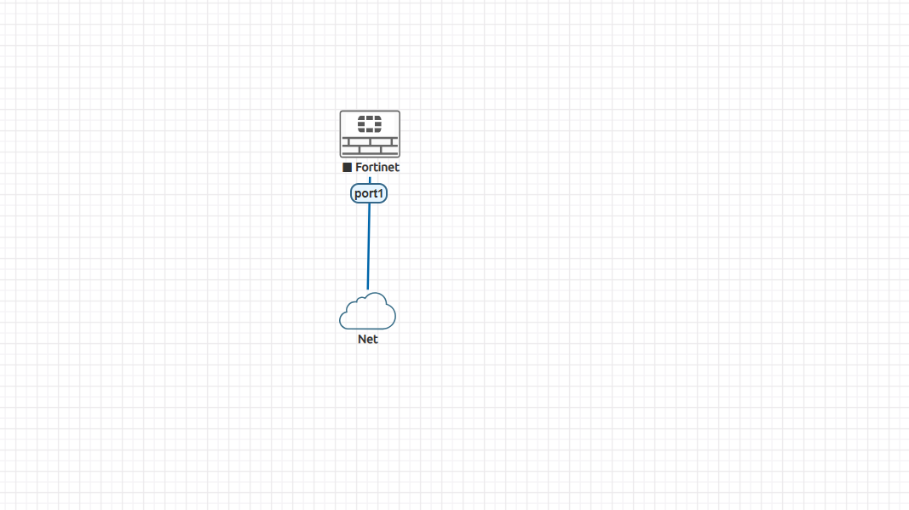

| Existing component | Starting value | Reused or changed? |
| --- | --- | --- |
| FortiOS | `v7.6.7 build 3704` | Reused |
| `port1` | Upstream DHCP / management | Reused, intentionally unchanged |
| Upstream address/gateway | Environment-dependent | Reused, not hard-coded |
| `port2` | No configured lab IP | Changed |
| `port3` | Unused | Unchanged |
| Evaluation license | Permanent restricted evaluation | Reused |

The address observed on `port1` during Lesson 00 was specific to that upstream network. The EVE uplink can receive a different subnet when the host is connected through a different Wi-Fi/network, so `port1` is treated as infrastructure rather than an experiment target.

---

## 3. Architecture delta

Lesson 01 adds one internal EVE bridge and a persistent Kali workstation.

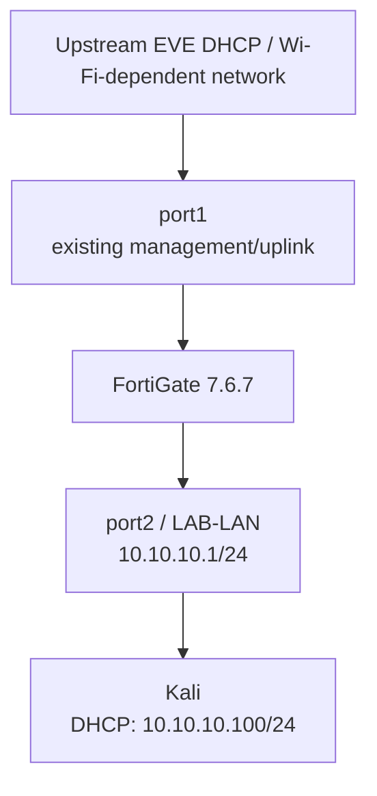

### Design intent

- **Kali instead of VPCS:** one persistent workstation can validate DHCP, HTTPS, SSH, PING, and later security-policy behavior.
- **Protect the known-good path:** `port1` remains the recovery/uplink interface and is not reconfigured for lesson experiments.
- **Use `port2` as a controlled test path:** `port2` remains a normal physical interface; it is not converted into a dedicated management port.
- **Do not duplicate working behavior:** the existing upstream default route already satisfies the gateway concept, so no redundant manual route is added.

---

## 4. Configuration

### 4.1 Configure `port2` with a manual address

The first change was deliberately limited to IPv4 addressing.

| Setting | Value |
| --- | --- |
| Interface | `port2` |
| Addressing mode | Manual |
| IPv4 / netmask | `10.10.10.1/255.255.255.0` |

FortiOS CLI verification:

```bash
show system interface port2
```

Observed relevant configuration:

```text
config system interface
    edit "port2"
        set vdom "root"
        set ip 10.10.10.1 255.255.255.0
        set type physical
        set snmp-index 2
    next
end
```

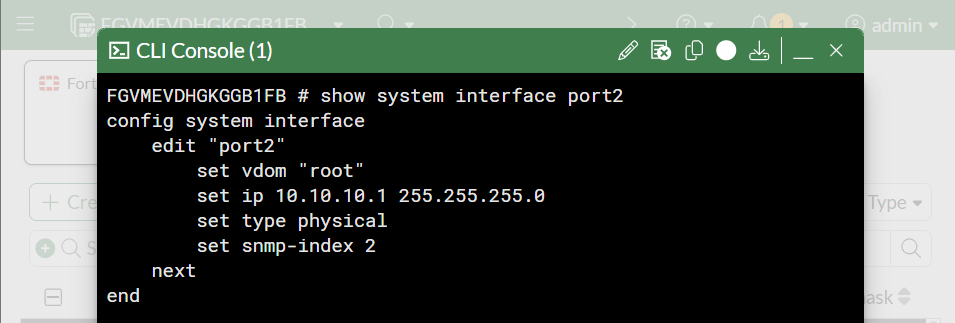

### 4.2 Apply interface identity

After the address itself was proven, the interface was given an operational identity.

| Field | Configured value | Intent |
| --- | --- | --- |
| Physical interface | `port2` | Stable FortiGate identifier |
| Alias | `LAB-LAN` | Human-readable operational label |
| Role | `LAN` | Identify the interface as LAN-facing |
| IPv4 | `10.10.10.1/24` | Gateway/interface address for the internal subnet |

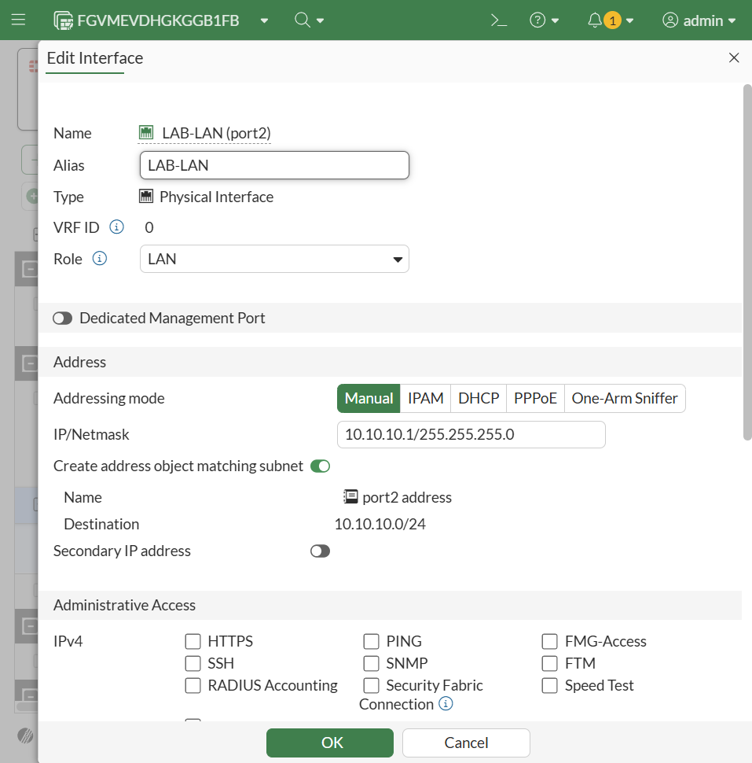

The alias and role are intentionally treated as different concepts: the alias describes what the interface is called operationally, while the role categorizes how FortiOS presents the interface.

### 4.3 Configure FortiGate DHCP on `LAB-LAN`

The DHCP server was enabled on `port2`.

| DHCP setting | Value |
| --- | --- |
| Status | Enabled |
| Address range | `10.10.10.100-10.10.10.150` |
| Netmask | `255.255.255.0` |
| Default gateway | Same as interface IP (`10.10.10.1`) |
| DNS server | Same as system DNS |
| Lease time | `604800` seconds, as shown by FortiOS |

Address-plan intent:

```text
10.10.10.1          FortiGate gateway
10.10.10.2-99       available for future static lab systems
10.10.10.100-150    DHCP clients
10.10.10.151-254    available for future use
```

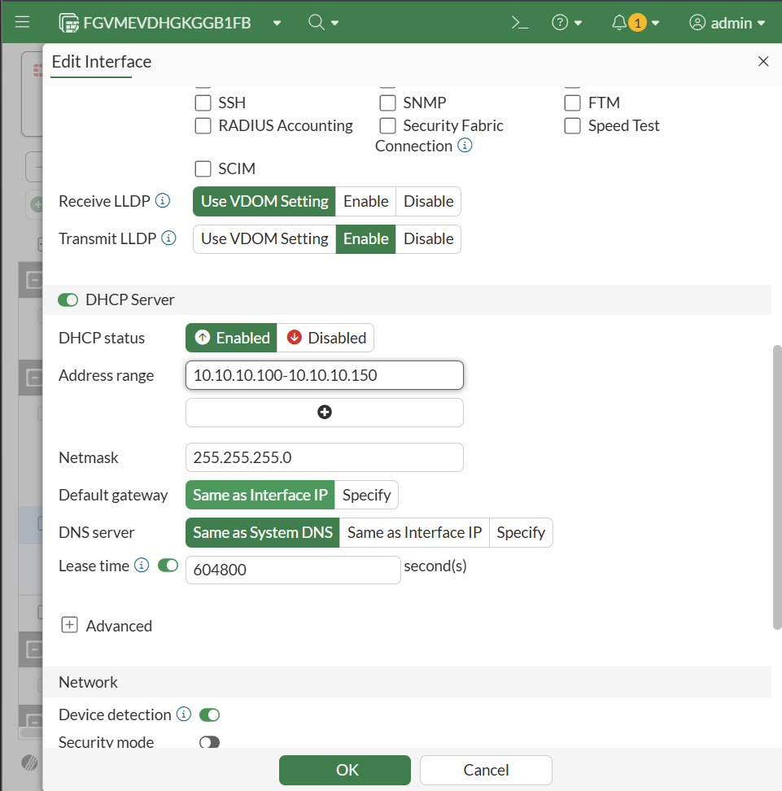

### 4.4 Validate DHCP from Kali

Kali received:

```text
10.10.10.100/24
```

and installed:

```text
default via 10.10.10.1 dev eth0 proto dhcp
```

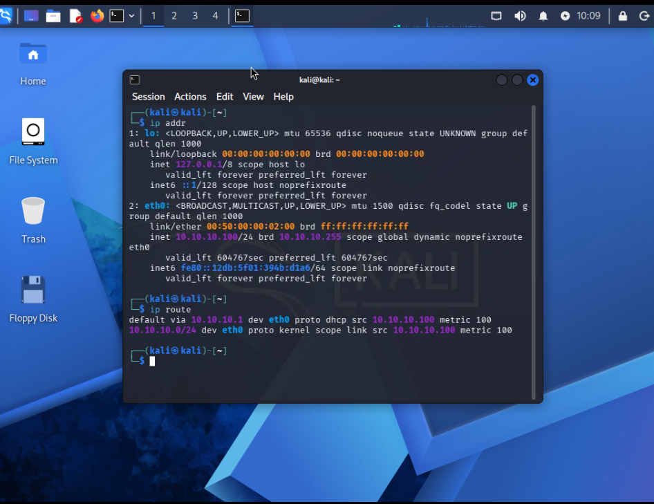

This proves more than address assignment: the FortiGate supplied the client address and the default gateway.

### 4.5 Preserve the existing upstream route

Before making any routing change, the FortiGate routing table was inspected:

```bash
get router info routing-table all
```

Observed during this lab run:

```text
S*      0.0.0.0/0 [5/0] via 192.168.1.1, port1, [1/0]
C       10.10.10.0/24 is directly connected, port2
C       192.168.1.0/24 is directly connected, port1
```

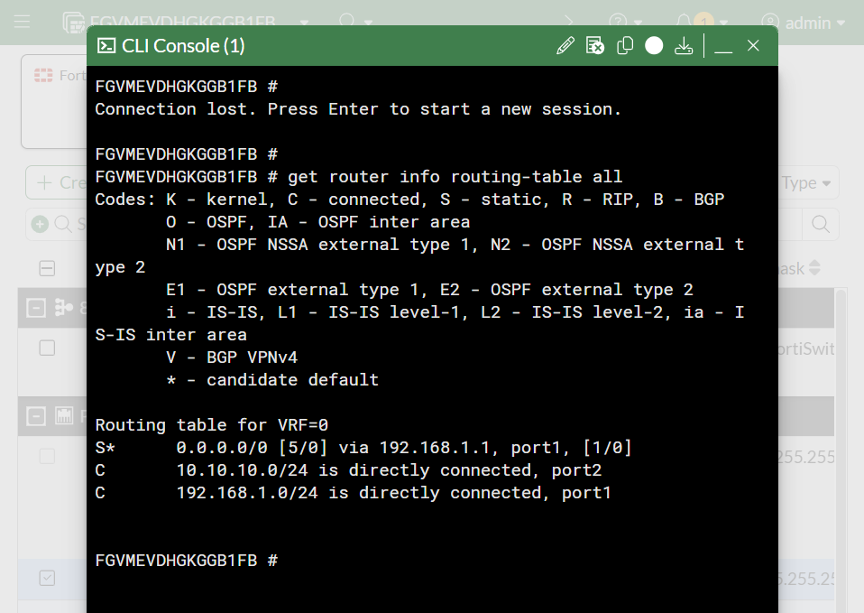

The `192.168.1.0/24` upstream was the network present during this run; it is not a permanent project assumption.

No additional default route was created. The required behavior already existed, and duplicating it would have added risk without adding learning value.

### 4.6 Enable administrative protocols on `port2`

The stable internal subnet was then used as the controlled administrative-access path.

Enabled on `port2`:

```text
HTTPS
SSH
PING
```

`port1` remained available as the known-good management/recovery path.

### 4.7 Create a separate administrator

A local administrator named `trusted-admin` was created specifically for source-restriction testing.

| Setting | Value |
| --- | --- |
| Administrator | `trusted-admin` |
| Type | Local administrator |
| Profile | `super_admin` for this isolated control test |
| Password | Set locally; deliberately omitted from the repository |
| Baseline Trusted Hosts | Empty |

Using a separate account prevents the Trusted Hosts experiment from locking out the original recovery administrator.

Baseline access from Kali succeeded:

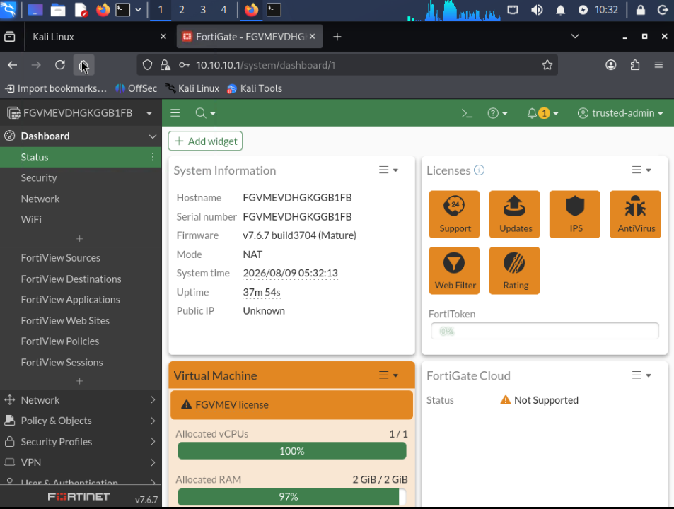

### 4.8 Enforce Trusted Hosts

After baseline access succeeded, the final allowed source was configured as:

```text
10.10.10.100/32
```

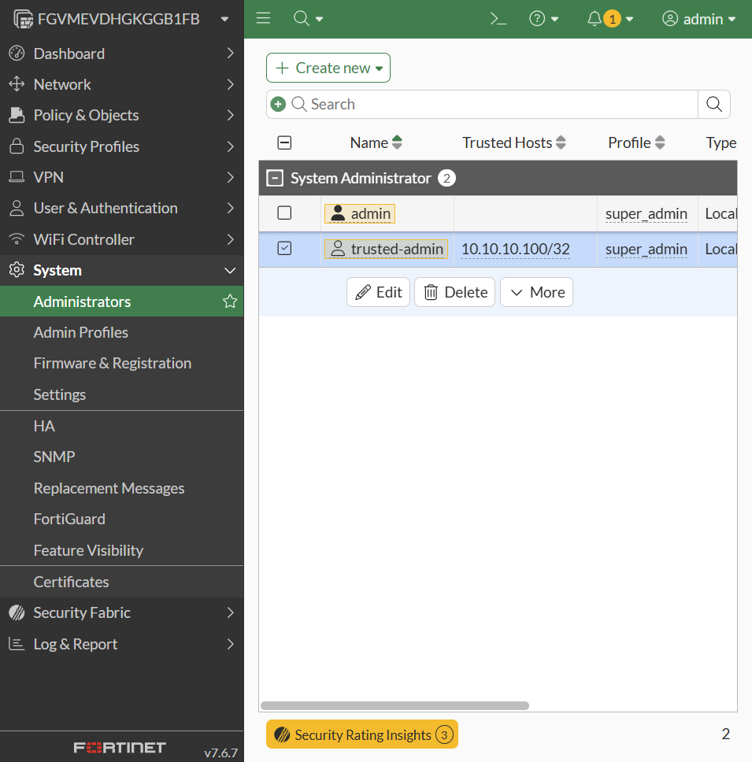

For the negative test, only the Trusted Host was changed:

```text
10.10.10.99/32
```

Kali remained `10.10.10.100`.

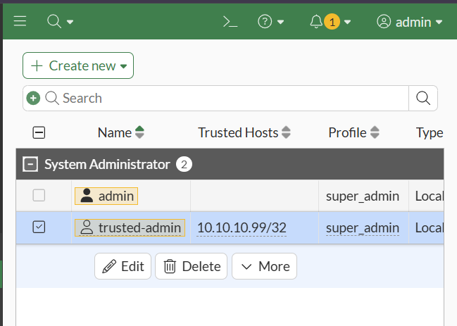

The login attempt then failed:

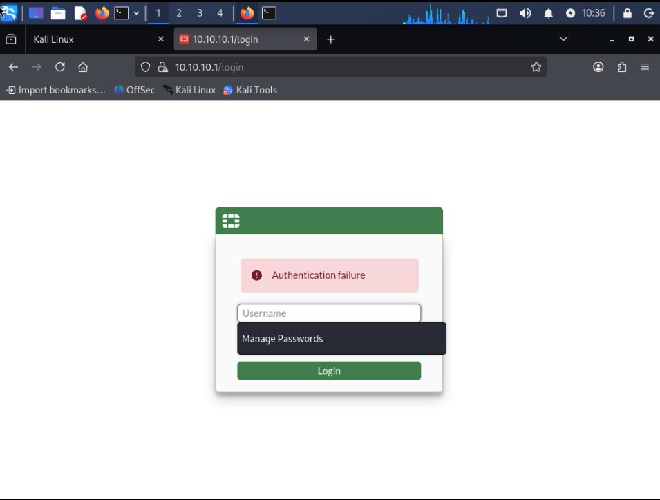

After the negative test, the final Trusted Host was restored to `10.10.10.100/32`.

---

## 5. Verification matrix

| Test ID | Type | Action | Expected result | Observed result |
| --- | --- | --- | --- | --- |
| `01-01` | Configuration | Inspect `port2` CLI | `10.10.10.1/24` exists | Passed |
| `01-02` | Configuration | Inspect alias and role | `LAB-LAN`, role `LAN` | Passed |
| `01-03` | Configuration | Inspect DHCP settings | Pool `10.10.10.100-150` | Passed |
| `01-04` | Client/data plane | Check Kali address and route | Dynamic address in pool; gateway `10.10.10.1` | Passed |
| `01-05` | Control plane | Inspect FortiGate routing table | Existing default on `port1`; connected LAB-LAN route | Passed |
| `01-06` | Positive security test | Login as `trusted-admin` with source matched | Login succeeds | Passed |
| `01-07` | Negative security test | Keep Kali at `.100`, set Trusted Host to `.99/32`, retry login | Authentication denied | Passed |
| `01-08` | Protocol validation | PING and SSH from Kali to `10.10.10.1` | PING replies; SSH reaches FortiGate CLI | Passed |

### Trusted Hosts result

| Case | Kali source | Trusted Host | Result |
| --- | --- | --- | --- |
| Allowed | `10.10.10.100` | `10.10.10.100/32` | Login succeeds |
| Negative test | `10.10.10.100` | `10.10.10.99/32` | Authentication fails |

The same account, FortiGate interface, and client were used in both cases. Only the trusted-source match changed.

### PING validation

```bash
ping -c 4 10.10.10.1
```

Observed: `4` transmitted, `4` received, `0%` packet loss.

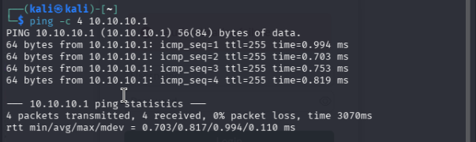

### SSH validation

```bash
ssh trusted-admin@10.10.10.1
```

Observed: authentication succeeded and the FortiGate CLI prompt was reached.

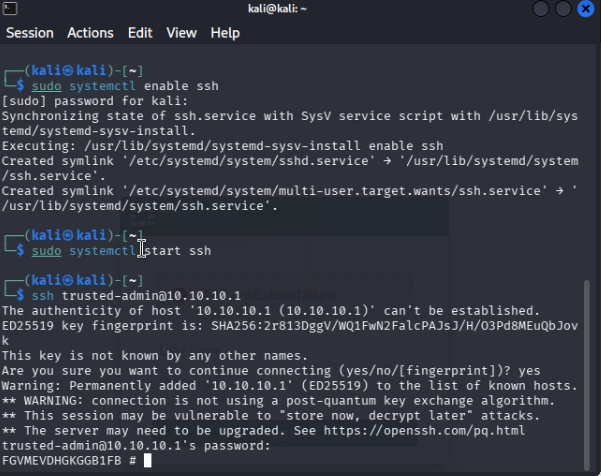

HTTPS was already proven by successful GUI access to:

```text
https://10.10.10.1
```

---

## 6. Troubleshooting and operational decisions

No configuration failure required a recovery procedure in this lesson. The more important work was preventing avoidable failure modes.

| Risk / situation | Decision | Why it mattered |
| --- | --- | --- |
| Upstream DHCP subnet can change | Leave `port1` untouched | Preserves access across different host Wi-Fi/network environments |
| Trusted Hosts can cause administrator lockout | Test with `trusted-admin`, not the original `admin` | Keeps a known-good recovery identity |
| Negative test could alter multiple variables | Change Trusted Host to `.99/32`; leave Kali at `.100` | Isolates the security control being tested |
| A working default route already exists | Observe it instead of adding a duplicate | Avoids unnecessary configuration and route consumption |
| Minimal VPCS would only cover basic IP tests | Keep Kali as the persistent workstation | Reusable for management and later security tests |

---

## 7. Final validated result

```text
Upstream EVE DHCP / Wi-Fi-dependent network
                 |
               port1
        existing management/uplink
                 |
          +-------------+
          | FortiGate   |
          | 7.6.7       |
          +-------------+
                 |
               port2
        LAB-LAN 10.10.10.1/24
        DHCP 10.10.10.100-150
        HTTPS / SSH / PING
                 |
               Kali
        10.10.10.100/24 via DHCP
                 |
        trusted-admin allowed
        from 10.10.10.100/32
```

| Capability | Validated result |
| --- | --- |
| Manual interface addressing | `port2 = 10.10.10.1/24`, confirmed in CLI |
| Interface identity | Alias `LAB-LAN`, role `LAN` |
| DHCP server | Kali received `10.10.10.100/24` and gateway `10.10.10.1` |
| Routing awareness | Existing upstream default route observed and preserved |
| Administrative GUI | HTTPS access to `10.10.10.1` succeeded |
| Trusted Hosts | Matching source allowed; mismatched source denied |
| PING | `10.10.10.1` responded with `0%` loss |
| SSH | `trusted-admin` reached the FortiGate CLI from Kali |

---

## 8. Cleanup / rollback

The validated end state is intentionally kept for later lessons, so no cleanup was performed after completion.

If this level must be rolled back to the Lesson 00 topology, preserve `port1` and reverse only the Lesson 01 changes:

1. Remove the `trusted-admin` test account.
2. Disable HTTPS, SSH, and PING on `port2` if no longer needed.
3. Disable DHCP on `port2`.
4. Remove the `LAB-LAN` alias and LAN role.
5. Remove the `10.10.10.1/24` address from `port2`.
6. Disconnect the Kali/LAB-LAN branch in EVE-NG.
7. Do **not** alter `port1`.

No exact rollback CLI transcript is claimed because the configuration was performed and validated interactively through the GUI.

---

## 9. Engineering takeaways

- Protect the known-good management path.
- A persistent test workstation can be more useful than the smallest possible client.
- Do not add redundant configuration merely because a course discusses it.
- Separate the identity under test from the recovery identity.
- Change one variable at a time.
- A security feature is not proven by its configuration page; validate both positive and negative behavior where appropriate.
- GUI, CLI, and client evidence answer different questions: intended configuration, FortiOS state, and actual network behavior.

---

## 10. Evidence and sanitization

See [`evidence/README.md`](evidence/README.md).

The evidence set is curated rather than exhaustive. It contains only artifacts that prove a meaningful configuration state, client behavior, routing state, or security-control result.

Before commit:

- [x] No administrator passwords
- [x] No FortiCare/FortiCloud credentials
- [x] No VM license files/data
- [x] No private keys
- [x] No reusable authentication tokens
- [x] No unrelated personal information
