# Lesson 02 - Firewall Policies and NAT

> Lab status: `Complete`  
> Documentation status: `Reviewed`  
> Date completed: `2026-08-13`  
> Depends on: `Lesson 01 - System, Network, and Administrative Access Foundations`

## 1. Scope

### Objective

Extend the Lesson 01 administration lab into a controlled transit-firewall lab and prove how FortiGate makes policy decisions and translates traffic.

The lesson deliberately separates four questions that are easy to blur together when learning a firewall:

1. **Can FortiGate route the packet?**
2. **Does a firewall policy authorize the new session?**
3. **Which policy wins when more than one policy could match?**
4. **If NAT is enabled, which address and/or port does the receiving host actually see?**

The course remains the curriculum, not a GUI checklist. Policy, logging, SNAT, IP-pool, VIP, and port-forwarding concepts were implemented because they produced observable packet behavior. Conceptual material such as flow-versus-proxy inspection, multi-interface policies, policy consolidation, and NAT design guidance was studied without manufacturing unnecessary configuration.

### In scope

- Preserve `port1` strictly as the known-good management/recovery path.
- Convert `port3` into a controlled outside-facing lab segment.
- Add a lightweight Alpine Linux outside host with a dedicated lab NIC.
- Prove implicit deny before creating a transit policy.
- Prove FortiGate stateful return-session behavior.
- Validate source, destination, and service matching independently.
- Validate policy sequence versus persistent Policy ID.
- Validate allowed and denied Forward Traffic logs.
- Compare no policy NAT, outgoing-interface SNAT, overload IP-pool SNAT, and one-to-one IP-pool SNAT.
- Add a second internal host (Metasploitable) to make SNAT behavior multi-host rather than single-client only.
- Publish an internal HTTP service through a static VIP.
- Publish the same service through VIP port forwarding with destination-port translation.
- Prove that the inbound firewall policy must reference the VIP object rather than the real backend address.
- Preserve the evaluation-license limits honestly instead of implying unrestricted policy capacity.

### Out of scope

- Reconfiguring `port1` for data-plane experiments.
- Internet-edge NAT through `port1`; the lesson uses a controlled simulated outside network on `port3`.
- A separate static-outbound-VIP scenario when the outbound SNAT behavior had already been proven through outgoing-interface and IP-pool tests.
- Artificial security-profile tests that would add little value without the corresponding FortiGuard services.
- Turning the lesson into a proxy-inspection benchmark; flow/proxy mode was treated as an inspection-model concept.
- Keeping every temporary negative-test object as permanent configuration.

### Completion criteria

- [x] `port1` remains untouched as management/recovery.
- [x] `port3` is configured as `10.20.20.1/24`, alias `externalToAlpine`, role `WAN`.
- [x] Alpine has `10.20.20.100/24` on its lab NIC and routes `10.10.10.0/24` through FortiGate.
- [x] Kali-to-Alpine transit fails before a matching firewall policy exists.
- [x] A `port2 -> port3` policy permits the intended traffic.
- [x] Return traffic for a session initiated from Kali is allowed without a reverse-direction policy.
- [x] A new session initiated from Alpine toward Kali is denied without a `port3 -> port2` policy.
- [x] Source, destination, and service match conditions are each proven with positive and negative tests.
- [x] Policy ID `1` and Policy ID `2` retain identity while sequence changes the winner.
- [x] Forward Traffic logs prove both accept and deny decisions.
- [x] Outgoing-interface SNAT is proven by packet capture on Alpine.
- [x] Overload IP-pool SNAT is proven by packet capture on Alpine.
- [x] One-to-one IP-pool behavior is proven with two simultaneous internal hosts.
- [x] Static VIP DNAT successfully publishes the Metasploitable HTTP service.
- [x] VIP port forwarding successfully maps external TCP/8080 to backend TCP/80.
- [x] Replacing the VIP destination in the inbound policy with the real backend object causes the published path to fail.
- [x] No reusable credential is committed.

---

## 2. Starting state from Lesson 01

Lesson 01 ended with a stable internal management/test subnet on `port2` while `port1` remained the protected management/uplink path.

| Existing component | Starting value | Reused or changed? |
| --- | --- | --- |
| FortiOS | `v7.6.7 build 3704` | Reused |
| `port1` | Upstream DHCP / management / recovery | Reused, intentionally untouched |
| `port2` | `LAB-LAN`, `10.10.10.1/24` | Reused |
| DHCP on `port2` | `10.10.10.100-10.10.10.150` | Reused |
| Kali | `10.10.10.100/24` via DHCP | Reused |
| Kali default gateway | `10.10.10.1` | Reused |
| `port3` | Unused | Changed |
| Firewall/NAT lesson state | No Lesson 02 transit/NAT configuration | Added |

The first design correction in this lesson was important: `port1` is **not** treated as the WAN test interface merely because it has upstream connectivity. In this project, `port1` owns the management/recovery responsibility. Lesson 02 therefore uses `port2` and `port3` for all forwarding and translation experiments.

---

## 3. Architecture delta

### 3.1 Controlled outside segment

`port3` was configured as a simulated outside/WAN-facing segment:

| Setting | Value |
| --- | --- |
| Physical interface | `port3` |
| Alias | `externalToAlpine` |
| Role | `WAN` |
| IPv4 | `10.20.20.1/24` |
| Administrative access | None |
| DHCP server | Disabled |

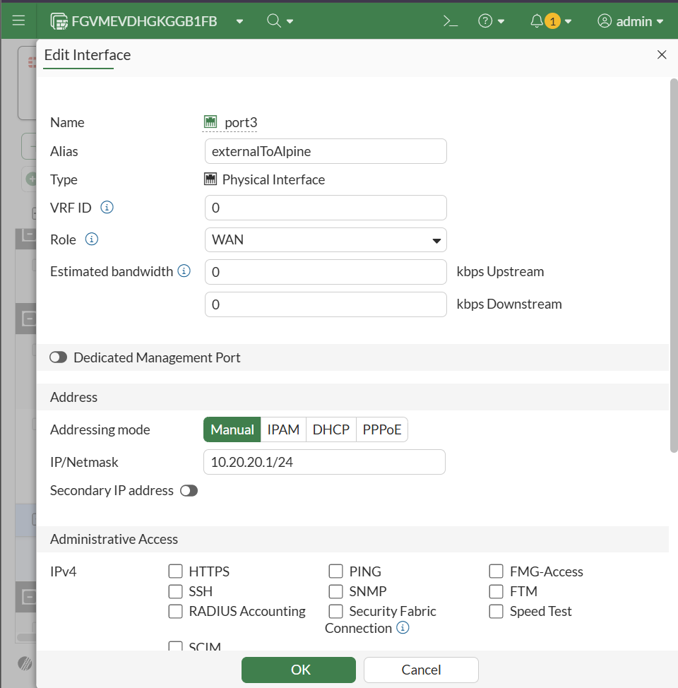

A static outside address was chosen rather than FortiGate-provided DHCP because the NAT/VIP experiments benefit from deterministic endpoint addressing.

### 3.2 Alpine as a dual-homed outside test host

Alpine was selected as the outside node because it is lightweight and sufficient for routing, ICMP, HTTP client testing, and `tcpdump` packet capture.

Alpine retained its own Internet-facing DHCP NIC while using a separate NIC only for the FortiGate lab:

```text
eth0  -> upstream DHCP / Alpine's normal Internet/default route
eth1  -> 10.20.20.100/24 / FortiGate lab
```

Observed during this run:

```text
default via 192.168.1.1 dev eth0
10.10.10.0/24 via 10.20.20.1 dev eth1
10.20.20.0/24 dev eth1 src 10.20.20.100
192.168.1.0/24 dev eth0 src 192.168.1.123
```

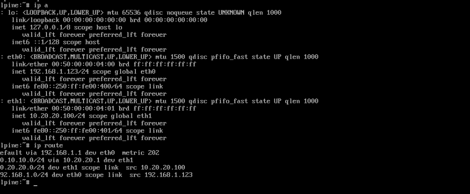

The important routing decision was **not** to replace Alpine's default route with `10.20.20.1`. Only `10.10.10.0/24` was routed through the lab NIC. This preserved Alpine's independent Internet access and kept the FortiGate experiment scoped to lab destinations.

### 3.3 Integrated topology

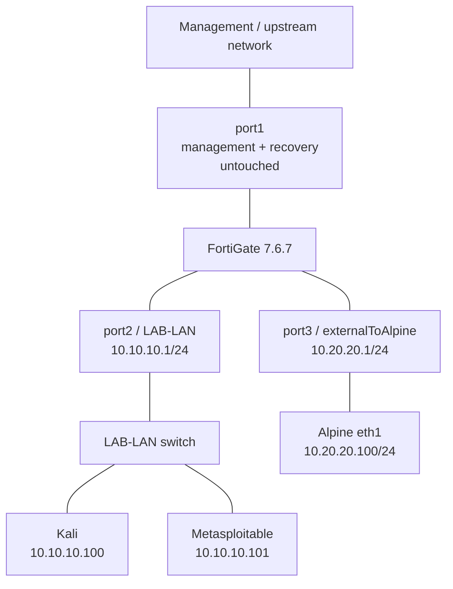

---

## 4. Adjacency and troubleshooting before policy work

FortiGate successfully pinged Alpine at `10.20.20.100`, confirming Layer-3 adjacency on the new segment.

A useful troubleshooting distinction appeared immediately: Alpine could not ping `10.20.20.1` because ICMP administrative access was intentionally not enabled on `port3`. That failure did **not** indicate broken Layer-3 connectivity. Traffic addressed *to the FortiGate interface itself* is different from transit traffic routed *through* the FortiGate.

This distinction matters throughout the lesson:

```text
Traffic to 10.20.20.1
=> terminates on FortiGate
=> governed by interface administrative access/local handling

Traffic to 10.20.20.100 from 10.10.10.100
=> transits FortiGate
=> governed by routing + firewall policy + session state + NAT
```

---

## 5. Implicit deny baseline

Before a `port2 -> port3` firewall policy existed, Kali attempted to reach Alpine:

```bash
ping -c 4 10.20.20.100
```

Kali already had `10.10.10.1` as its DHCP-provided default gateway, so no additional client-side static route was required. The ping still failed with `100%` packet loss.

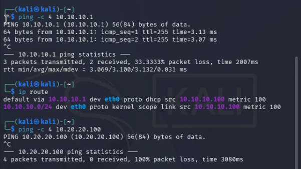

This proved a central firewall concept:

> **A route tells FortiGate where a packet can go; a firewall policy decides whether a new transit session is authorized to go there.**

Both networks were directly connected to FortiGate, but no matching firewall policy existed, so the new transit session was denied.

---

## 6. First transit firewall policy and stateful behavior

The first policy was intentionally broad so that interface-pair forwarding could be proven before individual match dimensions were tightened.

| Setting | Initial value |
| --- | --- |
| Name | `Lab-To-Outside` |
| Incoming interface | `LAB-LAN (port2)` |
| Outgoing interface | `externalToAlpine (port3)` |
| Source | `all` |
| Destination | `all` |
| Service | `ALL` |
| Action | `ACCEPT` |
| NAT | Disabled |
| Inspection mode | Flow-based |
| Logging | Enabled for allowed sessions |

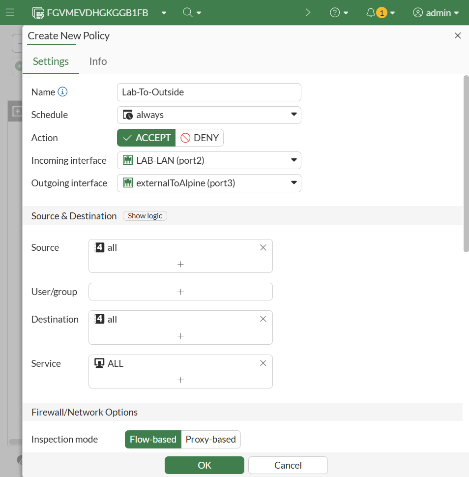

After creating the policy, Kali successfully pinged Alpine.

### 6.1 Why no return policy was required

A useful insight came from the successful ICMP replies: FortiGate is stateful.

When Kali initiates:

```text
10.10.10.100 -> 10.20.20.100
```

and the first packet matches `Lab-To-Outside`, FortiGate creates a session. Alpine's replies belong to that established session and are therefore allowed back through the reverse direction without requiring a separate `port3 -> port2` policy.

The reverse case behaved differently. When Alpine initiated a **new** connection toward Kali, it was blocked because no reverse-direction firewall policy existed.

```text
Kali initiates port2 -> port3
=> matching policy required once
=> stateful replies allowed

Alpine initiates new port3 -> port2 session
=> separate matching policy required
=> otherwise denied
```

This clarified why a FortiGate policy should not be interpreted as a stateless ACL applied independently to every packet in both directions.

---

## 7. Policy matching: source, destination, and service

The broad policy was then tightened one dimension at a time. The experimental rule was to keep all other variables constant while changing only the condition under test.

### 7.1 Source matching

Created address object:

```text
KALI-CLIENT
10.10.10.100/32
Interface: LAB-LAN (port2)
```

Positive case:

```text
Actual source: 10.10.10.100
Policy source: KALI-CLIENT 10.10.10.100/32
=> allowed
```

Negative case:

```text
Actual source: 10.10.10.100
Temporary policy source: 10.10.10.101/32
=> denied
```

The client was not readdressed. Only the source match object changed, so the result cleanly isolated source matching.

### 7.2 Destination matching

Created address object:

```text
ALPINE-OUTSIDE
10.20.20.100/32
Interface: externalToAlpine (port3)
```

Positive case:

```text
Actual destination: 10.20.20.100
Policy destination: ALPINE-OUTSIDE 10.20.20.100/32
=> allowed
```

Negative case:

```text
Actual destination: 10.20.20.100
Temporary policy destination: 10.20.20.101/32
=> denied
```

### 7.3 Service matching

The service field was then isolated.

```text
Service = PING
ICMP ping => allowed
```

The policy service was then changed to `SSH` while the test remained ICMP:

```text
Service = SSH
ICMP ping => denied
```

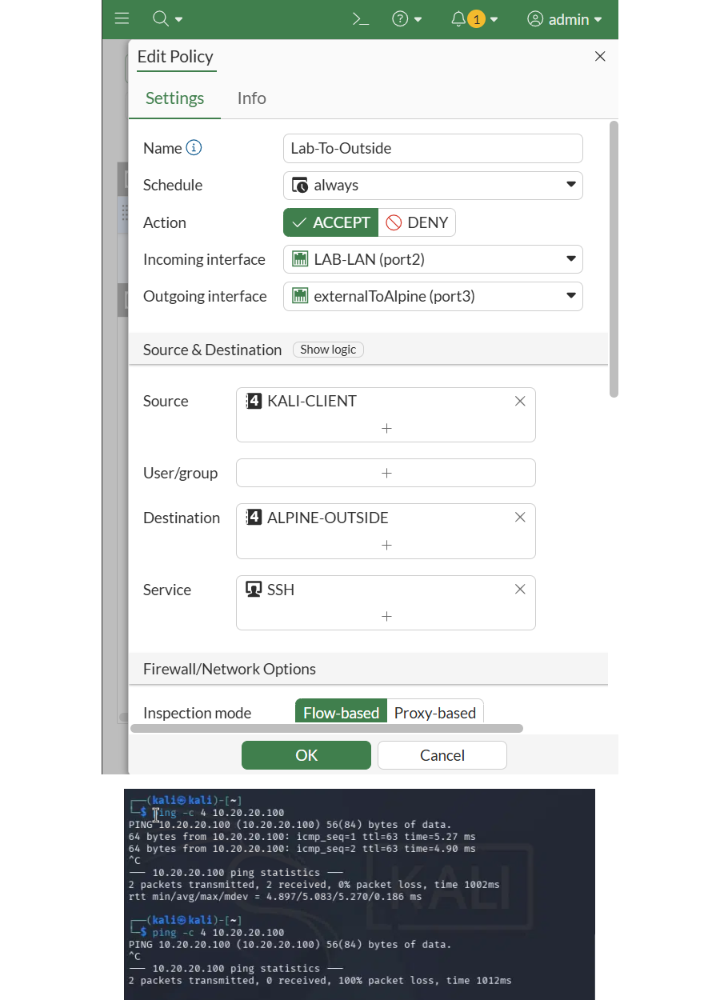

This demonstrated that an otherwise-correct source and destination are insufficient when the requested service does not match the policy.

### 7.4 Match model established

The experiments produced the following mental model:

```text
Incoming interface
      + source
      + destination / VIP
      + service
      + schedule
      + policy sequence
      => first complete match wins
```

---

## 8. Policy sequence versus Policy ID

A temporary explicit deny policy was created for the same interface pair:

```text
DENY-LAB-OUTSIDE
port2 -> port3
Source: all
Destination: all
Service: ALL
Action: DENY
```

The relevant IDs were:

```text
Lab-To-Outside      Policy ID 1
DENY-LAB-OUTSIDE   Policy ID 2
Implicit Deny       Policy ID 0
```

When the allow rule was above the deny rule, Kali traffic matched Policy ID `1` and succeeded.

The sequence was then changed without changing either policy object:

```text
1. DENY-LAB-OUTSIDE (ID 2)
2. Lab-To-Outside   (ID 1)
```

The same ping failed because Policy ID `2` matched first.

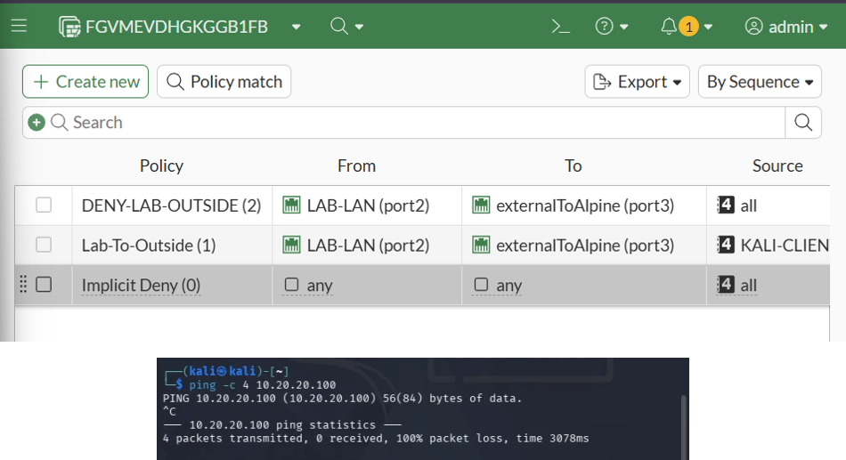

This produced an important distinction:

> **Policy ID identifies the policy object. Sequence controls evaluation precedence. Moving a policy changes its position, not its identity.**

---

## 9. Forward Traffic logging as control-plane proof

Forward Traffic logs were used to connect client behavior to FortiGate's actual decision.

The log view captured the same source/destination pair under both policy orders:

```text
10.10.10.100 -> 10.20.20.100
Application: PING
```

Allowed case:

```text
Result: Accept
Policy: Lab-To-Outside (1)
```

Denied case:

```text
Result: Deny
Policy: DENY-LAB-OUTSIDE (2)
```

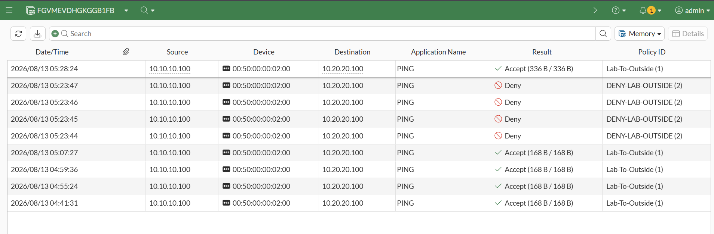

This is stronger evidence than a successful or failed ping alone because the FortiGate itself identifies the policy that made the decision.

---

## 10. Inspection mode and policy-design concepts

### 10.1 Flow-based versus proxy-based

The policy remained **Flow-based** as the retained setting.

The important conceptual separation is:

```text
Policy matching
=> decides whether the traffic is authorized

Inspection mode
=> determines how accepted traffic is inspected by applicable security engines
```

A simple ICMP test would not meaningfully demonstrate proxy-based application/content inspection, so no artificial benchmark was created.

### 10.2 Multiple interfaces in one policy

FortiGate can select multiple incoming or outgoing interfaces in one policy. That capability was understood but deliberately not used here.

A policy such as:

```text
Incoming: port2, port3
Outgoing: port2, port3
Source: all
Destination: all
Service: ALL
```

would be substantially broader than the intended design and could authorize both directions that this lab intentionally keeps distinct.

### 10.3 Combining firewall policies

Policies should be combined only when their security intent is genuinely identical: same direction, action, NAT behavior, inspection/security controls, schedule, and logging intent.

Policy consolidation is especially relevant under the three-policy evaluation limit, but reducing policy count is not a justification for weakening least privilege.

---

## 11. SNAT baseline and outgoing-interface translation

The same `port2 -> port3` path was reused for NAT instead of creating a separate mini-lab.

### 11.1 NAT disabled

The original policy initially forwarded traffic with policy NAT disabled. This kept source translation out of the firewall-policy matching experiments.

### 11.2 Use outgoing interface address

NAT was then enabled with:

```text
IP pool configuration: Use Outgoing Interface Address
```

Alpine ran:

```bash
tcpdump -ni eth1 icmp
```

The capture showed:

```text
10.20.20.1 > 10.20.20.100: ICMP echo request
10.20.20.100 > 10.20.20.1: ICMP echo reply
```

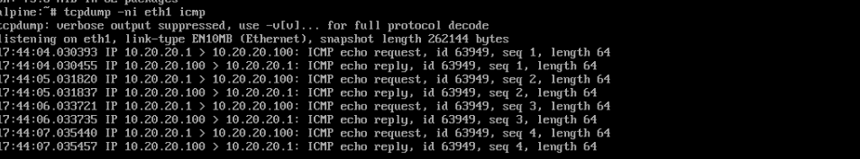

Kali's real source was `10.10.10.100`, but the receiver saw `10.20.20.1`, which is the FortiGate `port3` address.

This made the translation concrete:

```text
Before SNAT inside the lab:
SRC 10.10.10.100
DST 10.20.20.100

After outgoing-interface SNAT:
SRC 10.20.20.1
DST 10.20.20.100
```

---

## 12. Dynamic IP pool - Overload

A dedicated overload pool was created:

| Setting | Value |
| --- | --- |
| Name | `SNAT-OVERLOAD` |
| Type | `Overload` |
| External range | `10.20.20.200-10.20.20.200` |

The firewall policy was switched from `Use Outgoing Interface Address` to `Use Dynamic IP Pool` with `SNAT-OVERLOAD`.

Alpine then observed:

```text
10.20.20.200 > 10.20.20.100
```

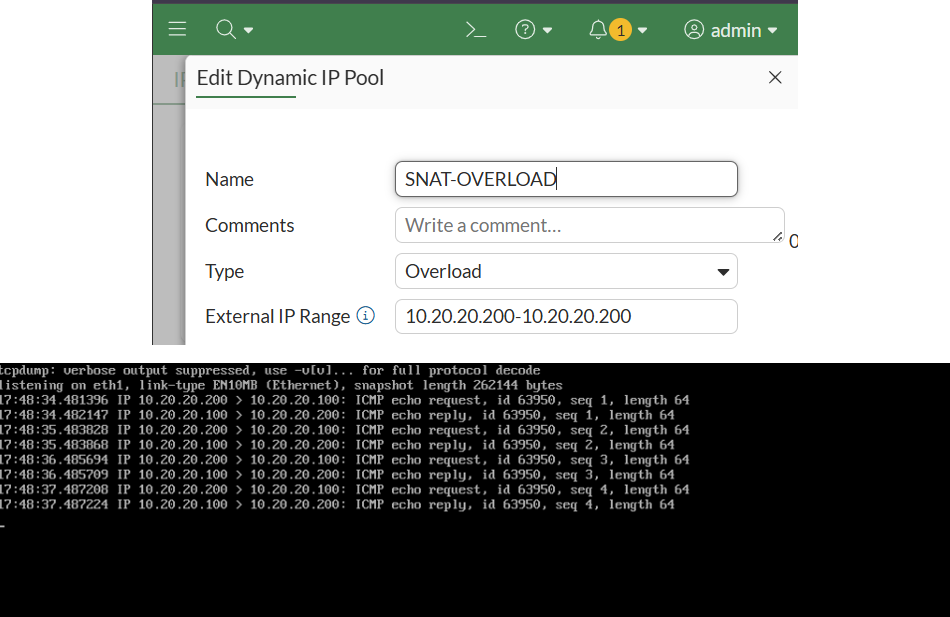

This separated two SNAT choices clearly:

```text
Outgoing-interface SNAT
=> receiver sees 10.20.20.1

Overload pool SNAT
=> receiver sees 10.20.20.200
```

---

## 13. Multi-host SNAT with Metasploitable

A second internal node was added to make the NAT environment more realistic rather than continuing with a single source host.

Metasploitable was attached to the same internal switch as Kali and obtained:

```text
10.10.10.101/24
Default gateway: 10.10.10.1
```

Address object:

```text
MSF-CLIENT
10.10.10.101/32
Interface: LAB-LAN (port2)
```

The existing `Lab-To-Outside` policy was expanded to include both internal sources rather than creating another equivalent policy:

```text
Source:
- KALI-CLIENT      10.10.10.100/32
- MSF-CLIENT       10.10.10.101/32
```

This was a meaningful example of combining multiple source objects in one policy because both hosts had the same direction, destination, service intent, action, and NAT treatment.

### 13.1 Multi-host outgoing-interface SNAT

Both Kali and Metasploitable successfully reached Alpine while using outgoing-interface SNAT. The receiver saw the shared translated source `10.20.20.1` rather than either internal address.

### 13.2 Why this made overload more meaningful

With two internal clients, the purpose of overload/PAT is easier to understand: multiple internal sessions can share the same translated address while FortiGate maintains distinct session state.

---

## 14. One-to-one IP pool with simultaneous internal hosts

A one-to-one pool was first validated with a single external address, then extended to two addresses for simultaneous multi-host testing:

| Setting | Value |
| --- | --- |
| Name | `SNAT-OneToOne` |
| Type | `One-to-One` |
| External range | `10.20.20.210-10.20.20.211` |

Kali and Metasploitable then pinged Alpine at the same time.

Alpine's packet capture showed two distinct translated sources:

```text
10.20.20.210 -> 10.20.20.100
10.20.20.211 -> 10.20.20.100
```

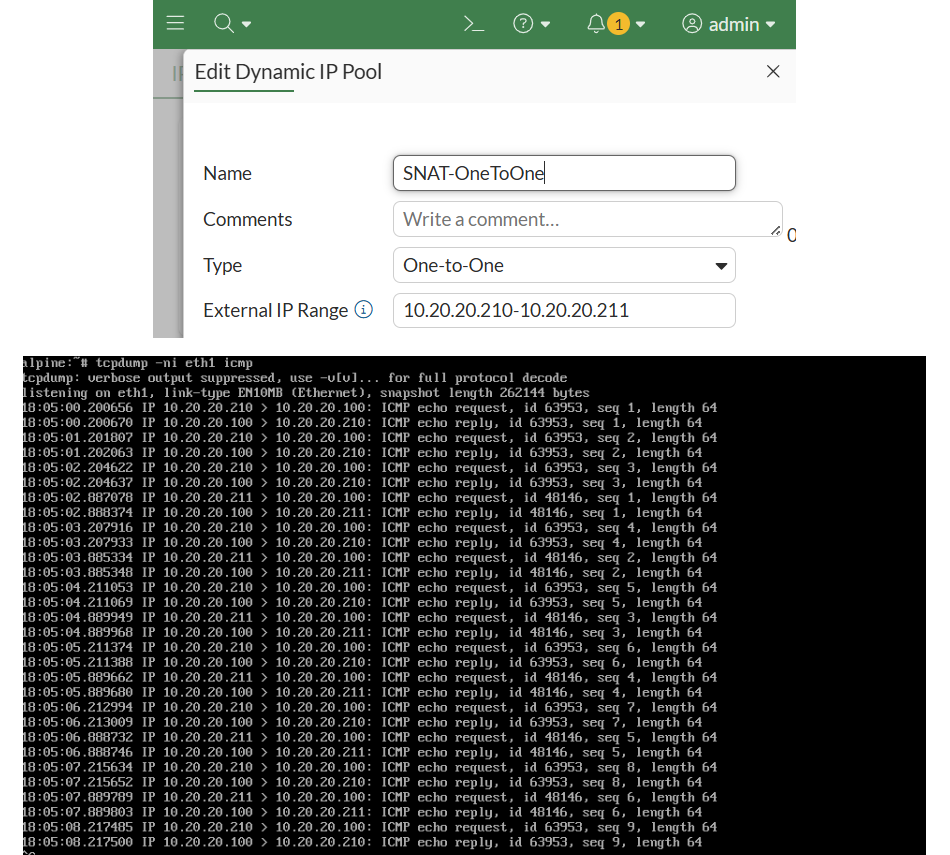

This provided a clearer practical comparison than the original single-host test:

```text
Outgoing-interface SNAT
multiple inside hosts -> 10.20.20.1

Overload pool
multiple inside sessions can share -> 10.20.20.200

One-to-one pool
simultaneous inside hosts -> distinct external addresses from .210-.211
```

---

## 15. Preparing the DNAT backend

Metasploitable already exposed an HTTP service on TCP/80.

Before introducing a VIP, Kali validated the backend directly:

```bash
curl http://10.10.10.101
```

The Metasploitable web page was returned successfully.

This baseline mattered because a failed VIP test should not be blamed on DNAT if the backend service itself is unavailable.

---

## 16. Static VIP DNAT

A static VIP was created on the outside-facing interface:

| Setting | Value |
| --- | --- |
| Name | `MSF-WEB-VIP` |
| Interface | `externalToAlpine (port3)` |
| Type | Static NAT |
| External address | `10.20.20.220` |
| Mapped address | `10.10.10.101` |
| Port forwarding | Disabled |

The VIP creates the destination translation relationship:

```text
10.20.20.220
      |
      | DNAT
      v
10.10.10.101
```

### 16.1 Inbound policy

A separate policy was required because the traffic direction is now the reverse of `Lab-To-Outside`:

```text
Name: OUTSIDE-to-MSF-WEB
Incoming: externalToAlpine (port3)
Outgoing: LAB-LAN (port2)
Source: ALPINE-OUTSIDE
Destination: MSF-WEB-VIP
Service: HTTP
Action: ACCEPT
Policy NAT: Disabled
Logging: Enabled
```

Policy NAT remained disabled because the VIP already performs destination translation. Enabling policy NAT here would add source translation as a separate behavior, which was not part of this test.

### 16.2 Successful incoming translation

From Alpine:

```bash
curl http://10.20.20.220
```

returned the internal Metasploitable HTTP page.

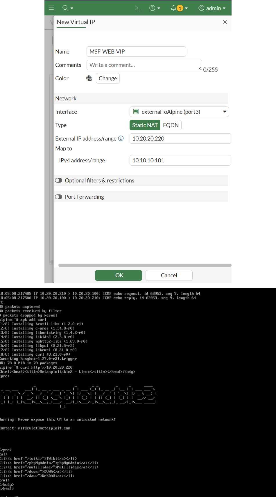

The packet model is:

```text
Alpine sends:
SRC 10.20.20.100
DST 10.20.20.220:80

FortiGate matches MSF-WEB-VIP and rewrites destination:
SRC 10.20.20.100
DST 10.10.10.101:80
```

The external client does not need to know that the real server address is on `10.10.10.0/24`.

---

## 17. VIP port forwarding

A second VIP demonstrated destination-address **and destination-port** translation.

| Setting | Value |
| --- | --- |
| Name | `MSF-Web_PORTFWD` |
| Interface | `externalToAlpine (port3)` |
| External address | `10.20.20.221` |
| Mapped address | `10.10.10.101` |
| Protocol | TCP |
| External service port | `8080` |
| Mapped port | `80` |

Translation:

```text
10.20.20.221:8080
        |
        | DNAT + destination-port translation
        v
10.10.10.101:80
```

The existing inbound policy was expanded to include both VIP objects rather than creating another equivalent inbound policy:

```text
Destination:
- MSF-WEB-VIP
- MSF-Web_PORTFWD

Service: HTTP
Policy NAT: Disabled
```

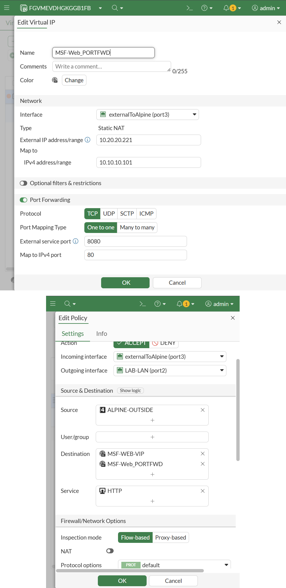

From Alpine:

```bash
curl http://10.20.20.221:8080
```

returned the same backend web page.

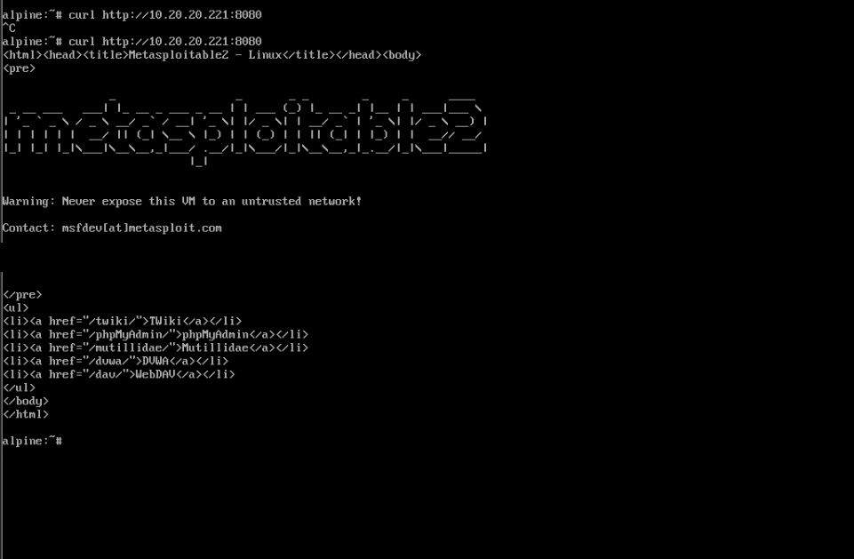

### 17.1 Design insight: one external IP can publish multiple internal services

A single external address can be reused when the externally matched ports differ. For example, a valid design could be:

```text
10.20.20.221:8080 -> 10.10.10.101:80
10.20.20.221:2222 -> 10.10.10.100:22
```

FortiGate can distinguish those flows by destination protocol/port and translate each to a different internal service. The exact second mapping above was retained as a design insight rather than implemented as another permanent object.

This should not be confused with SNAT overload:

```text
SNAT overload
many internal sessions -> shared translated source address

DNAT port forwarding
external destination IP:port -> selected internal destination IP:port
```

---

## 18. VIP policy matching negative test

The inbound policy's destination was deliberately changed from the VIP object to the real backend object:

```text
MSF-CLIENT
10.10.10.101/32
```

Alpine then retried the external VIP address. The connection failed.

The VIP object was restored and the published service worked again.

This proved an important FortiGate policy-model point:

> **For incoming VIP traffic, the firewall policy must match the VIP object representing the external destination; simply placing the backend's real address object in the policy is not equivalent.**

---

## 19. Evaluation-license strategy

The permanent evaluation is limited to three firewall policies, so Lesson 02 was explicitly designed as a sequence of controlled scenarios rather than an ever-growing production rulebase.

The important policies used were:

```text
Lab-To-Outside        port2 -> port3 allow / SNAT experiments
DENY-LAB-OUTSIDE     temporary port2 -> port3 deny for sequence proof
OUTSIDE-to-MSF-WEB   port3 -> port2 VIP publication
```

Temporary address objects, policy-order states, and NAT choices were changed in place as required by each experiment.

The repository therefore documents **validated sequential states**. It does not imply that every temporary test setting is a recommended permanent final configuration.

---

## 20. Troubleshooting and engineering decisions

| Observation / question | Interpretation | Decision / result |
| --- | --- | --- |
| `port1` already had upstream connectivity | It is also the known-good management/recovery path | Do not use it as the Lesson 02 WAN experiment interface; isolate forwarding work on `port2/port3` |
| Alpine needs Internet and a FortiGate lab path | Replacing its default route would unnecessarily couple Internet to the lab | Keep DHCP/default route on `eth0`; add only `10.10.10.0/24 via 10.20.20.1 dev eth1` |
| Alpine could not ping `10.20.20.1` | Traffic to FortiGate itself differs from transit traffic | Do not diagnose this as broken routing; FortiGate could reach Alpine and transit tests were evaluated separately |
| Kali already had default gateway `10.10.10.1` | Off-subnet traffic already goes to FortiGate | Do not add a redundant static route on Kali |
| Kali->Alpine replies worked without reverse policy | FortiGate created state for the allowed session | No return policy needed for established replies |
| Alpine->Kali new session failed | No reverse-direction policy authorized a new session | Confirms directionality + stateful session handling |
| Wrong source object blocked traffic | Source condition is part of policy match | Restore exact `KALI-CLIENT` after negative test |
| Wrong destination object blocked traffic | Destination condition is part of policy match | Restore `ALPINE-OUTSIDE` after negative test |
| `Service=SSH` blocked an ICMP test | Correct IPs do not compensate for a service mismatch | Treat service as an independent match dimension |
| ID 2 blocked traffic when moved above ID 1 | Sequence, not numeric Policy ID, determines first-match precedence | Use By Sequence view + logs to prove the winner |
| One policy can select multiple interfaces | Technically possible but can broaden trust relationships | Keep the directional `port2 -> port3` and `port3 -> port2` intents separate |
| Evaluation allows only three policies | A naive lab design would quickly exhaust the limit | Reuse policies and combine only genuinely equivalent match intent |
| Simple ping does not meaningfully demonstrate proxy inspection | Inspection model is not the same as policy matching | Keep Flow-based and treat flow/proxy comparison as theory here |
| A VIP exists but traffic is still blocked | Translation object does not itself grant access | Create an inbound firewall policy referencing the VIP |
| Policy NAT was unnecessary for inbound VIP test | The VIP already performs destination translation | Leave policy NAT disabled to preserve Alpine's source identity |
| Real backend object failed as inbound policy destination | VIP policy matching uses the virtual destination object | Restore `MSF-WEB-VIP` / port-forward VIP in the policy |
| Course included an outgoing static-NAT example | Outbound source translation had already been proven in richer tests | Do not duplicate configuration merely to reproduce an example |

---

## 21. Final validated architecture

At the end of Lesson 02, the project has evolved from an administration-only LAB-LAN into a small segmented firewall environment with internal clients, an outside test host, stateful policy control, SNAT, and published inbound services.

```text
Management / upstream
        |
      port1
management + recovery
     UNCHANGED
        |
 +---------------+
 | FortiGate     |
 | 7.6.7         |
 +---------------+
    /         \
 port2         port3
 LAB-LAN       externalToAlpine
 10.10.10.1    10.20.20.1
    |              |
 switch          Alpine eth1
 /    \          10.20.20.100
Kali   MSF
.100   .101
       HTTP :80
```

Validated security/network behaviors:

| Capability | Validated result |
| --- | --- |
| Implicit deny | Routed Kali-to-Alpine traffic fails before an allow policy exists |
| Stateful firewall | Reply traffic for a permitted session returns without a reverse policy; new reverse sessions remain blocked |
| Source matching | Correct source allowed; mismatched source denied |
| Destination matching | Correct destination allowed; mismatched destination denied |
| Service matching | ICMP allowed under `PING`; denied when service changed to `SSH` |
| Policy sequence | Moving ID 2 above ID 1 changes the winner without changing IDs |
| Logging | FortiGate logs identify both the accepting and denying Policy IDs |
| Outgoing-interface SNAT | Alpine sees `10.20.20.1` |
| Overload pool | Alpine sees `10.20.20.200` |
| One-to-one pool | Simultaneous internal hosts appear as `10.20.20.210` and `.211` |
| Static DNAT | `10.20.20.220:80` publishes `10.10.10.101:80` |
| Port-forward DNAT | `10.20.20.221:8080` publishes `10.10.10.101:80` |
| VIP policy matching | Backend object alone fails; VIP destination restores the published path |

---

## 22. Cleanup / handoff to the next lesson

This lesson intentionally used temporary negative-test objects and sequence changes. Before a later lesson needs additional policy capacity, the following are candidates for removal/reset:

- `DENY-LAB-OUTSIDE` after policy-order evidence is no longer needed.
- temporary wrong-source and wrong-destination address objects.
- NAT pools not required by the next scenario.
- transient NAT mode selections used only for comparison.

The useful reusable topology is:

```text
port1 = protected management/recovery
port2 = LAB-LAN with Kali + Metasploitable
port3 = controlled outside segment with Alpine
```

The useful reusable address/service concepts are:

```text
KALI-CLIENT
MSF-CLIENT
ALPINE-OUTSIDE
MSF-WEB-VIP
MSF-Web_PORTFWD
```

The project should reset temporary policy objects as needed rather than treating the three-policy evaluation limit as a reason to weaken policy design.

---

## 23. Lessons learned

- A firewall can know a route and still deny the session; routing and authorization solve different problems.
- Traffic addressed to a FortiGate interface is not the same as transit traffic crossing that interface.
- FortiGate's state table explains why established replies return without a mirror policy.
- New sessions remain directional: allowing `port2 -> port3` does not automatically allow Alpine to initiate `port3 -> port2`.
- Source, destination, and service should be debugged as independent policy-match dimensions.
- Policy ID is identity; sequence is precedence.
- Logs turn an endpoint symptom into a FortiGate decision that can be attributed to a specific policy.
- A packet capture at the receiving host is a stronger NAT proof than a checked NAT box in the GUI.
- Outgoing-interface SNAT, overload pools, and one-to-one pools solve different address-translation needs even when all three make the same original host reachable.
- Adding a second internal client made the difference between shared SNAT and one-to-one mapping materially visible.
- A VIP is a destination-translation object, not an allow rule.
- The inbound firewall policy should use the VIP object as its destination for the published path.
- DNAT and policy SNAT are independent; enabling both would translate different fields for different reasons.
- One external IP can publish multiple internal services when external ports uniquely distinguish the mappings.
- Multiple-interface policies and policy consolidation are tools, not goals; least privilege still defines whether consolidation is appropriate.
- Evaluation-license constraints should influence lab architecture openly rather than being hidden.

---

## 24. Evidence index

| Evidence | What it proves |
| --- | --- |
| `evidence/01-port3-outside-interface.png` | Controlled `port3` outside interface is `10.20.20.1/24`, alias `externalToAlpine`, role WAN |
| `evidence/02-alpine-dual-homed-routing.png` | Alpine keeps Internet/default route on `eth0` and routes only `10.10.10.0/24` through `eth1`/FortiGate |
| `evidence/03-implicit-deny-baseline.png` | Kali has the correct default gateway but transit to Alpine fails before a firewall allow policy |
| `evidence/04-first-firewall-policy.png` | Initial `Lab-To-Outside` `port2 -> port3` accept policy |
| `evidence/05-service-matching-negative.png` | Source/destination are correct but `Service=SSH` causes ICMP ping to fail |
| `evidence/06-policy-sequence-deny-first.png` | Policy ID 2 moved before Policy ID 1 and the same ping is denied |
| `evidence/07-forward-traffic-policy-logs.png` | FortiGate logs show both accept by Policy 1 and deny by Policy 2 |
| `evidence/08-outgoing-interface-snat.png` | Alpine sees FortiGate `10.20.20.1` as translated source |
| `evidence/09-overload-ip-pool-snat.png` | `SNAT-OVERLOAD` translates source to `10.20.20.200` |
| `evidence/10-one-to-one-multi-host-snat.png` | Two simultaneous internal hosts use distinct one-to-one pool addresses `.210` and `.211` |
| `evidence/11-static-vip-dnat.png` | Static VIP `10.20.20.220 -> 10.10.10.101` successfully publishes the backend HTTP page |
| `evidence/12-port-forward-config-policy.png` | Port-forward VIP maps external `:8080` to backend `:80` and is referenced by the inbound policy |
| `evidence/13-port-forward-success.png` | Alpine successfully reaches the Metasploitable web service through `10.20.20.221:8080` |

### Sanitization

Evidence was curated rather than dumped. Screenshots containing reusable passwords were not committed in unredacted form. No FortiGate administrator password, FortiCare/FortiCloud credential, VM license artifact, private key, or reusable token is included.
