# Lesson 03 - Routing, Static Routes, and ECMP

> Lab status: `Complete`  
> Documentation status: `Reviewed`  
> Date completed: `2026-08-15`  
> Depends on: `Lesson 02 - Firewall Policies and NAT`

## 1. Scope

### Objective

Extend the existing FortiGate 7.6.7 lab from a directly attached outside host into a routed, dual-path topology. The lesson proves static routing, route lookup, route-versus-policy behavior, return routing on Cisco vIOS and Alpine Linux, and FortiGate Equal-Cost Multi-Path (ECMP) forwarding to one shared destination.

The implementation follows the repository's central rule: the Fortinet course provides the curriculum, while the lab is engineered around the existing topology, the permanent-evaluation restrictions, and evidence that explains behavior rather than merely showing configuration screens.

### In scope

- Routing, route lookup, RIB, and FIB concepts
- Longest-prefix match, administrative distance, metric, and FortiGate priority
- Reading FortiGate route attributes such as `[10/0]` and `[1/0]`
- A first routed path through Cisco vIOS R1
- A second routed path through Cisco vIOS R2
- FortiGate static routes and route-monitor correlation
- Static routes with named addresses and Internet Service routing as studied course concepts
- GUI Route Lookup behavior as a studied operational tool
- Cisco return routes toward `LAB-LAN`
- Alpine interface, static-route, and multipath configuration
- Route-versus-firewall-policy negative and positive validation
- A shared Alpine loopback destination for ECMP
- FortiGate source-IP-based ECMP validation through both members
- Packet-sniffer proof of selected ingress and egress interfaces
- Troubleshooting and design corrections discovered during implementation

### Out of scope

- Dynamic routing protocols
- SD-WAN member configuration
- Weight-based ECMP implementation
- Usage-based ECMP implementation
- Source-destination-IP-based ECMP implementation
- Production-grade policy design
- Revalidation of the Lesson 02 NAT/VIP publication design after the topology change
- Persistent Alpine network configuration across a reboot
- Cisco startup-configuration persistence unless saved separately

### Completion criteria

- [x] Alpine retains its established `10.20.20.100/24` identity.
- [x] R1 creates a real routed hop between FortiGate and Alpine.
- [x] FortiGate reaches Alpine through an explicit static route.
- [x] Transit failure without a matching policy is recorded as a negative baseline.
- [x] Transit succeeds after policy restoration with NAT disabled.
- [x] R2 creates an independently validated second routed path.
- [x] Alpine has correct routes through both routers.
- [x] A single shared `/32` destination is reachable through both paths.
- [x] FortiGate installs two eligible next hops for that same `/32`.
- [x] FortiGate's active ECMP mode is confirmed as `source-ip-based`.
- [x] Packet capture proves one source uses port3/R1 and another source uses port1/R2.
- [x] Named-address routes, Internet Service routes, and GUI Route Lookup are documented without falsely claiming a separate implementation.
- [x] Evaluation-license route, interface, and policy constraints are documented honestly.
- [x] Troubleshooting events are tied to their actual layer and root cause.

---

## 2. Implementation ideology

Lesson 03 was not implemented as a list of isolated GUI exercises. Each change answered a specific engineering question.

| Question | Design response |
| --- | --- |
| How can static routing be made real rather than cosmetic? | Move Alpine behind a Cisco router so `10.20.20.0/24` is no longer directly connected to FortiGate. |
| How can the existing Lesson 02 Alpine identity be preserved? | Keep Alpine at `10.20.20.100/24` and introduce `10.30.30.0/24` as the FortiGate-R1 transit network. |
| How can routing be separated from firewall authorization? | First ping from FortiGate itself, then test Kali transit with and without a firewall policy. |
| How can the second path fit within three FortiGate interfaces? | Repurpose port1 as the R2 transit link and continue GUI administration from `LAB-LAN` on port2. |
| How can ECMP be tested correctly? | Create one shared loopback destination and install two equal FortiGate routes to the exact same `/32`. |
| How can path choice be proven? | Use FortiGate packet sniffing to show the actual `port1 out` or `port3 out` decision for each source. |
| How can three-policy and three-route limits be respected? | Reuse/repurpose policies and routes after their earlier states are proven instead of pretending every state coexisted. |

The validation order was deliberately layered:

```text
interface state
    -> same-subnet adjacency
    -> router return route
    -> FortiGate static route
    -> FortiGate-originated reachability
    -> transit policy
    -> endpoint-to-endpoint reachability
    -> ECMP control-plane installation
    -> ECMP data-plane path selection
```

A configuration object is not treated as proof by itself.

---

## 3. Starting state inherited from Lesson 02

Lesson 02 ended with Alpine directly connected to FortiGate port3.

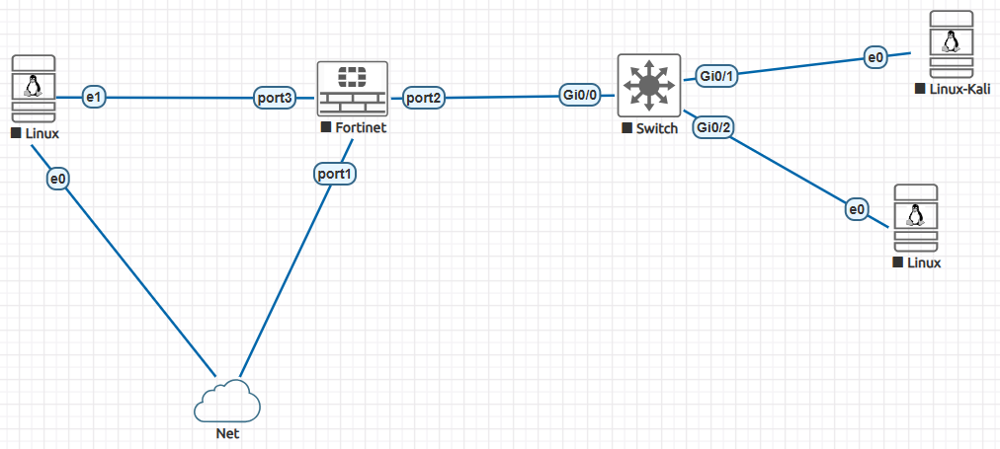

| Component | Lesson 02 value | Lesson 03 treatment |
| --- | --- | --- |
| FortiGate port1 | Upstream DHCP and management/recovery | Reused later as R2 transit because only three interfaces are licensed |
| FortiGate port2 | `LAB-LAN`, `10.10.10.1/24` | Preserved |
| LAB-LAN DHCP | `10.10.10.100-10.10.10.150` | Preserved |
| Kali | `10.10.10.100/24` | Preserved as primary client and GUI workstation |
| Metasploitable | `10.10.10.101/24` | Preserved as second client/source |
| FortiGate port3 | `10.20.20.1/24`, directly attached to Alpine | Readdressed to the R1 transit subnet |
| Alpine eth1 | `10.20.20.100/24` | Preserved |
| Lesson 02 policies/NAT/VIPs | Validated in the old direct topology | Treated as historical after the routing redesign unless revalidated |

The design did not change Alpine merely to fit a course example. The transit segment moved instead.

---

## 4. Routing concepts tied to the lab

### 4.1 Routing and policy answer different questions

```text
Routing: Where should this packet go?
Policy:  Is a new transit session allowed to cross the firewall?
```

A FortiGate route can be fully correct while a Kali-to-Alpine session is still denied by the firewall policy table.

### 4.2 RIB and FIB

- **RIB (Routing Information Base):** the routes FortiGate knows and considers.
- **FIB (Forwarding Information Base):** the installed forwarding state used to send packets.

The GUI route configuration proves intent. `get router info routing-table all` proves which routes are installed for forwarding.

### 4.3 Route-selection distinctions

| Concept | Meaning in this lab |
| --- | --- |
| Longest-prefix match | The most specific matching destination prefix is considered first. |
| Administrative distance | Compares route sources for the same prefix; lower is preferred. |
| Metric | Compares paths within a routing protocol. The implemented static routes displayed metric `0`. |
| FortiGate priority | Additional tie-breaker for competing routes, especially static routes with equal distance; lower is preferred. |
| ECMP eligibility | Same destination/prefix plus equal preference values and reachable next hops allows multiple routes to be installed. |

The notation:

```text
[10/0] ... [1/0]
```

means:

```text
administrative distance = 10
metric                  = 0
priority                = 1
weight                  = 0
```

The first pair is distance/metric. The later pair on the static-route output is priority/weight. Distance, metric, priority, and weight are not interchangeable labels for the same number.

### 4.4 Reverse Path Forwarding context

Reverse Path Forwarding (RPF), also called anti-spoofing, checks an arriving packet's source against the routing information. FortiGate supports strict and feasible-path behavior; the `strict-src-check` system setting selects the behavior. Strict checking requires the best reverse route to use the ingress interface. Feasible-path checking can accept another viable route through that ingress interface even when it is not the best route.

No RPF or asymmetric-routing setting was changed for this lab. The lesson observed both symmetric and asymmetric returns during ECMP testing, and the successful asymmetric ICMP reply was interpreted only as observed packet flow—not as evidence that anti-spoofing had been disabled. Packet capture identified the actual interfaces instead of treating a successful ping alone as proof of symmetry.

Useful diagnostics if a future packet is received but never forwarded include:

```text
show full-configuration system settings | grep -e strict-src-check -e asymroute
show full-configuration system interface | grep -f src-check
diagnose debug flow
```

Disabling source checks or enabling asymmetric routing weakens the normal anti-spoofing/stateful model and is not a routine fix.

### 4.5 Static routes with named addresses

FortiOS can use an IP/Netmask or FQDN firewall address—and an eligible address group—as a static-route destination. In FortiOS 7.6, the object's **Routing configuration** option must be enabled; the CLI equivalent is `set allow-routing enable`. The route then references the object with `set dstaddr <object-name>`.

Conceptual example only:

```text
config firewall address
    edit "ROUTED-DESTINATION"
        set subnet 203.0.113.0 255.255.255.0
        set allow-routing enable
    next
end

config router static
    edit 0
        set dstaddr "ROUTED-DESTINATION"
        set gateway <next-hop>
        set device <egress-interface>
    next
end
```

This was not added to the live topology. The numeric prefixes were already unambiguous, and consuming or replacing a route solely to rename the destination would add no new forwarding proof under the three-route limit.

### 4.6 Internet Service routing

A FortiGate static-route form can select a predefined or custom Internet Service Database (ISDB) entry as the destination. Although configured under static routes, the resulting Internet Service route operates as a policy route and is verified in the policy-route table rather than as an ordinary destination-prefix entry in `get router info routing-table all`.

Conceptual shape only:

```text
config router static
    edit <id>
        set gateway <internet-next-hop>
        set device <internet-interface>
        set internet-service <ISDB-ID>
    next
end

diagnose firewall proute list
```

It was deliberately not implemented here: the final lab has two internal routed members toward Alpine, not two Internet exits, and the evaluation has no FortiGuard subscription. Replacing the ECMP routes with an ISDB experiment would not strengthen this topology's routing proof.

### 4.7 Routing Monitor and GUI Route Lookup

The Routing Monitor was implemented and correlated with `get router info routing-table all` in the single-path phase. Its **Route Lookup** tool can evaluate a destination and highlight the matching route; additional source, interface, protocol, and port criteria can be supplied when policy-route context is relevant.

No separate Route Lookup screenshot was captured. CLI tables, Alpine `ip route get`, and packet sniffing provided stronger evidence for this implementation because they showed the installed candidates, the endpoint's selected return path, and FortiGate's actual packet egress. The tool is therefore documented as studied but not falsely presented as independently proven.

---

## 5. Phase A architecture - the first real static route

The first topology inserted R1 between FortiGate and Alpine:

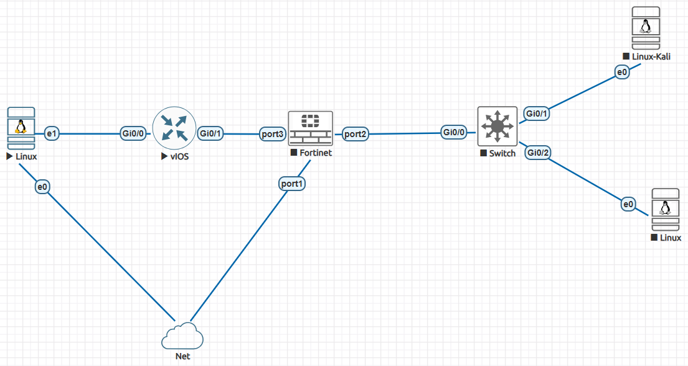

```text
LAB-LAN 10.10.10.0/24
        |
FortiGate port2 10.10.10.1
        |
FortiGate port3 10.30.30.1
        |
R1 Gi0/1 10.30.30.2
R1 Gi0/0 10.20.20.1
        |
Alpine eth1 10.20.20.100
```

This design made `10.20.20.0/24` remote from FortiGate and therefore created a meaningful need for a static route.

---

## 6. Alpine interface troubleshooting

### 6.1 Incorrect `/32`

The first address command omitted the prefix length:

```bash
ip addr add 10.20.20.100 dev eth1
```

Linux installed `10.20.20.100/32`, which was not the intended connected `/24` network.

### 6.2 Dotted-decimal mask rejected

A later attempt used dotted-decimal mask syntax with `ip addr add`. The Linux `ip` command expects CIDR prefix notation in this form, so the address was corrected to:

```bash
ip addr del 10.20.20.100/32 dev eth1
ip addr add 10.20.20.100/24 dev eth1
```

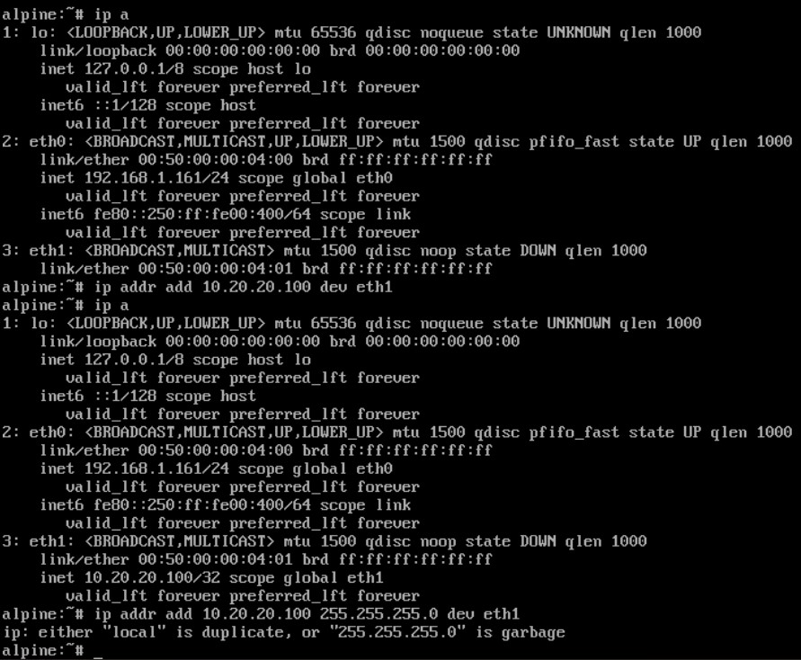

### 6.3 Correct address, interface still down

Even after the `/24` was correct, `eth1` remained administratively down. R1 could not ping Alpine because Layer 2 was unavailable, not because a remote route was missing.

```bash
ip link set eth1 up
```

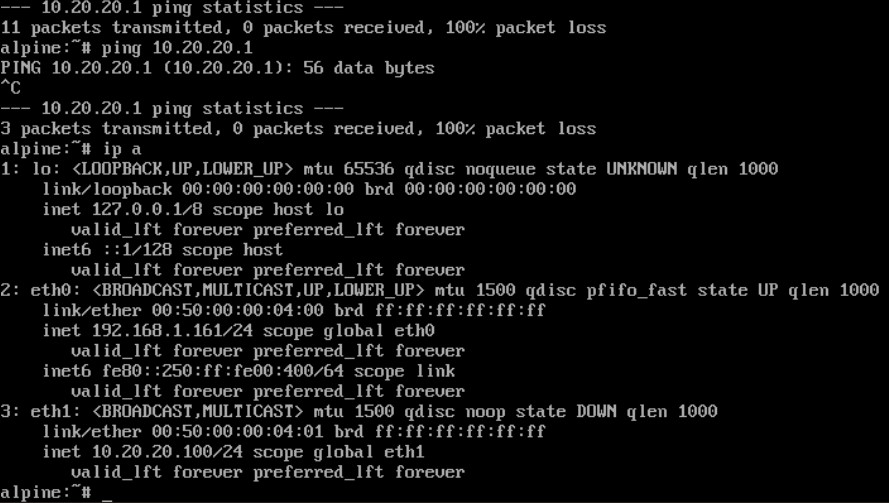

This became one of the lesson's most important debugging insights:

> An IP address can be present while the interface carrying it is still down. Verify link state before diagnosing a same-subnet failure as routing.

---

## 7. Configure R1 and the lower routed path

### 7.1 R1 interfaces

```text
configure terminal
interface GigabitEthernet0/0
 ip address 10.20.20.1 255.255.255.0
 no shutdown
exit
interface GigabitEthernet0/1
 ip address 10.30.30.2 255.255.255.0
 no shutdown
exit
```

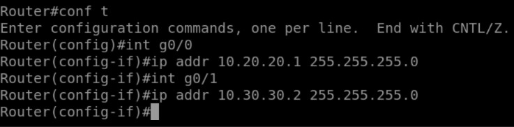

### 7.2 R1 return route to LAB-LAN

```text
ip route 10.10.10.0 255.255.255.0 10.30.30.1
```

R1 needs this route so replies to Kali/Metasploitable are sent back to FortiGate rather than treated as unknown.

### 7.3 Initial failed ping correctly isolated

R1 showed the configured interfaces, but its first ping to Alpine failed while Alpine eth1 was down.

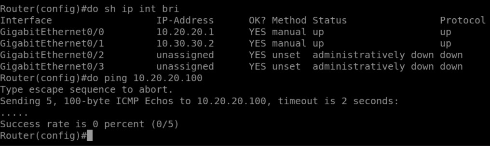

Once Alpine eth1 was brought up, same-subnet adjacency worked.

---

## 8. Alpine lower-path routing

Alpine retained its ordinary upstream/default route on eth0 and used narrow lab routes through R1 on eth1.

```bash
ip route add 10.10.10.0/24 via 10.20.20.1 dev eth1
ip route add 10.30.30.0/24 via 10.20.20.1 dev eth1
```

| Destination | Next hop | Interface | Purpose |
| --- | --- | --- | --- |
| `10.20.20.0/24` | Directly connected | eth1 | Alpine-R1 network |
| `10.30.30.0/24` | `10.20.20.1` | eth1 | Reach the R1-FortiGate transit subnet |
| `10.10.10.0/24` | `10.20.20.1` | eth1 | Return toward LAB-LAN |
| Default | Upstream DHCP gateway | eth0 | Preserve ordinary upstream/Internet behavior |

Alpine then successfully pinged R1's far-side `10.30.30.2` address, proving routing across R1 before FortiGate was modified.

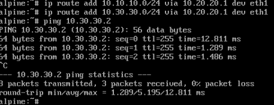

---

## 9. FortiGate lower transit and static route

### 9.1 Readdress port3

| Field | Value |
| --- | --- |
| Interface | port3 |
| Final alias in this phase | `TRANSIT-R1` |
| Role | WAN |
| Address | `10.30.30.1/24` |
| Administrative access | None for the routing experiment |

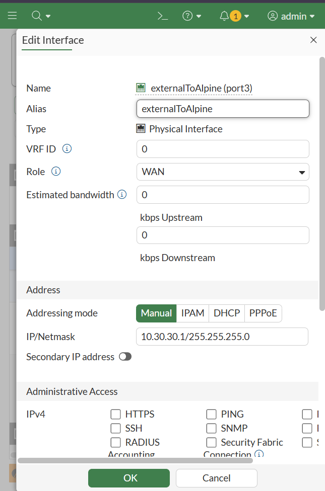

FortiGate no longer considered `10.20.20.0/24` directly connected.

### 9.2 Prove FortiGate-R1 adjacency

```text
execute ping 10.30.30.2
```

The ping completed with `0%` loss.

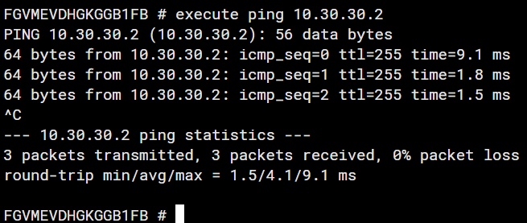

### 9.3 Add the first FortiGate static route

| Field | Value |
| --- | --- |
| Destination | `10.20.20.0/24` |
| Gateway | `10.30.30.2` |
| Interface | `TRANSIT-R1 (port3)` |
| Administrative distance | `10` |
| Status | Enabled |

Route meaning:

```text
10.20.20.0/24 -> 10.30.30.2 -> port3
```

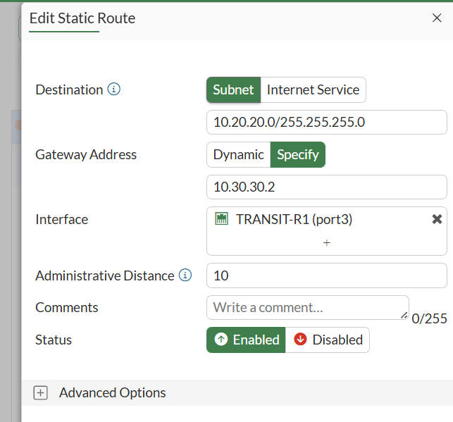

### 9.4 Prove the route without a transit policy

```text
execute ping 10.20.20.100
```

FortiGate reached Alpine with `0%` loss and replies at TTL `63`, consistent with one routed hop through R1.

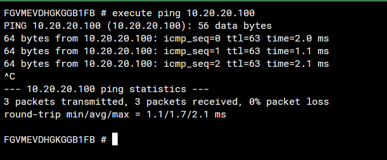

This isolated routing from policy because the traffic was generated by FortiGate itself.

---

## 10. Route present does not mean transit allowed

All firewall policies were accidentally deleted during the transition. The empty rulebase became a useful negative baseline:

- Kali still reached FortiGate `10.10.10.1`, proving LAB-LAN was healthy.
- FortiGate still reached Alpine, proving the route and R1 path were healthy.
- Kali could not reach Alpine because the transit session had no matching allow policy and hit implicit deny.

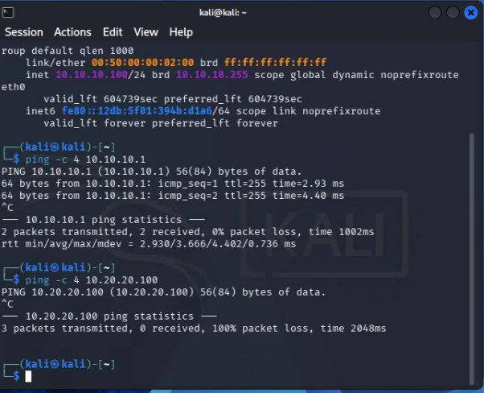

### 10.1 Recreate the narrow lower-path policy

| Field | Value |
| --- | --- |
| Name | `Lab-to-Alpine` |
| Incoming | `LAB-LAN (port2)` |
| Outgoing | `TRANSIT-R1 (port3)` |
| Source | `KALI-CLIENT` |
| Destination | `ALPINE-OUTSIDE` |
| Service | `PING` |
| Action | ACCEPT |
| NAT | Disabled |
| Inspection | Flow-based |

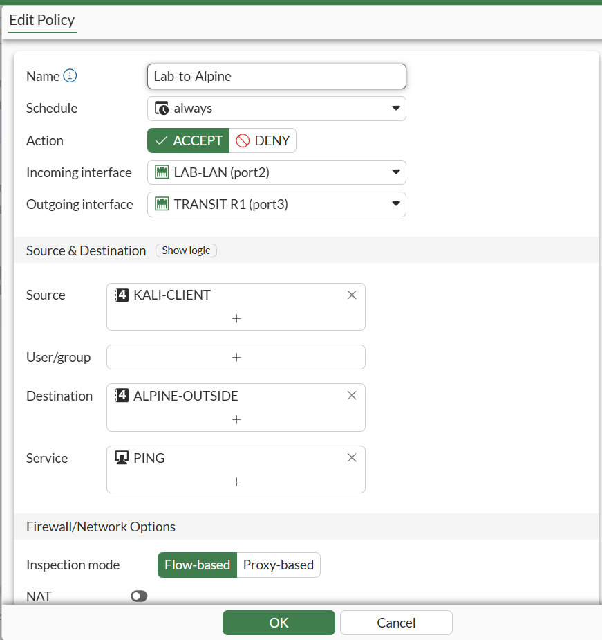

NAT was deliberately disabled so the routing proof retained the real endpoint addresses.

### 10.2 Positive lower-path transit proof

Kali successfully pinged Alpine with `0%` loss. Replies at TTL `62` were consistent with R1 and FortiGate as the two routed hops.

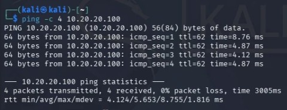

Validated path:

```text
Kali 10.10.10.100
  -> FortiGate port2 10.10.10.1
  -> FortiGate static route via 10.30.30.2
  -> R1
  -> Alpine 10.20.20.100
```

---

## 11. FortiGate route-table and monitor correlation

The last validated single-path table before port1 was repurposed contained:

```text
S* 0.0.0.0/0      [5/0] via 192.168.1.1, port1
C  10.10.10.0/24        directly connected, port2
S  10.20.20.0/24 [10/0] via 10.30.30.2, port3
C  10.30.30.0/24        directly connected, port3
C  192.168.1.0/24       directly connected, port1
```

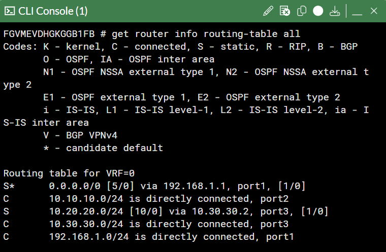

The GUI widget showed five routes: three connected and two static. The two static routes were the then-existing default route and the new `10.20.20.0/24` route.

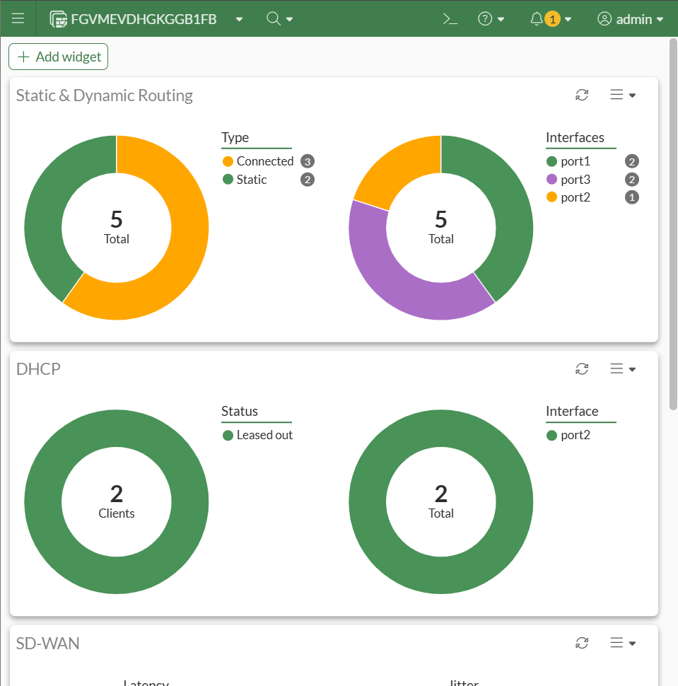

This state is historical. Once port1 became the R2 transit interface, the old `192.168.1.0/24` connected network and default route were no longer part of the final Lesson 03 topology.

---

## 12. Legacy Lesson 02 objects after the topology change

The Lesson 02 VIP objects still appeared on the renamed port3 interface:

```text
MSF-WEB-VIP       10.20.20.220      -> 10.10.10.101
MSF-Web_PORTFWD   10.20.20.221:8080 -> 10.10.10.101:80
```

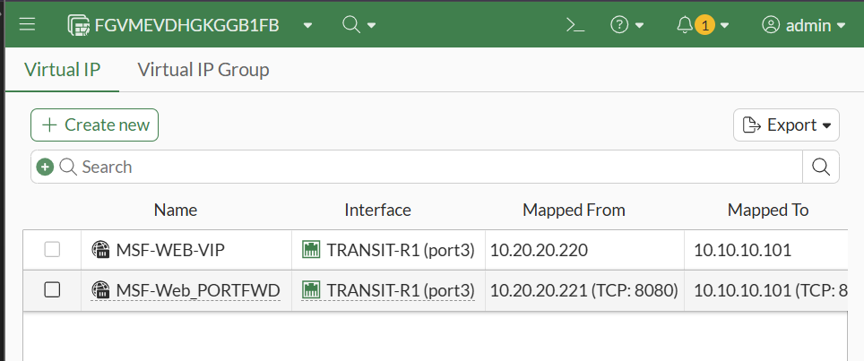

They were created when `10.20.20.0/24` was directly attached to FortiGate. After the routing redesign, that subnet moved behind R1. The VIPs were therefore retained only as historical Lesson 02 objects and were not claimed as validated Lesson 03 publication paths.

The Lesson 03 routing policies kept NAT disabled.

---

## 13. Observed reverse reachability

Alpine later successfully pinged Kali at `10.10.10.100` with TTL `62`.

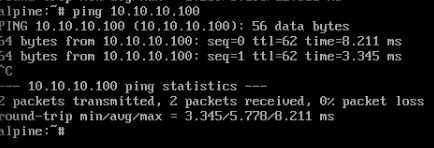

This screenshot proves reachability at that moment. It does not independently identify the exact policy/session state responsible, so the repository records the observation without inventing a separate configuration claim.

---

## 14. Phase B architecture - add R2 and repurpose port1

The evaluation license permits only three FortiGate interfaces. port2 was required for LAB-LAN and port3 was required for R1, leaving no fourth interface for R2.

The deliberate design decision was:

- Keep administration available from Kali through port2.
- Readdress port1 as the R2 transit interface.
- Treat the old port1 management/default-route state as historical.
- Use all three FortiGate ports for the completed routing topology.

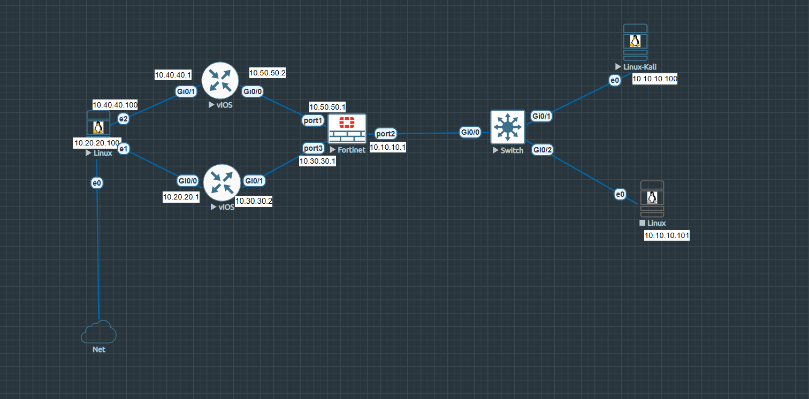

### 14.1 Final addressing plan

| Segment | Endpoint A | Endpoint B |
| --- | --- | --- |
| LAB-LAN `10.10.10.0/24` | FortiGate port2 `10.10.10.1` | Kali `.100`, Metasploitable `.101` |
| Lower FortiGate-R1 transit `10.30.30.0/24` | FortiGate port3 `10.30.30.1` | R1 Gi0/1 `10.30.30.2` |
| Lower R1-Alpine `10.20.20.0/24` | R1 Gi0/0 `10.20.20.1` | Alpine eth1 `10.20.20.100` |
| Upper FortiGate-R2 transit `10.50.50.0/24` | FortiGate port1 `10.50.50.1` | R2 Gi0/0 `10.50.50.2` |
| Upper R2-Alpine `10.40.40.0/24` | R2 Gi0/1 `10.40.40.1` | Alpine eth2 `10.40.40.100` |
| Shared ECMP test destination | - | Alpine loopback `10.60.60.100/32` |

---

## 15. Configure and validate R2

### 15.1 R2 interfaces

```text
configure terminal
interface GigabitEthernet0/0
 ip address 10.50.50.2 255.255.255.0
 no shutdown
exit
interface GigabitEthernet0/1
 ip address 10.40.40.1 255.255.255.0
 no shutdown
exit
```

Both interfaces were verified `up/up`.

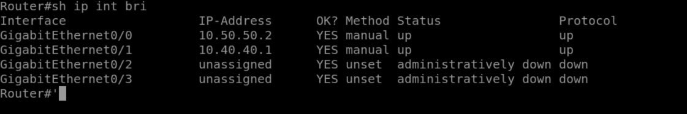

### 15.2 R2 return route to LAB-LAN

```text
ip route 10.10.10.0 255.255.255.0 10.50.50.1
```

R2's route table showed:

```text
S 10.10.10.0/24 via 10.50.50.1
C 10.40.40.0/24 directly connected, Gi0/1
C 10.50.50.0/24 directly connected, Gi0/0
```

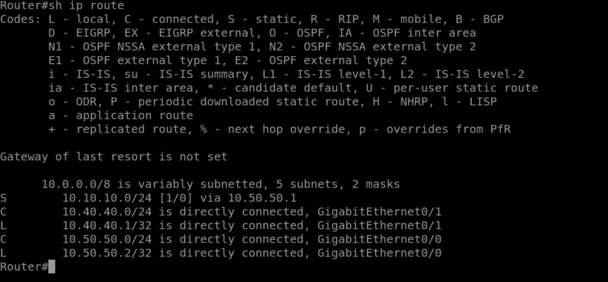

### 15.3 Intermediate FortiGate route to the upper Alpine network

Before ECMP, the second path was validated as an independent static-routing path:

| Field | Value |
| --- | --- |
| Destination | `10.40.40.0/24` |
| Gateway | `10.50.50.2` |
| Interface | `R2-Port1 (port1)` |
| Administrative distance | `10` |
| Status | Enabled |

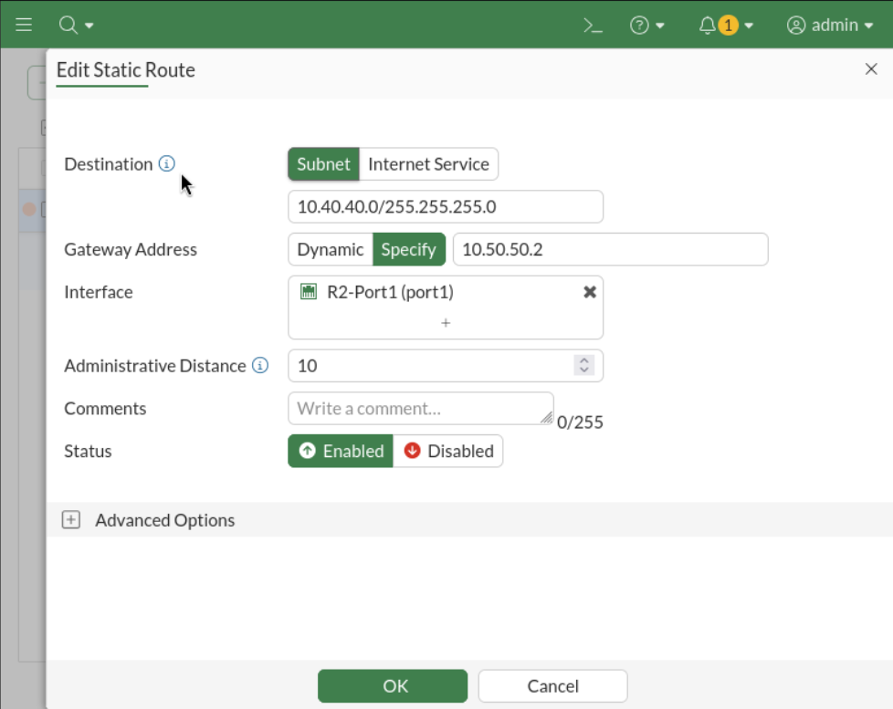

FortiGate successfully reached R2's far-side `10.40.40.1` interface.

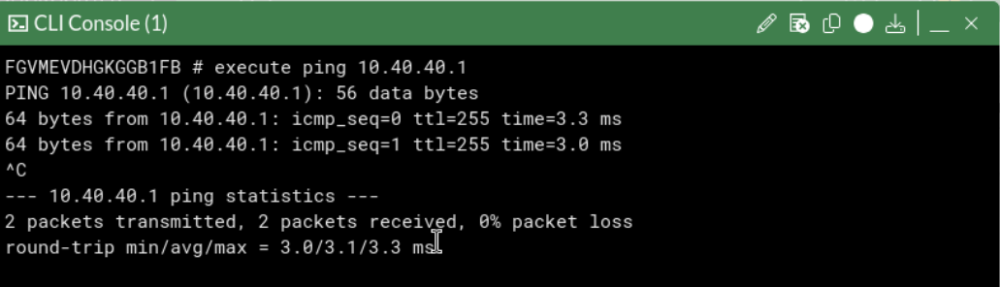

That ping proved routing through R2, but it terminated on R2 itself. It did not yet prove Alpine eth2.

---

## 16. Alpine dual-path routing and Alpine ECMP

### 16.1 Configure both lab interfaces

```bash
ip addr add 10.20.20.100/24 dev eth1
ip addr add 10.40.40.100/24 dev eth2
ip link set eth1 up
ip link set eth2 up
```

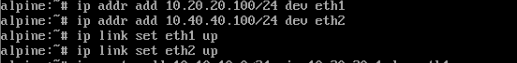

### 16.2 Install full iproute2

The initial Alpine environment required the full iproute2 implementation before using multipath `nexthop` syntax.

```bash
apk add iproute2
```

### 16.3 Add an equal-cost return route to LAB-LAN

```bash
ip route add 10.10.10.0/24 \
  nexthop via 10.20.20.1 dev eth1 weight 1 \
  nexthop via 10.40.40.1 dev eth2 weight 1
```

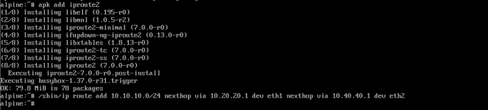

This is **Alpine ECMP**, separate from the FortiGate ECMP implemented later.

### 16.4 Complete the Alpine remote-transit routes

```bash
ip route replace 10.30.30.0/24 via 10.20.20.1 dev eth1
ip route replace 10.50.50.0/24 via 10.40.40.1 dev eth2
```

The resulting main table was:

```text
default via 192.168.1.1 dev eth0 metric 202
10.10.10.0/24
  nexthop via 10.20.20.1 dev eth1 weight 1
  nexthop via 10.40.40.1 dev eth2 weight 1
10.20.20.0/24 dev eth1 src 10.20.20.100
10.30.30.0/24 via 10.20.20.1 dev eth1
10.40.40.0/24 dev eth2 src 10.40.40.100
10.50.50.0/24 via 10.40.40.1 dev eth2
192.168.1.0/24 dev eth0 src 192.168.1.161
```

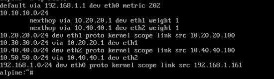

### 16.5 Verify source-dependent path selection

```bash
ip route get 10.10.10.100 from 10.20.20.100
ip route get 10.10.10.100 from 10.40.40.100
```

Observed selections:

```text
from 10.20.20.100 -> via 10.20.20.1 dev eth1
from 10.40.40.100 -> via 10.40.40.1 dev eth2
```

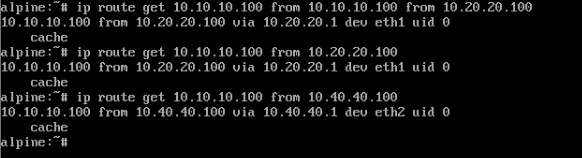

These checks prevented a successful ping from hiding an unintended return interface.

### 16.6 Prove the upper path to Alpine

FortiGate successfully pinged `10.40.40.100` with `0%` loss and TTL `63`.

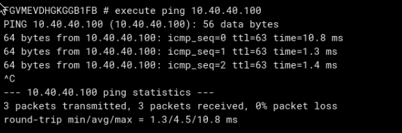

---

## 17. Policy reuse under the three-policy limit

The existing rulebase already consumed the limited policy capacity. The lab therefore reused a combined policy for routing tests instead of representing it as production least-privilege design.

The routing-stage policy set included:

| Policy ID/name | Direction | Purpose |
| --- | --- | --- |
| `2` / `Lab-to-Alpine` | port2 -> port3 | Lower-path client traffic |
| `4` / `Alpine-To-Lab` | port3 -> port2 | Lower-path Alpine-initiated traffic |
| `3` / `Lab-to-alpine&alpine-to-lab` | Initially port2/port1 in both interface lists; later expanded to include port3 | Consolidated bidirectional routing/ECMP ICMP tests |

The broad ID 3 policy used `all` source and destination objects for the controlled routing lab and was kept because only three policies were available. This is explicitly a lab constraint, not a production recommendation.

### 17.1 Unsaved policy configuration

The upper path initially failed even though FortiGate itself could reach the destination. The policy had been configured in the GUI but **OK was not pressed**, so it did not exist in the active rulebase.

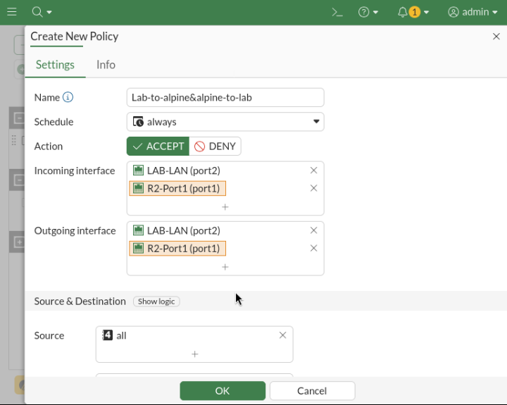

After saving the policy, Kali successfully pinged Alpine `10.40.40.100` with TTL `62`.

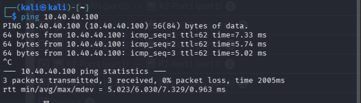

Alpine also initiated a successful ping from source `10.40.40.100` to Kali.

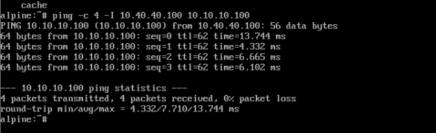

This troubleshooting event reinforced the same repository principle used throughout the project: an editor screen is not proof that the active configuration contains the object.

---

## 18. Correct the ECMP destination design

At this point FortiGate had two independent static routes:

```text
10.20.20.0/24 through R1
10.40.40.0/24 through R2
```

They had equal distance, but they were **not ECMP routes** because the destination prefixes were different.

This was caught before claiming ECMP success. The two paths were not wasted: they had established and proven the dual-path underlay. A single common destination was still required above that underlay.

The solution was a loopback address on Alpine:

```bash
ip addr add 10.60.60.100/32 dev lo
ip link set lo up
ping -c 3 10.60.60.100
```

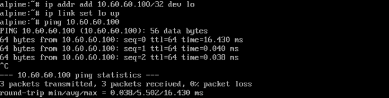

### Why a `/32` loopback?

- It represents one host destination independent of eth1 and eth2 addressing.
- R1 and R2 can each route to the exact same prefix.
- FortiGate can install two equivalent routes to that prefix.
- It isolates the ECMP experiment from the two different link networks.

---

## 19. Route both routers to the shared loopback

### 19.1 R1 route

```text
ip route 10.60.60.100 255.255.255.255 10.20.20.100
```

R1 successfully pinged `10.60.60.100` with 100% success.

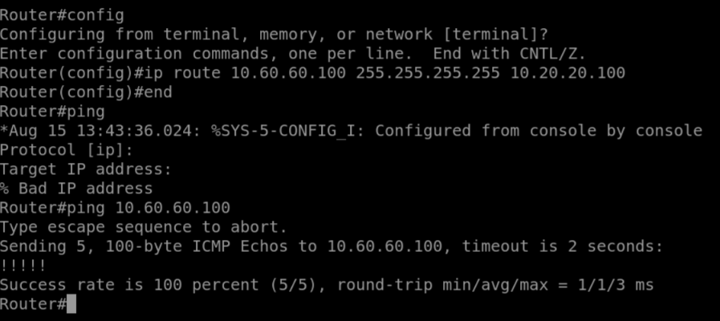

### 19.2 R2 route

```text
ip route 10.60.60.100 255.255.255.255 10.40.40.100
```

R2 was also configured and validated to reach the same loopback through Alpine eth2. The implementation was confirmed during the live lab, although no separate R2 screenshot was captured for the repository evidence set.

The router paths now represented:

```text
R1 -> 10.60.60.100/32 via 10.20.20.100
R2 -> 10.60.60.100/32 via 10.40.40.100
```

---

## 20. Configure FortiGate ECMP

The evaluation license permits only three routes. After the separate `10.20.20.0/24` and `10.40.40.0/24` paths were proven, those two FortiGate static-route slots were repurposed for the final ECMP experiment.

### 20.1 Final equivalent routes

| Destination | Gateway | Interface | Distance | Metric | Priority | Weight |
| --- | --- | --- | ---: | ---: | ---: | ---: |
| `10.60.60.100/32` | `10.30.30.2` | `TRANSIT-R1 (port3)` | `10` | `0` | `1` | `0` |
| `10.60.60.100/32` | `10.50.50.2` | `R2-Port1 (port1)` | `10` | `0` | `1` | `0` |

The destination, prefix length, distance, metric, and priority were identical. Only the gateways and egress interfaces differed.

### 20.2 Routing-table proof

```text
C 10.10.10.0/24 is directly connected, port2
C 10.30.30.0/24 is directly connected, port3
C 10.50.50.0/24 is directly connected, port1
S 10.60.60.100/32 [10/0] via 10.30.30.2, port3, [1/0]
                     [10/0] via 10.50.50.2, port1, [1/0]
```

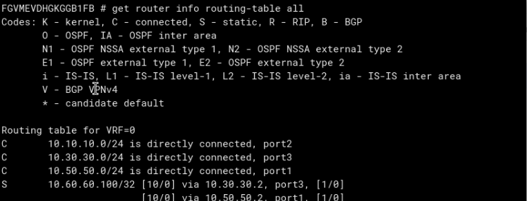

There is no separate ECMP enable button. FortiGate formed the ECMP group automatically when both eligible routes were installed.

### 20.3 FortiGate-originated reachability

```text
execute ping 10.60.60.100
```

The ping succeeded with `0%` loss and TTL `63`.

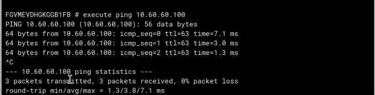

A single ping proves the target is reachable through one selected member. It does not prove that different sessions use both members.

---

## 21. ECMP policy mismatch and fix

### 21.1 Symptom

Kali initially received 100% loss to `10.60.60.100` even though FortiGate could ping it.

The FortiGate sniffer showed only:

```text
port2 in 10.10.10.100 -> 10.60.60.100: icmp echo request
```

There was no `port1 out` or `port3 out` line.

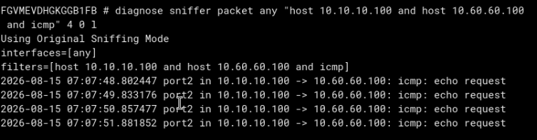

### 21.2 Root cause

The combined policy contained port1 and port2, but port3 was absent. If ECMP selected port3, the older lower-path policy did not match the new `10.60.60.100` destination, so the session reached implicit deny.

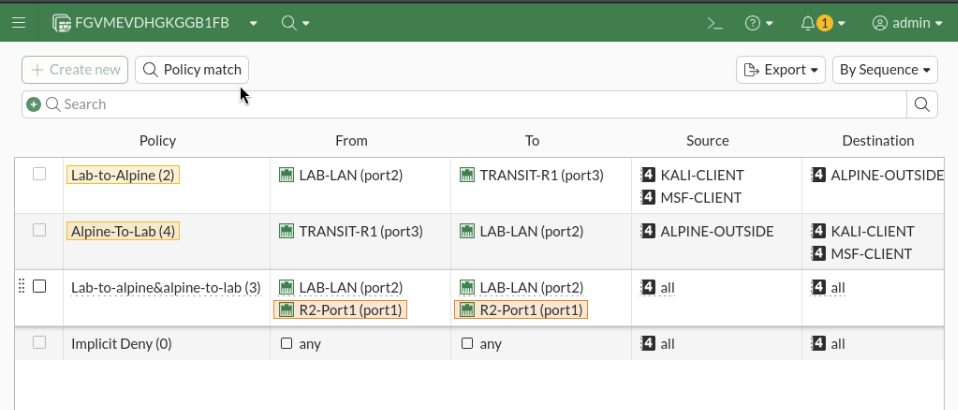

### 21.3 Fix

`TRANSIT-R1 (port3)` was added to both interface lists of the combined lab policy:

```text
Incoming:
- LAB-LAN (port2)
- R2-Port1 (port1)
- TRANSIT-R1 (port3)

Outgoing:
- LAB-LAN (port2)
- R2-Port1 (port1)
- TRANSIT-R1 (port3)

Source: all
Destination: all
Action: ACCEPT
NAT: Disabled
```

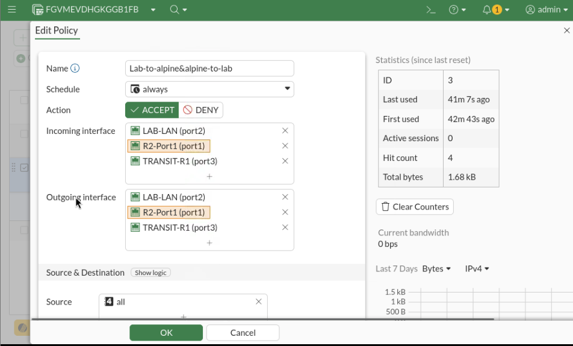

This consolidation is intentionally broad and limited to the controlled lab. In production, directional policies and scoped address/service objects would be preferred.

Kali then reached `10.60.60.100` with `0%` loss and TTL `62`.

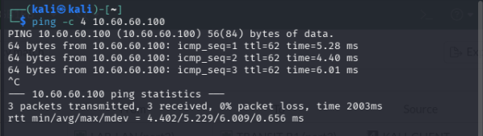

---

## 22. Verify FortiGate source-IP-based ECMP

### 22.1 Confirm the algorithm

```text
show full-configuration system settings | grep v4-ecmp-mode
```

Observed:

```text
set v4-ecmp-mode source-ip-based
```


This means FortiGate hashes the source IP and keeps traffic from that source on the selected member. Equal weights do not cause packets from one source to alternate between paths.

### 22.2 Source `10.10.10.100` selects port3/R1

Sniffer flow:

```text
port2 in  10.10.10.100 -> 10.60.60.100 echo request
port3 out 10.10.10.100 -> 10.60.60.100 echo request
port3 in  10.60.60.100 -> 10.10.10.100 echo reply
port2 out 10.60.60.100 -> 10.10.10.100 echo reply
```

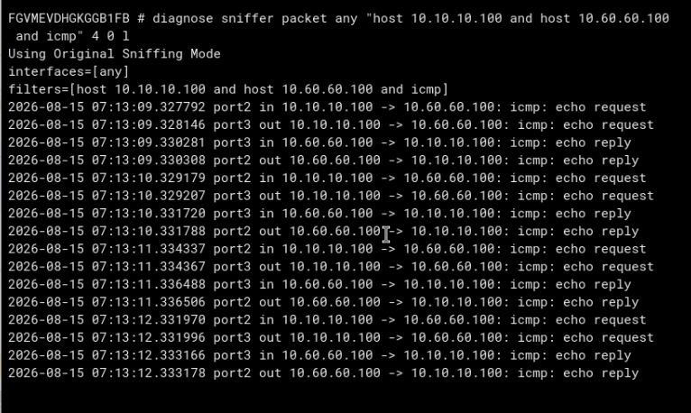

This is symmetric proof of the lower ECMP member.

### 22.3 Source `10.10.10.101` illustrates independent return hashing

For the second client:

```text
request: port2 in -> port3 out
reply:   port1 in -> port2 out
```

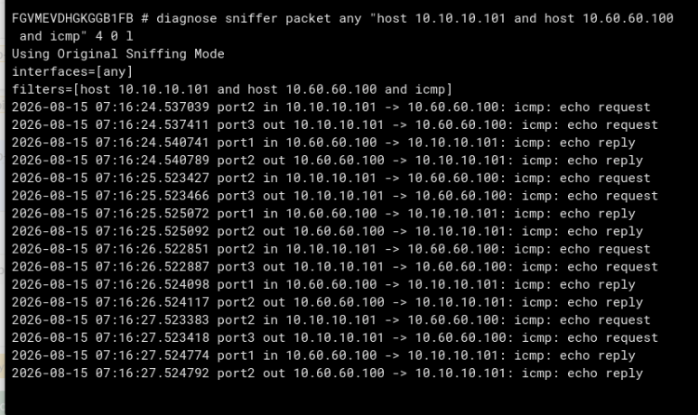

Important interpretation:

- FortiGate still selected port3 for the outbound request.
- Alpine's own ECMP route selected the upper path for the reply.
- Seeing `port1 in` did not prove FortiGate selected port1 outbound.

The actual proof required a `port1 out` request line.

### 22.4 Temporary Kali source `10.10.10.110` selects port1/R2

A temporary additional address generated another source hash:

```bash
sudo ip addr add 10.10.10.110/24 dev eth0
ping -c 3 -I 10.10.10.110 10.60.60.100
```

`10.10.10.110` falls inside the FortiGate DHCP scope. It was safe only as a short, controlled test after confirming that no other client held that lease. A repeatable lab should reserve/exclude the address or use an unused address outside the dynamic pool.

Sniffer flow:

```text
port2 in  10.10.10.110 -> 10.60.60.100 echo request
port1 out 10.10.10.110 -> 10.60.60.100 echo request
port1 in  10.60.60.100 -> 10.10.10.110 echo reply
port2 out 10.60.60.100 -> 10.10.10.110 echo reply
```

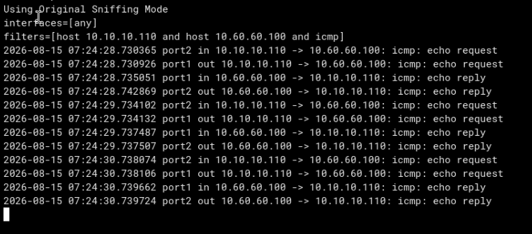

Together, `.100 -> port3` and `.110 -> port1` prove that FortiGate used both ECMP members under source-IP-based selection.

### 22.5 Weight-based discussion

Weight-based ECMP was discussed but not implemented. Changing static-route weights while `v4-ecmp-mode` remains `source-ip-based` would not test weighted distribution. A valid future weight experiment must first change the ECMP mode, assign unequal route weights, generate many distinct sessions, and compare session counts rather than assuming that byte volume will match the configured ratio.

---

## 23. Exact final IP inventory

| Device / interface | Address | Role |
| --- | --- | --- |
| FortiGate port2 / `LAB-LAN` | `10.10.10.1/24` | Internal LAN and current GUI/client access |
| LAB-LAN DHCP scope | `10.10.10.100-10.10.10.150` | Preserved client-address pool |
| Kali eth0 | `10.10.10.100/24` | Primary internal client |
| Kali temporary alias | `10.10.10.110/24` | Source-IP ECMP proof only |
| Metasploitable eth0 | `10.10.10.101/24` | Second internal client/source |
| FortiGate port3 / `TRANSIT-R1` | `10.30.30.1/24` | Lower transit |
| R1 Gi0/1 | `10.30.30.2/24` | Toward FortiGate port3 |
| R1 Gi0/0 | `10.20.20.1/24` | Toward Alpine eth1 |
| Alpine eth1 | `10.20.20.100/24` | Lower path |
| FortiGate port1 / `R2-Port1` | `10.50.50.1/24` | Upper transit; no longer the Lesson 00/02 management uplink |
| R2 Gi0/0 | `10.50.50.2/24` | Toward FortiGate port1 |
| R2 Gi0/1 | `10.40.40.1/24` | Toward Alpine eth2 |
| Alpine eth2 | `10.40.40.100/24` | Upper path |
| Alpine loopback | `10.60.60.100/32` | Shared ECMP destination |
| Alpine eth0 | `192.168.1.161/24` observed | Separate upstream/DHCP interface |

---

## 24. Exact final route inventory

### 24.1 FortiGate final installed routes

```text
C 10.10.10.0/24 directly connected, port2
C 10.30.30.0/24 directly connected, port3
C 10.50.50.0/24 directly connected, port1
S 10.60.60.100/32 [10/0] via 10.30.30.2, port3
                     [10/0] via 10.50.50.2, port1
```

The earlier FortiGate `10.20.20.0/24` and `10.40.40.0/24` routes were intermediate validation states and were repurposed for the final `/32` ECMP pair.

### 24.2 R1 routes

```text
C 10.20.20.0/24 directly connected, Gi0/0
C 10.30.30.0/24 directly connected, Gi0/1
S 10.10.10.0/24 via 10.30.30.1
S 10.60.60.100/32 via 10.20.20.100
```

### 24.3 R2 routes

```text
C 10.40.40.0/24 directly connected, Gi0/1
C 10.50.50.0/24 directly connected, Gi0/0
S 10.10.10.0/24 via 10.50.50.1
S 10.60.60.100/32 via 10.40.40.100
```

### 24.4 Alpine routes

```text
default via 192.168.1.1 dev eth0 metric 202
10.10.10.0/24
  nexthop via 10.20.20.1 dev eth1 weight 1
  nexthop via 10.40.40.1 dev eth2 weight 1
10.20.20.0/24 dev eth1 src 10.20.20.100
10.30.30.0/24 via 10.20.20.1 dev eth1
10.40.40.0/24 dev eth2 src 10.40.40.100
10.50.50.0/24 via 10.40.40.1 dev eth2
192.168.1.0/24 dev eth0 src 192.168.1.161
local 10.60.60.100/32 dev lo
```

---

## 25. Verification matrix

| Test | Layer or mechanism | Expected | Observed |
| --- | --- | --- | --- |
| R1 -> Alpine before eth1 up | Interface/L2 | Failure | Failed; eth1 was down |
| Alpine -> R1 far-side `10.30.30.2` | R1 routing | Success | `0%` loss |
| FortiGate -> R1 `10.30.30.2` | Lower transit adjacency | Success | `0%` loss |
| FortiGate -> Alpine `10.20.20.100` | Lower static route | Success | `0%` loss, TTL `63` |
| Kali -> Alpine with no policy | Firewall authorization | Failure | `100%` loss |
| Kali -> Alpine after policy | Stateful transit | Success | `0%` loss, TTL `62` |
| FortiGate -> R2 far-side `10.40.40.1` | Upper routing | Success | `0%` loss |
| FortiGate -> Alpine `10.40.40.100` | Upper static route | Success | `0%` loss, TTL `63` |
| Kali -> Alpine upper before saving policy | Active policy state | Failure | Policy had not been saved |
| Kali -> Alpine upper after saving policy | Upper transit policy | Success | `0%` loss, TTL `62` |
| Alpine source `.40` -> Kali | Reverse initiated path | Success | `0%` loss, TTL `62` |
| R1 -> loopback `10.60.60.100` | Shared target via lower path | Success | 100% success |
| R2 -> loopback `10.60.60.100` | Shared target via upper path | Success | Validated live |
| FortiGate route table | ECMP control plane | Two next hops | Both installed |
| Kali -> ECMP target before port3 policy fix | Policy/interface match | Failure | Only `port2 in` captured |
| Kali -> ECMP target after policy fix | ECMP data plane | Success | `0%` loss, TTL `62` |
| Source `.100` | Source-IP ECMP | Stable member | port3/R1 |
| Source `.110` | Source-IP ECMP | Other member | port1/R2 |

---

## 26. Troubleshooting record

| Symptom | Root cause | Diagnostic evidence | Fix | Retest |
| --- | --- | --- | --- | --- |
| Alpine address appeared as `/32` | Prefix length omitted | `ip addr` output | Delete `/32`; add `/24` | Correct subnet shown |
| Dotted mask command failed | `ip addr` expected CIDR notation | CLI error | Use `10.20.20.100/24` | Address accepted |
| R1 could not ping Alpine on the same subnet | Alpine eth1 administratively down | `ip link`/`ip addr` showed DOWN | `ip link set eth1 up` | Ping succeeded |
| FortiGate reached Alpine but Kali did not | Routing worked; transit policy absent | FortiGate ping success plus Kali failure | Recreate allow policy | Kali ping succeeded |
| All policies disappeared | Accidental deletion | Empty policy state | Use as negative baseline, then rebuild narrowly | Route-versus-policy distinction proven |
| Old port1 default route no longer represented reality | port1 was rewired and readdressed for R2 | New topology/address plan | Treat old default/connected route as historical | Final table shows `10.50.50.0/24` on port1 |
| FortiGate reached upper path but Kali did not | Policy editor changes were not saved | Policy absent from active list | Press **OK** | Kali reached `10.40.40.100` |
| Two equal-distance routes did not form ECMP | Destinations were different (`10.20/24` and `10.40/24`) | Route-design review | Add shared loopback `10.60.60.100/32` | Two equal `/32` routes installed |
| Kali ECMP ping failed while FortiGate ping worked | ECMP selected port3 but the combined policy omitted port3 | Sniffer showed only `port2 in`; policy list showed interface gap | Add port3 to the policy interface lists | Kali ECMP ping succeeded |
| `port1 in` appeared for `.101` replies | Alpine chose a different return member | Sniffer showed request `port3 out`, reply `port1 in` | Interpret directions correctly; do not call it FortiGate port1 outbound proof | New source `.110` produced `port1 out` |
| `.100` and `.101` both selected port3 outbound | Source-IP hashes are not guaranteed to alternate for adjacent addresses | Packet capture | Add temporary `.110` source | port1/R2 selected |
| Additional policies/routes could not be added freely | Permanent evaluation limit of three | License limits | Reuse/repurpose objects and document sequential states | Full experiment completed within limit |

---

## 27. Command recap

### Alpine

```bash
# Correct lower interface
ip addr del 10.20.20.100/32 dev eth1
ip addr add 10.20.20.100/24 dev eth1
ip link set eth1 up

# Upper interface
ip addr add 10.40.40.100/24 dev eth2
ip link set eth2 up

# Full multipath-capable tooling
apk add iproute2

# Alpine ECMP return route
ip route add 10.10.10.0/24 \
  nexthop via 10.20.20.1 dev eth1 weight 1 \
  nexthop via 10.40.40.1 dev eth2 weight 1

# Transit-network reachability
ip route replace 10.30.30.0/24 via 10.20.20.1 dev eth1
ip route replace 10.50.50.0/24 via 10.40.40.1 dev eth2

# Shared ECMP destination
ip addr add 10.60.60.100/32 dev lo
ip link set lo up

# Route-selection checks
ip route get 10.10.10.100 from 10.20.20.100
ip route get 10.10.10.100 from 10.40.40.100
```

### R1

```text
interface GigabitEthernet0/0
 ip address 10.20.20.1 255.255.255.0
 no shutdown
interface GigabitEthernet0/1
 ip address 10.30.30.2 255.255.255.0
 no shutdown
ip route 10.10.10.0 255.255.255.0 10.30.30.1
ip route 10.60.60.100 255.255.255.255 10.20.20.100
```

### R2

```text
interface GigabitEthernet0/0
 ip address 10.50.50.2 255.255.255.0
 no shutdown
interface GigabitEthernet0/1
 ip address 10.40.40.1 255.255.255.0
 no shutdown
ip route 10.10.10.0 255.255.255.0 10.50.50.1
ip route 10.60.60.100 255.255.255.255 10.40.40.100
```

### FortiGate verification and diagnostics

```text
execute ping 10.30.30.2
execute ping 10.20.20.100
execute ping 10.40.40.1
execute ping 10.40.40.100
execute ping 10.60.60.100
get router info routing-table all
show full-configuration system settings | grep v4-ecmp-mode
diagnose sniffer packet any 'host 10.10.10.100 and host 10.60.60.100 and icmp' 4 0 l
```

### Temporary Kali ECMP source

```bash
sudo ip addr add 10.10.10.110/24 dev eth0
ping -c 3 -I 10.10.10.110 10.60.60.100
```

---

## 28. Final validated architecture

```text
                                       LAB-LAN 10.10.10.0/24
                                  Kali .100/.110   MSF .101
                                           |
                                  FortiGate port2 .1
                                      /           \
                   port3 10.30.30.1/24             port1 10.50.50.1/24
                             |                               |
                   R1 Gi0/1 10.30.30.2             R2 Gi0/0 10.50.50.2
                   R1 Gi0/0 10.20.20.1             R2 Gi0/1 10.40.40.1
                             |                               |
                 Alpine eth1 10.20.20.100         Alpine eth2 10.40.40.100
                                      \           /
                                   Alpine loopback
                                    10.60.60.100/32
```

Validated outcomes:

- Static routing through R1
- Static routing through R2
- Router return routing to LAB-LAN
- Alpine narrow routes and equal-cost multipath return route
- Route-versus-policy negative baseline
- Lower and upper bidirectional ICMP reachability
- One shared loopback destination reachable through both routers
- Two installed FortiGate routes for the same `/32`
- Source-IP-based FortiGate ECMP
- port3/R1 selected for source `10.10.10.100`
- port1/R2 selected for source `10.10.10.110`
- Packet-level evidence of symmetric and asymmetric returns

---

## 29. Cleanup, persistence, and handoff

### Temporary Kali address

After ECMP evidence is complete, the temporary alias can be removed:

```bash
sudo ip addr del 10.10.10.110/24 dev eth0
```

Removing it also eliminates the risk of colliding with a later DHCP lease from the `10.10.10.100-10.10.10.150` pool.

### Alpine persistence

The captured Alpine `ip addr` and `ip route` commands configure the live system. They should not be described as reboot-persistent unless they are added to Alpine's persistent network configuration or the EVE node state is preserved.

### Cisco persistence

The captured Cisco commands modify the running configuration. Save separately if persistence across node restart is required:

```text
copy running-config startup-config
```

### Policy design

The all-interface/all-address policy is a lab response to the three-policy ceiling. A production handoff should replace it with directional, least-privilege policies using explicit source, destination, and service objects.

### Historical objects

The old Lesson 02 VIPs and the intermediate Lesson 03 `10.20.20.0/24` / `10.40.40.0/24` FortiGate routes should not be presented as part of the final ECMP state. The repository preserves their evidence as earlier validated stages.

---

## 30. Lessons learned

- Preserve established addressing when a cleaner transit redesign can achieve the lesson objective.
- An address can be correct while its interface remains administratively down.
- Same-subnet failures should be debugged below the routing layer first.
- Router return routes are as important as FortiGate forward routes.
- A FortiGate-originated ping proves routing without proving transit policy.
- A route does not authorize a session.
- NAT should be disabled when the purpose is to observe pure routing behavior.
- `[10/0]` means distance 10 and metric 0; the later `[1/0]` means priority 1 and weight 0.
- Longest prefix, distance, metric, and priority solve different selection decisions.
- Two equal-distance routes to different destination prefixes are not ECMP.
- A loopback `/32` is a useful shared destination independent of link addressing.
- FortiGate ECMP activates from eligible equivalent routes; it is not a separate checkbox.
- Source-IP-based ECMP pins a source to one member; it is not per-packet round robin.
- Two adjacent source addresses are not guaranteed to hash to different members.
- A temporary static test address must be checked against the active DHCP scope to avoid conflicts.
- `port1 in` proves an inbound/return interface, not a FortiGate outbound ECMP decision.
- Packet sniffing is required to distinguish `port1 out` from `port1 in`.
- Alpine and FortiGate each had their own ECMP decision in this topology.
- Policy interface lists must include every possible ECMP egress member.
- An unsaved GUI editor state is not active configuration.
- Evaluation limitations should drive transparent object reuse, not hidden or misleading claims.

---

## 31. Evidence

The curated evidence index is maintained in [evidence/README.md](evidence/README.md). It covers the full progression from the Lesson 02 starting topology through the single-R1 route, the dual-path underlay, Alpine routing, loopback creation, FortiGate ECMP installation, policy troubleshooting, and packet-level proof of both ECMP members.

### Sanitization

No FortiGate administrator password, FortiCare/FortiCloud credential, VM license artifact, private key, reusable token, or unsanitized appliance backup is included.

---

## 32. Fortinet references for conceptual-only topics

- [Named address objects and address groups in static routes](https://community.fortinet.com/fortigate-3/technical-tip-how-to-add-named-address-objects-or-named-address-groups-in-the-static-routes-95793)
- [Static routes for predefined Internet Services (ISDB)](https://community.fortinet.com/fortigate-3/technical-tip-creating-a-static-route-for-predefined-internet-services-isdb-100113)
- [Reverse Path Forwarding implementation and `strict-src-check`](https://community.fortinet.com/fortigate-3/technical-tip-reverse-path-forwarding-rpf-implementation-and-use-of-strict-src-check-enable-disable-96432)
