# Lesson 04 - Firewall Authentication

This lesson extends the Lesson 03 routed/ECMP topology with identity-aware access control. Kali remains the internal client on `LAB-LAN`; Alpine remains outside the LAN and hosts one protected HTTP resource on its shared loopback. FortiGate allows the traffic only after a valid member of `LAB-AUTH-USERS` authenticates.

> Implementation boundary: local active authentication was implemented and validated. LDAP, RADIUS, passive authentication, two-factor authentication/FortiToken, and production HTTPS portal design were studied as theory only.

## 1. Scope

### Objective

Prove that a FortiGate policy can require all of the following at the same time:

- a known client address
- an authenticated user in an allowed firewall group
- a specific destination
- an allowed service

The lesson also records authentication timeout behavior and correlates the GUI Firewall User Monitor with the CLI authentication table.

### Implemented

- Alpine HTTP service bound to `10.60.60.100:80`
- local user `lab-local-user`
- firewall group `LAB-AUTH-USERS`
- identity-aware policy `auth-lan-to-alpine` (Policy ID `3`)
- active browser authentication
- pre-authentication negative test
- post-authentication HTTP and PING tests
- five-minute idle timeout and reauthentication
- CLI and GUI authenticated-user monitoring

### Theory only

- LDAP and directory structure
- RADIUS AAA and packet exchange
- server-based user/group authentication
- two-factor authentication and FortiToken assignment
- passive authentication/FSSO
- production-grade HTTPS authentication portal

## 2. Methodology and design intent

The Fortinet lesson remains a curriculum, not a checklist of screens to reproduce. Lesson 04 keeps the repository methodology established in Lessons 00-03:

1. Extend the existing cumulative topology.
2. Separate theory from implemented claims.
3. Establish a working service before placing authentication in front of it.
4. Keep the endpoint and destination constant while changing the policy behavior.
5. Validate both denial and success.
6. Correlate browser behavior, endpoint traffic, FortiGate policy state, and the authentication table.
7. Reuse an existing policy because the evaluation permits only three firewall policies.

The protected server was deliberately placed on Alpine, which is outside `LAB-LAN`. The lesson therefore demonstrates a LAN user authenticating to cross FortiGate toward a routed resource. Kali and Metasploitable remain the two LAN-side hosts; Alpine is not reclassified as a LAN member.

## 3. Starting state and traffic path

Lesson 03 already provided two equal FortiGate routes to Alpine's loopback:

```text
Kali 10.10.10.100
        |
LAB-LAN / port2 10.10.10.1
        |
     FortiGate
      /     \
 port3/R1  port1/R2
      \     /
 Alpine loopback 10.60.60.100/32
```

Both port1 and port3 remain possible egress interfaces because the FortiGate ECMP algorithm is `source-ip-based`. The authentication policy must therefore authorize both routed members even though a single session uses only the member selected by the route lookup.

## 4. Theory tied to the implementation

### 4.1 Authentication and authorization are different

Authentication answers **who is this user?** Authorization answers **may this authenticated identity perform this action?**

In this lab:

- `lab-local-user` supplies the identity.
- `LAB-AUTH-USERS` groups identities with the same access intent.
- the firewall policy authorizes that group only from `KALI-CLIENT` to `ALPINE-LOOPBACK` over `HTTP` and `PING`.

Adding a user group does not replace the IP condition. Both must match. A valid username from the wrong source address is not sufficient, and the correct IP without an authenticated group mapping is also not sufficient.

### 4.2 Local and server-based password authentication

Local authentication stores the user definition on FortiGate. It is appropriate for a small lab and proves the firewall-policy workflow without another server dependency.

Server-based authentication delegates credential verification to an external identity service. FortiGate still uses a firewall group and policy to authorize the result; the external server changes where identity is verified, not the need for policy authorization.

### 4.3 Active and passive authentication

- **Active authentication:** FortiGate prompts the user when matching traffic requires an identity and no valid IP-to-user mapping exists.
- **Passive authentication:** FortiGate learns an existing logon from another system, such as FSSO/Active Directory, without presenting its own login prompt.

Only active authentication was implemented here.

### 4.4 Authentication protocols and service behavior

The recorded FortiGate setting supports active authentication triggers for `http`, `https`, `ftp`, and `telnet`. HTTP can redirect a browser to the form portal. ICMP/PING cannot display a login form, but it can use an authentication mapping created earlier through HTTP.

This distinction explains the observed sequence:

1. unauthenticated PING fails;
2. HTTP triggers login;
3. successful login creates an IP-to-user mapping;
4. PING succeeds while that mapping remains valid.

## 5. Prepare and validate the protected HTTP resource

Alpine's live network configuration and the upper-router state were restored first because those lab nodes can lose volatile state. Existing Lesson 03 reachability was validated before adding authentication.

BusyBox on this Alpine image did not contain the `httpd` applet, so Python was used as the smallest available working substitute:

```sh
apk add python3
nohup python3 -m http.server 80 \
  --bind 10.60.60.100 \
  --directory /var/www/lesson04 \
  >/tmp/lesson04-http.log 2>&1 &
ss -lntp | grep ':80'
```

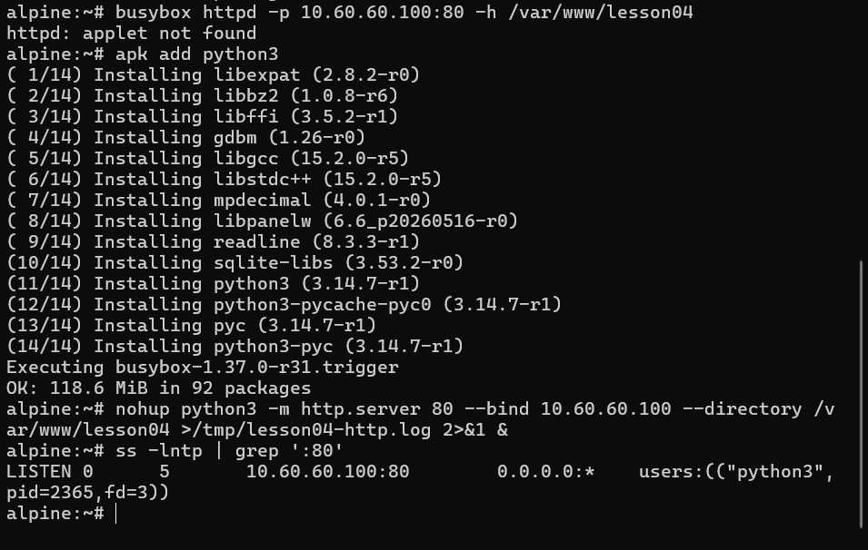

The listener was bound specifically to `10.60.60.100:80`, keeping the application aligned with the shared ECMP destination rather than either physical Alpine interface.

## 6. Why authentication was initially bypassed

Kali could initially retrieve the page without authentication. The cause was not a failed user configuration: the inherited broad lab policy already accepted traffic between all three FortiGate interfaces with source `all`, destination `all`, and service `ALL`.

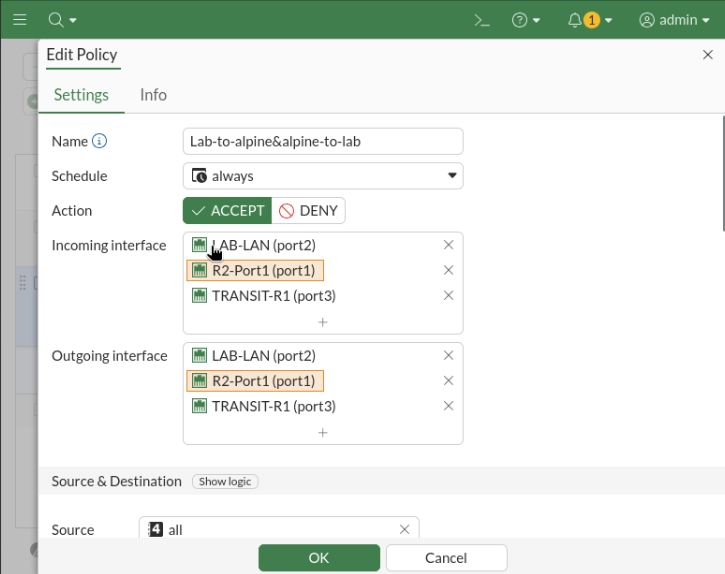

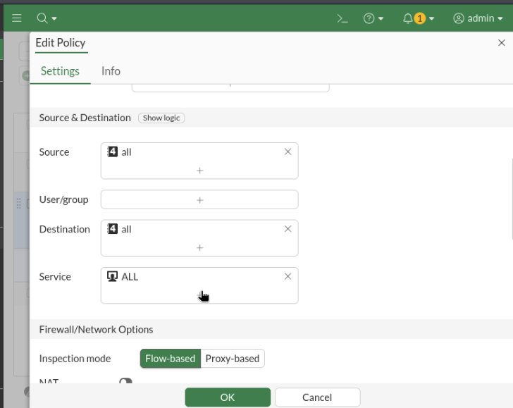

FortiGate uses the first matching policy. A broad unauthenticated allow policy can therefore bypass a narrower authentication intention if it matches first. The fix was to repurpose Policy ID `3` into the explicit authenticated policy instead of consuming a fourth policy unavailable under the evaluation license.

## 7. Create the identity and authorization objects

The local account password is intentionally omitted from the repository.

```fortios
config user local
    edit "lab-local-user"
        set type password
        set passwd <REDACTED>
    next
end

config user group
    edit "LAB-AUTH-USERS"
        set group-type firewall
        set member "lab-local-user"
    next
end
```

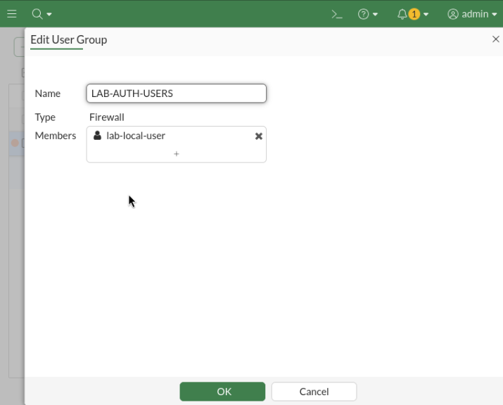

Address objects used by the policy:

| Object | Value | Purpose |
| --- | --- | --- |
| `KALI-CLIENT` | `10.10.10.100/32` | Fixed client identity condition |
| `ALPINE-LOOPBACK` | `10.60.60.100/32` | Protected routed destination |

## 8. Build the identity-aware firewall policy

Policy ID `3` was narrowed to the following final intent:

| Field | Final value |
| --- | --- |
| Name | `auth-lan-to-alpine` |
| Incoming interface | `LAB-LAN (port2)` |
| Outgoing interfaces | `R2-Port1 (port1)`, `TRANSIT-R1 (port3)` |
| Source | `KALI-CLIENT` |
| User/group | `LAB-AUTH-USERS` |
| Destination | `ALPINE-LOOPBACK` |
| Services | `HTTP`, `PING` |
| Action | `ACCEPT` |
| NAT | Disabled |
| Inspection | Flow-based |

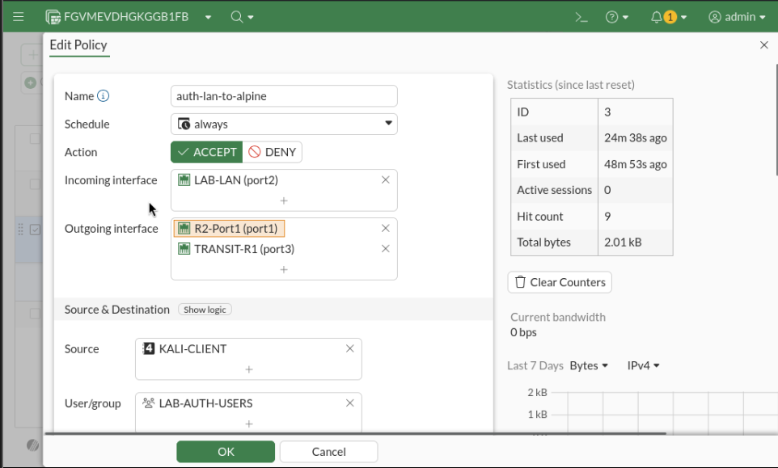

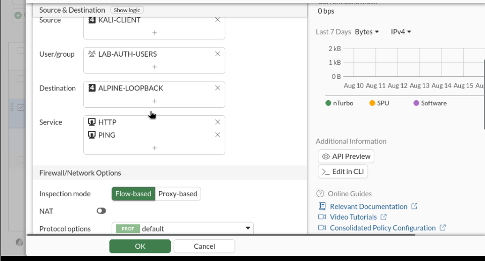

The two outgoing interfaces do not make the flow bidirectional. They allow route selection to choose either ECMP member for a new port2-originated session. Return packets are accepted because FortiGate is stateful; a new Alpine-initiated connection would still require its own matching policy.

## 9. Validate active authentication behavior

### 9.1 Before authentication

After clearing the old sessions and authentication state:

- PING from Kali to `10.60.60.100` received no replies.
- HTTP reached FortiGate, but FortiGate returned its authentication response instead of the Alpine page.

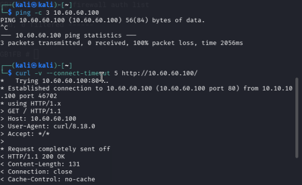

This is the expected result: the routing path exists, but the policy's user/group condition is not yet satisfied.

### 9.2 HTTP login and protected-resource access

Browsing to `http://10.60.60.100` redirected Kali to the FortiGate form portal at `10.10.10.1:1000/fgtauth...`.

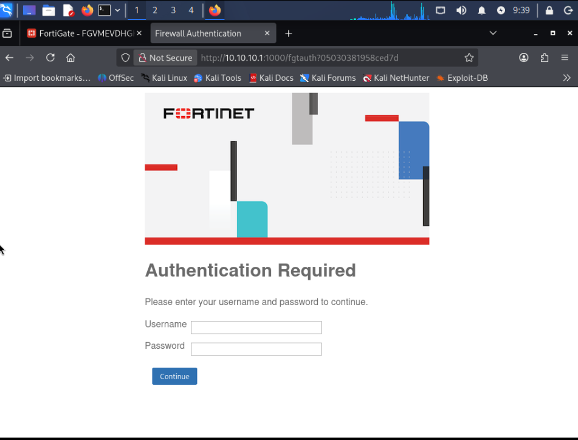

After `lab-local-user` authenticated successfully, FortiGate redirected the browser to the requested Alpine resource.

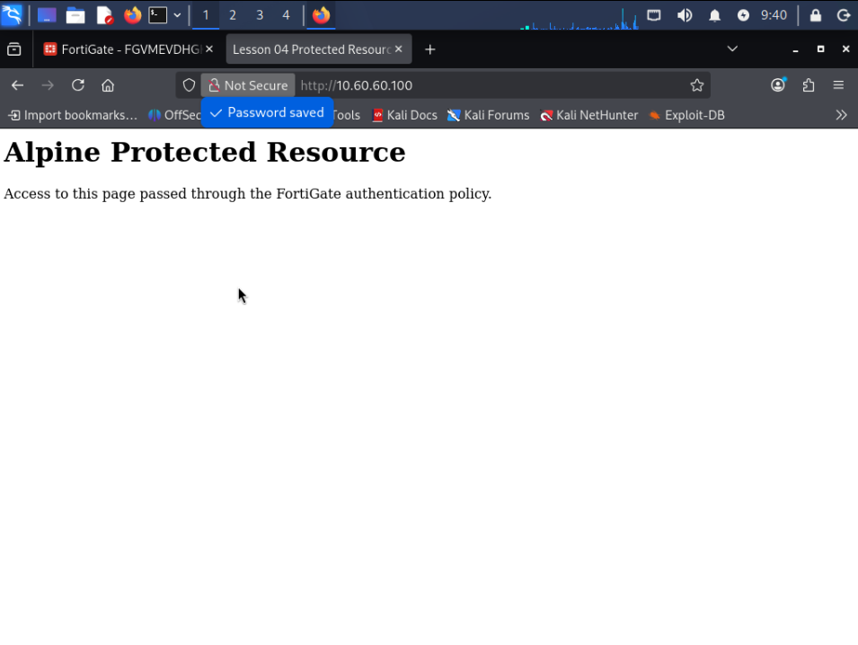

### 9.3 IP-to-user mapping and PING

The CLI displayed the authenticated identity, client address, group, duration, idle timer, and traffic counters:

```fortios
diagnose firewall auth list
```

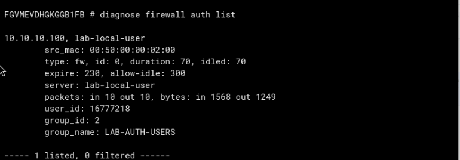

PING then succeeded from the same client:

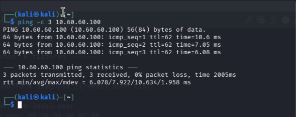

This does not mean ICMP authenticated the user. HTTP performed the interactive authentication; ICMP reused the resulting mapping for `10.10.10.100`.

## 10. Timeout and user monitoring

The global firewall-user timeout was five minutes with `idle-timeout` behavior. Traffic refreshed the idle timer. After five idle minutes, the mapping expired and the next HTTP request required login again.

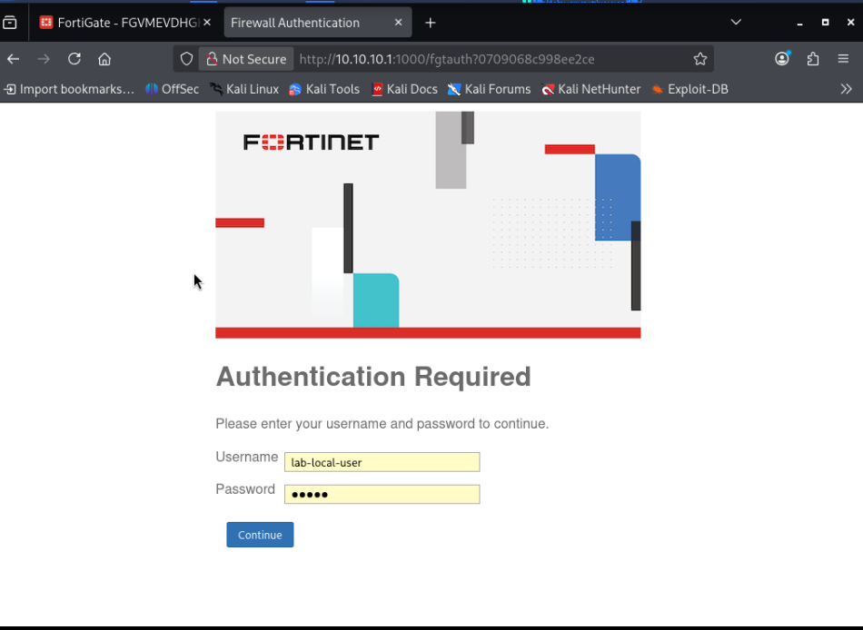

The GUI **Firewall User Monitor** showed the same state as the CLI table:

- username `lab-local-user`
- IP address `10.10.10.100`
- group `LAB-AUTH-USERS`
- method `Firewall`
- duration and traffic volume

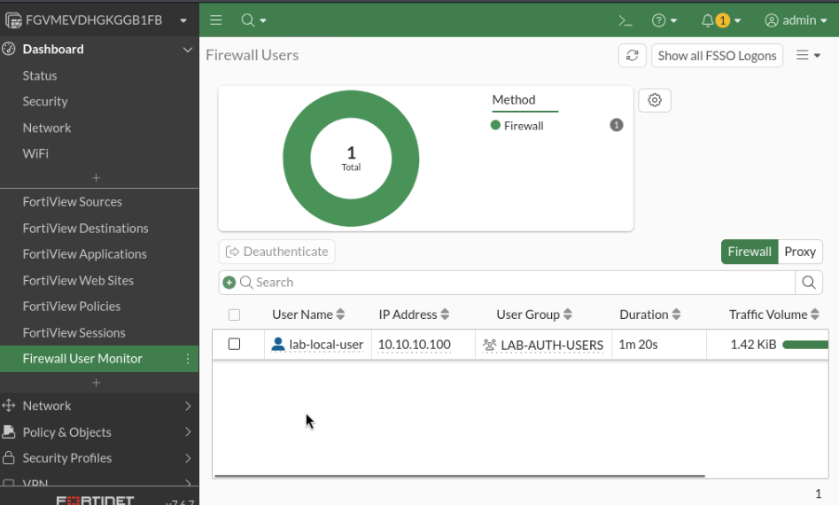

The GUI can also deauthenticate a selected user, which removes the current mapping without waiting for timeout.

## 11. Recorded active-authentication settings

The effective settings were captured with:

```fortios
show full-configuration user setting
```

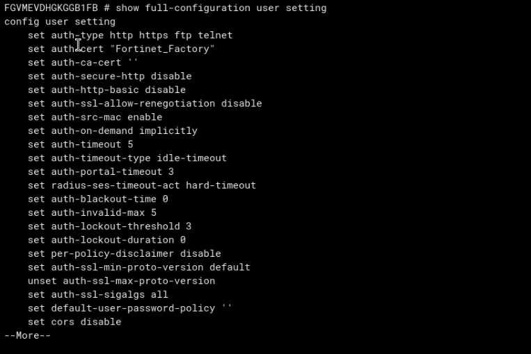

| Setting | Recorded value | Meaning in this lab |
| --- | --- | --- |
| `auth-type` | `http https ftp telnet` | Protocols capable of active authentication |
| `auth-on-demand` | `implicitly` | Policy-triggered authentication |
| `auth-timeout` | `5` | Five-minute authentication timeout |
| `auth-timeout-type` | `idle-timeout` | Expire after inactivity |
| `auth-portal-timeout` | `3` | Time allowed to complete portal login |
| `auth-http-basic` | `disable` | Use the HTML form rather than browser Basic Auth |
| `auth-secure-http` | `disable` | Final lab portal remains HTTP |
| `auth-cert` | `Fortinet_Factory` | Restored final certificate setting |

## 12. HTTPS portal: studied, tested, and rolled back

Conceptually, `auth-secure-http enable` redirects HTTP authentication to HTTPS port `1003`, protecting credentials in transit. A production design also needs a modern server certificate whose SAN matches the portal DNS name and whose issuing CA is trusted by clients.

The lab temporarily enabled the redirect. FortiGate correctly sent Kali to `https://10.10.10.1:1003`, but Firefox rejected the TLS handshake with `SSL_ERROR_NO_CYPHER_OVERLAP`. Changing from `Fortinet_Factory` to the available `Fortinet_GUI_Server` certificate produced the same result.

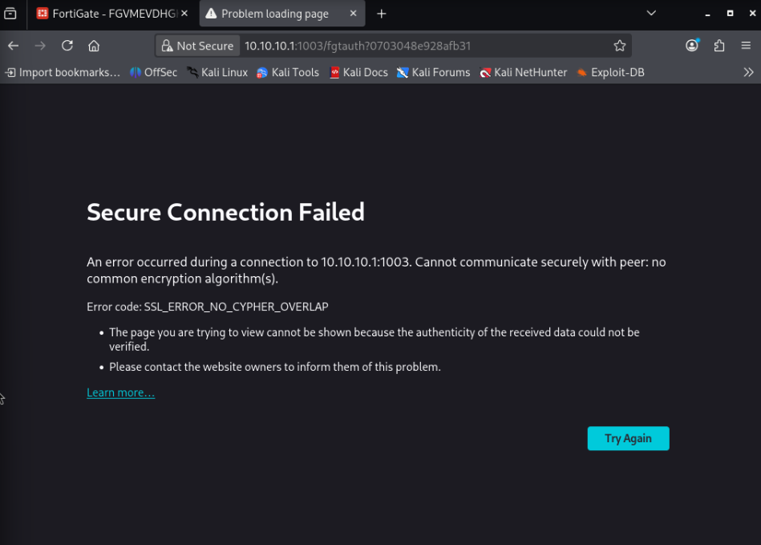

The browser's security level was not weakened. The experiment was rolled back to the original working state:

```fortios
config user setting
    set auth-cert "Fortinet_Factory"
    set auth-secure-http disable
end
```

No working HTTPS-portal implementation is claimed. HTTPS portal hardening remains theory only for this lesson.

## 13. Remote authentication theory

### 13.1 LDAP

LDAP organizes identity data as a directory tree. Important components are:

- `DC` - domain component, such as `DC=lab,DC=local`
- `OU` - organizational unit/container, such as `OU=Users`
- `CN` - common name of an entry, such as `CN=alice`
- `RDN` - the entry's name relative to its parent
- `DN` - the complete path, such as `CN=alice,OU=Users,DC=lab,DC=local`
- Base DN - where FortiGate begins searching
- bind account - the account FortiGate uses to search the directory

LDAP commonly uses TCP/389, while LDAPS commonly uses TCP/636. A production configuration should protect directory credentials with LDAPS or StartTLS and then map LDAP users/groups into a FortiGate firewall group.

A typical FortiGate LDAP exchange is: bind with the configured search account, search below the Base DN using the username attribute, obtain the user's full DN, and verify the submitted password. Group membership returned from the directory can then satisfy a FortiGate firewall-group condition.

The server object would define the LDAP server, Base DN, username attribute, bind DN/password, and transport security. A theoretical CLI query test is:

```fortios
diagnose test authserver ldap <server-name> <username> <password>
```

### 13.2 RADIUS

RADIUS is an AAA protocol rather than a browsable directory:

- **Authentication** verifies identity.
- **Authorization** returns permitted attributes/access information.
- **Accounting** records session activity.

FortiGate acts as the RADIUS client/NAS and sends an `Access-Request`. The server can return `Access-Accept`, `Access-Reject`, or `Access-Challenge`. Authentication commonly uses UDP/1812 and accounting UDP/1813. Both sides must share the same secret.

The FortiGate RADIUS object would define the server address, shared secret, and authentication method. A theoretical PAP query test is:

```fortios
diagnose test authserver radius <server-name> pap <username> <password>
```

RADIUS was intentionally not installed on Kali, Alpine, or Metasploitable. Its behavior is documented as theory only rather than claiming an unvalidated server-based deployment.

### 13.3 LDAP versus RADIUS

| LDAP | RADIUS |
| --- | --- |
| Directory access and search | AAA request/response protocol |
| Hierarchical entries and attributes | Access decisions and returned attributes |
| FortiGate can search users/groups | FortiGate sends authentication requests |
| TCP/389 or secured TCP/636 | UDP/1812 and optionally UDP/1813 |

## 14. Other theory-only authentication methods

- **Two-factor authentication:** combines a password with an independent factor, reducing the value of a stolen password.
- **FortiToken:** Fortinet's OTP mechanism; a token is assigned to a user and supplies the second factor.
- **Passive authentication/FSSO:** learns user logons from directory infrastructure so users are not prompted repeatedly by FortiGate.
- **Mixing authenticated and unauthenticated policies:** order remains critical because the first complete policy match determines the action. A broad unauthenticated policy placed first can bypass an authenticated policy.

These concepts were understood without forced configuration because they would require additional identity infrastructure, licensing, or duplicate behavior beyond the lesson's local-authentication objective.

## 15. Verification matrix

| Test | Expected result | Observed |
| --- | --- | --- |
| Alpine listens on `10.60.60.100:80` | HTTP service available | Pass |
| Kali HTTP under broad old policy | Resource opens without login | Pass; exposed policy issue |
| Unauthenticated Kali PING | Blocked | Pass |
| Unauthenticated Kali HTTP | FortiGate portal response | Pass |
| Valid local user login | Redirect to Alpine resource | Pass |
| Post-login PING | Allowed using active mapping | Pass |
| `diagnose firewall auth list` | User/IP/group visible | Pass |
| GUI Firewall User Monitor | Same authenticated identity visible | Pass |
| Five minutes idle | Reauthentication required | Pass |
| HTTPS portal | Compatible encrypted portal | Not achieved; rolled back |
| LDAP/RADIUS | Server-based authentication | Theory only |

## 16. Final validated state

- Alpine remains outside `LAB-LAN` and serves HTTP on `10.60.60.100:80`.
- Kali remains `10.10.10.100` on `LAB-LAN`.
- Policy ID `3` is `auth-lan-to-alpine`.
- Both `KALI-CLIENT` and `LAB-AUTH-USERS` must match.
- Only `HTTP` and `PING` to `ALPINE-LOOPBACK` are permitted by this policy.
- Either port1/R2 or port3/R1 can be selected as ECMP egress.
- NAT remains disabled.
- Authentication uses the local user database and a five-minute idle timeout.
- The final portal is HTTP in this isolated lab; HTTPS is not claimed as implemented.

## 17. Persistence and security notes

- Alpine's live `ip` configuration and Python process may not survive a reboot; restore the Lesson 03 network state and restart the service when required.
- Cisco router configurations must remain saved to startup configuration.
- Never commit the local user's password, authentication cookies, private keys, certificate private material, or a raw FortiGate backup.
- HTTP authentication exposes credentials in transit and is acceptable only for this isolated demonstration. A real deployment must use a trusted HTTPS portal.

## 18. Engineering takeaways

1. Identity is an additional policy match condition; it does not replace source, destination, service, routing, or session state.
2. A broad earlier policy can silently bypass an authentication design.
3. Web traffic can trigger active authentication; noninteractive protocols can only reuse an existing mapping.
4. The authenticated mapping is associated with the client identity/IP and has an explicit lifetime.
5. GUI monitoring and CLI diagnostics should describe the same user state.
6. Remote authentication protocols solve different problems: LDAP provides directory search; RADIUS provides AAA exchanges.
7. A failed optional hardening experiment should be rolled back and documented honestly rather than converted into a false implementation claim.

## 19. Evidence

See [`evidence/README.md`](evidence/README.md) for the curated evidence index. The evidence set intentionally excludes passwords, private keys, license material, and redundant screenshots.
