# Lesson 05 - Antivirus and Inspection Modes

This lesson adds content inspection to the authenticated HTTP path built in Lesson 04. Kali remains the authenticated client, Alpine remains the routed server, and Policy ID `3` remains the authorization point. The new variable is the security profile applied after the policy accepts the session.

The lab uses the harmless, industry-standard EICAR test string as a positive antivirus control and an ordinary text file as a negative control. It then compares flow-based and proxy-based inspection, correlates the client outcome with FortiGate logs, and validates oversized-file and compressed-archive handling.

> Safety and implementation boundary: EICAR is not malware, but security products intentionally detect it. No live malware was used. Signature detection, inspection modes, protocol options, logging, and archive inspection were implemented. FortiSandbox, current FortiGuard services, EMS threat feeds, external malware block lists, and production TLS inspection remain theory only.

## 1. Scope

### Objective

Prove that an identity-aware firewall policy can authorize an HTTP session while an attached antivirus profile independently blocks malicious content within that allowed session.

### Implemented and validated

- restoration of Alpine's volatile dual-path network and HTTP service state
- AV engine/signature readiness check
- harmless `benign.txt` and 68-byte EICAR test artifacts
- pre-AV baseline in which both files downloaded successfully
- flow-based AV profile and data-plane test
- proxy-based AV profile and data-plane test
- FortiGate antivirus block page
- AV-event and Forward Traffic log correlation
- deliberately low oversized-file threshold using a custom Protocol Options profile
- flow and proxy behavior when the file exceeded that threshold
- benign ZIP negative control and EICAR ZIP positive control

### Theory only

- production-current FortiGuard signature coverage
- grayware policy selection beyond the default lab behavior
- AI/heuristic detection claims against unknown malware
- Virus Outbreak Prevention cloud verdicts
- external malware block lists and EMS threat feeds
- FortiSandbox submission and verdict handling
- HTTPS content inspection with a trusted deep-inspection CA
- legacy full-file AV mode as a deployed final state

## 2. Methodology and design intent

Lesson 05 keeps the repository's cumulative methodology:

1. Restore and prove the inherited route, policy, identity, and application state before adding AV.
2. Keep the client, server, URL, policy, and authentication identity constant.
3. Use a benign negative control and a known-detectable positive control.
4. Establish a pre-control baseline before enabling the security profile.
5. Change one inspection variable at a time.
6. Prove the result from Kali and then explain it with FortiGate security/traffic logs.
7. Distinguish policy acceptance from UTM/content denial.
8. Preserve evaluation and signature-age limitations instead of implying production readiness.

The intended security chain is:

```text
route exists
  -> Policy ID 3 matches source, user group, destination, and HTTP
  -> session is accepted
  -> AV inspects the allowed HTTP content
  -> benign content passes or detected content is blocked
```

This distinction matters: the firewall policy protects **who may communicate with what**, while antivirus protects **what content may cross an otherwise permitted session**.

## 3. Starting state and volatile recovery

The topology did not change from Lesson 04:

| Component | Address / role |
| --- | --- |
| Kali | `10.10.10.100/24`; authenticated client on `LAB-LAN` |
| FortiGate port2 | `10.10.10.1/24`; `LAB-LAN` ingress |
| FortiGate port3 / R1 | lower ECMP path through `10.30.30.2` and Alpine eth1 |
| FortiGate port1 / R2 | upper ECMP path through `10.50.50.2` and Alpine eth2 |
| Alpine eth1 | `10.20.20.100/24` |
| Alpine eth2 | `10.40.40.100/24` |
| Alpine loopback | `10.60.60.100/32`; shared HTTP destination |
| Policy ID `3` | `auth-lan-to-alpine`; `KALI-CLIENT` + `LAB-AUTH-USERS`; HTTP/PING; NAT disabled |

Alpine's live addresses, routes, and process state are volatile. The following recovery commands represent the Lesson 05 start state:

```sh
ip link set eth1 up
ip addr add 10.20.20.100/24 dev eth1

ip link set eth2 up
ip addr add 10.40.40.100/24 dev eth2

ip link set lo up
ip addr add 10.60.60.100/32 dev lo

ip route replace 10.30.30.0/24 via 10.20.20.1 dev eth1
ip route replace 10.50.50.0/24 via 10.40.40.1 dev eth2
ip route replace 10.10.10.0/24 \
  nexthop via 10.20.20.1 dev eth1 weight 1 \
  nexthop via 10.40.40.1 dev eth2 weight 1
```

The existing Python service was then confirmed/restarted on the loopback:

```sh
nohup python3 -m http.server 80 \
  --bind 10.60.60.100 \
  --directory /var/www/lesson04 \
  >/tmp/lesson04-http.log 2>&1 &

ss -lntp | grep ':80'
wget -qO- http://10.60.60.100/
```

FortiGate could reach `10.60.60.100`, and Kali could reach it after active authentication. This prevented a missing route, expired user mapping, or stopped server from being misdiagnosed as antivirus behavior.

## 4. Inspection terminology tied to the lab

### 4.1 Policy inspection architecture

| Mode | Processing model | Practical effect observed |
| --- | --- | --- |
| Flow-based | Inspects traffic while the original client/server stream passes through FortiGate | Lower buffering/latency; FortiGate could reset an in-progress transfer after a detection or limit was reached |
| Proxy-based | FortiGate acts as an application-layer intermediary between two connection sides | FortiGate could withhold/replace the server response and return its own `403 Forbidden`/block page |

Flow versus proxy describes the **policy/session processing architecture**.

### 4.2 Antivirus scan behavior

Stream-based versus legacy describes **how AV handles file content**:

- **Stream-based AV** scans successive chunks and is the normal/default behavior used by the profiles in this lesson.
- **Legacy AV** is a proxy-only option that buffers a complete file before releasing it. It provides a different delivery model at the cost of memory, latency, and scalability.

The proxy profile's recorded full configuration showed:

```fortios
set scan-mode default
```

Therefore, proxy mode in this lab did not mean legacy full-file AV. It used proxy inspection architecture with the default stream-scanning behavior.

### 4.3 Antivirus techniques

| Technique | Purpose | Lab status |
| --- | --- | --- |
| Signature detection | Matches content against known malware patterns | Implemented with `EICAR_TEST_FILE` |
| Grayware detection | Identifies potentially unwanted or risky software that may not be a traditional virus | Studied; no separate artifact installed |
| AI/heuristic analysis | Uses characteristics/models to identify suspicious or previously unknown content | Theory only; no unknown-malware claim |
| Virus Outbreak Prevention | Uses rapid cloud-assisted verdicts for emerging threats | Theory only; requires applicable FortiGuard service |
| External malware block list | Blocks content identified by an administrator-supplied threat list | Theory only |
| EMS threat feed | Uses endpoint telemetry/intelligence supplied by FortiClient EMS | Theory only; no EMS server |
| FortiSandbox | Submits supported content for deeper analysis | Theory only; logs showed submission `false` |

## 5. Verify AV readiness and limitations

The FortiGate database state was recorded before testing:

```fortios
diagnose autoupdate versions
```

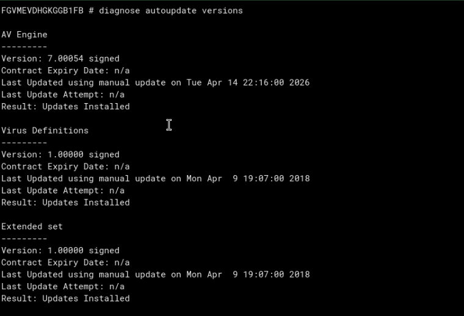

Observed state:

| Component | Observed value | Interpretation |
| --- | --- | --- |
| AV Engine | `7.00054`, signed | Engine present and usable for controlled testing |
| Virus Definitions | `1.00000`, signed, dated 2018 | Base/old definitions, not current production coverage |
| Extended set | `1.00000`, signed, dated 2018 | Present but old |
| Contract | `n/a` | Evaluation has no subscribed FortiGuard service |

The EICAR signature is sufficient for this deterministic lab, but the results must not be represented as proof of protection against current real-world malware.

## 6. Build safe positive and negative controls

On Alpine:

```sh
printf '%s\n' 'Lesson 05 harmless control file.' \
  > /var/www/lesson04/benign.txt

EICAR_PART1='X5O!P%@AP[4\PZX54(P^)7CC)7}$EICAR-STANDARD-'
EICAR_PART2='ANTIVIRUS-TEST-FILE!$H+H*'
printf '%s%s' "$EICAR_PART1" "$EICAR_PART2" \
  > /var/www/lesson04/eicar.com.txt
unset EICAR_PART1 EICAR_PART2

ls -l /var/www/lesson04
wc -c /var/www/lesson04/eicar.com.txt
```

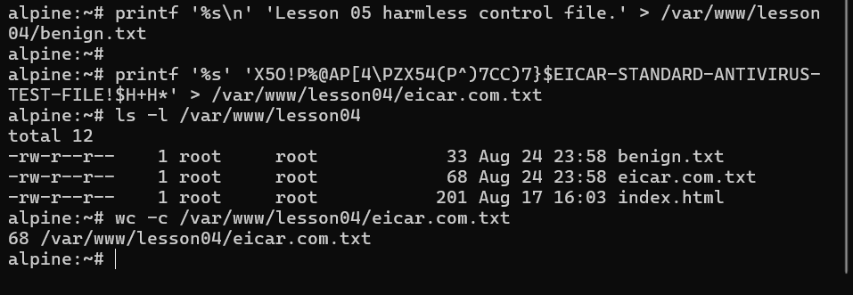

| Artifact | Size | SHA-256 | Role |
| --- | ---: | --- | --- |
| `benign.txt` | 33 bytes | `faa50486471b5958a718d6bdb16e113a5dcc8d26c84f876ed43a3ea3ef88ca7a` | Negative control |
| `eicar.com.txt` | 68 bytes | `275a021bbfb6489e54d471899f7db9d1663fc695ec2fe2a2c4538aabf651fd0f` | Positive AV control |

The 68-byte check verifies that shell quoting did not alter the canonical test string. File size is not what makes EICAR malicious; exact content is what allows signature detection.

The repository stores only the benign sample. See [`lab-files/README.md`](lab-files/README.md) for safe reproduction. The EICAR and derived ZIP artifacts are intentionally not committed because local endpoint security may quarantine them.

## 7. Establish the pre-AV baseline

After authenticating through HTTP, Kali downloaded both files while no AV profile was attached:

```sh
wget -O /tmp/benign-before-av.txt \
  http://10.60.60.100/benign.txt

wget -O /tmp/eicar-before-av.txt \
  http://10.60.60.100/eicar.com.txt
```

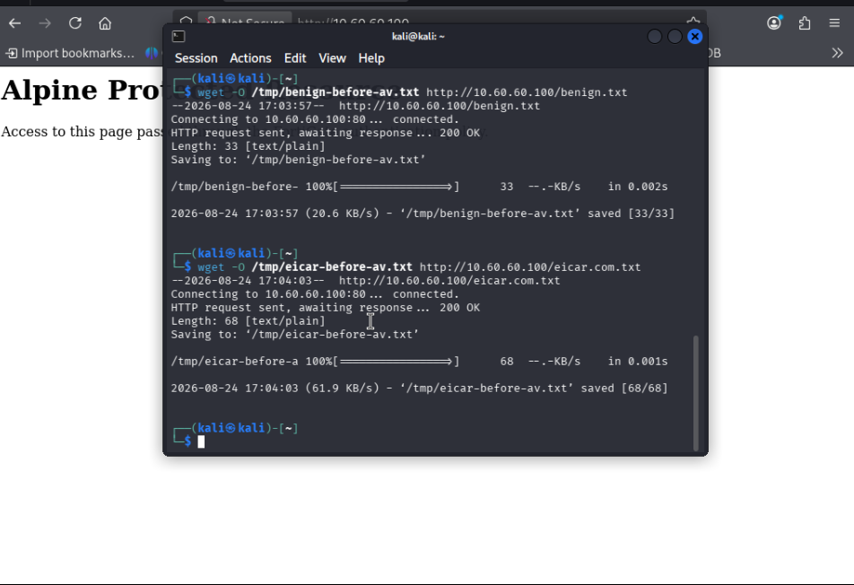

Observed results:

- `benign.txt`: HTTP `200`, `33/33` bytes
- `eicar.com.txt`: HTTP `200`, `68/68` bytes

Earlier 131-byte `text/html` downloads were FortiGate authentication responses after the five-minute identity mapping expired, not the requested files. Reauthenticating and verifying the expected byte counts corrected the baseline.

## 8. Flow-based antivirus

### 8.1 Profile and policy state

Profile `L05-AV-FLOW`:

| Setting | Value |
| --- | --- |
| Antivirus scan | Enabled |
| Action | Block |
| Feature set | Flow-based |
| Inspected protocol | HTTP enabled |
| Unused lesson protocols | Left disabled/default |

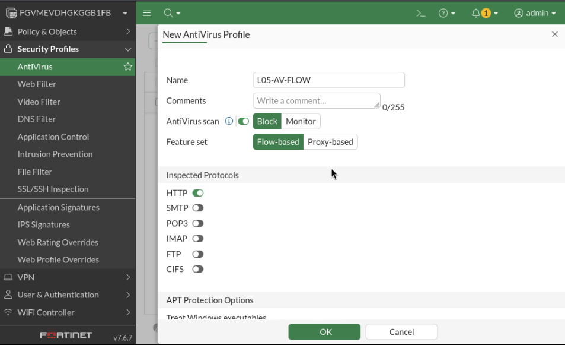

Policy ID `3` remained the same identity-aware rule. Only its inspection/security-profile state changed:

- inspection mode `Flow-based`
- antivirus `L05-AV-FLOW`
- protocol options `default`
- NAT disabled
- SSL inspection `no-inspection` because the test service used plain HTTP

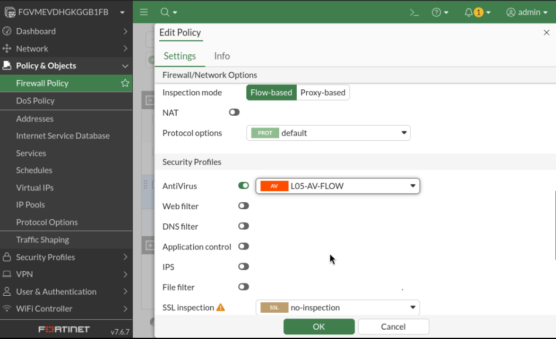

### 8.2 Result

```sh
wget -O /tmp/benign-after-av.txt \
  http://10.60.60.100/benign.txt

wget -O /tmp/eicar-after-av.txt \
  http://10.60.60.100/eicar.com.txt
```

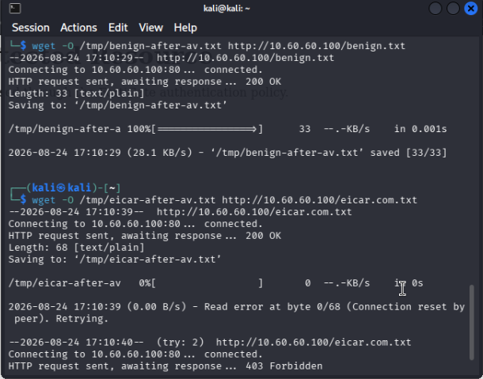

- benign file: HTTP `200`, `33/33` bytes
- EICAR request: Alpine's HTTP response began, FortiGate detected the signature, reset the transfer, and a retry received `403 Forbidden`
- Wget reported `0/68` file bytes, so no EICAR payload was written successfully

The first `200 OK` came from Alpine. It does not mean FortiGate approved the file. In flow mode, server response processing had begun before the security engine terminated the stream.

## 9. Proxy-based antivirus

Profile `L05-AV-PROXY` used the same security intent with a different feature set:

| Setting | Value |
| --- | --- |
| Antivirus scan | Enabled |
| Action | Block |
| Feature set | Proxy-based |
| Inspected protocol | HTTP enabled |
| AV scan mode | `default` stream behavior |

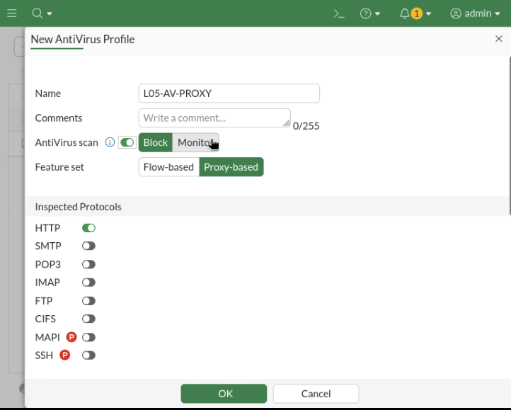

Policy ID `3` was temporarily switched to proxy inspection and attached to `L05-AV-PROXY`.

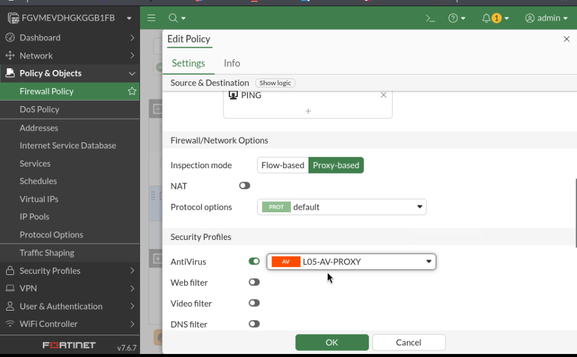

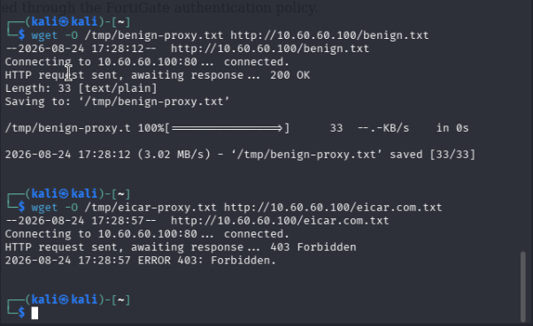

The benign file still passed. The EICAR request received `403 Forbidden` immediately, and the browser displayed FortiGate's replacement page:

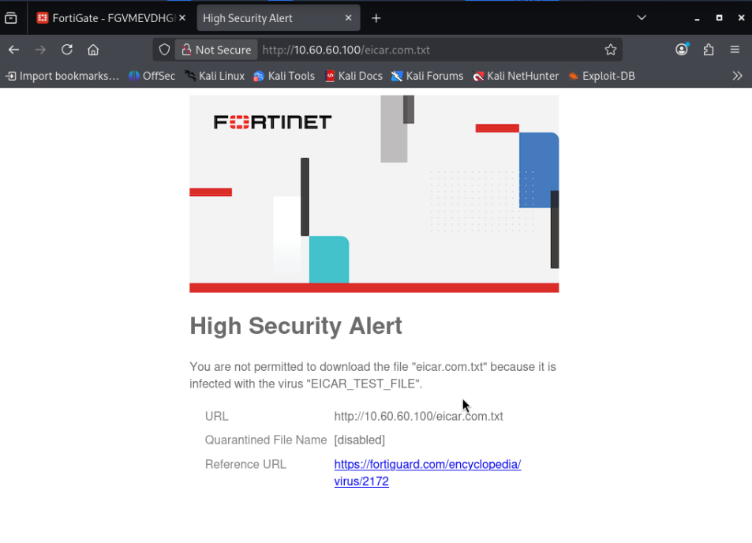

The control itself did not change; the delivery architecture did. Proxy inspection could present a FortiGate-generated denial rather than exposing the original server response to the client.

## 10. Logs explain the enforcement decision

The antivirus event identified:

- event type `infected`
- file `eicar.com.txt`
- infection type `Malicious`
- profile `L05-AV-FLOW` in the captured flow event
- detection type `cached`
- FortiSandbox submission `false`

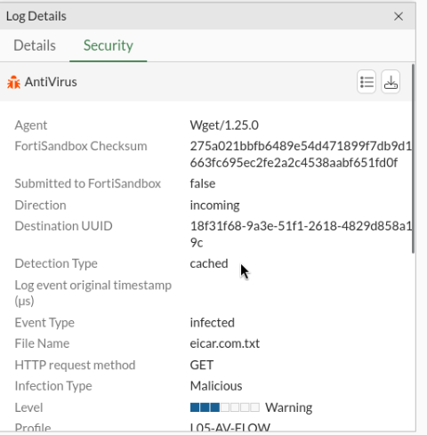

`Detection Type: cached` means FortiGate reused a previously calculated AV result for the same content. It does not refer to the browser cache.

Forward Traffic details correlated the same security result with the inherited controls:

- source `10.10.10.100`
- user `lab-local-user`
- group `LAB-AUTH-USERS`
- ingress `LAB-LAN (port2)`
- destination `10.60.60.100:80`
- egress `TRANSIT-R1 (port3)` for this source/session
- NAT `noop`
- HTTP application

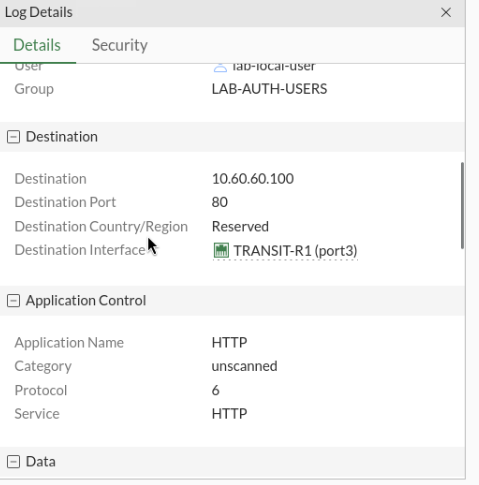

This proves that the route, ECMP member, authenticated identity, and Policy ID `3` allowed the connection. The later UTM verdict blocked the content. A UTM deny is therefore not the same as a firewall-policy deny.

## 11. Protocol Options: oversized files

FortiGate has finite resources for buffering and scanning. An oversized-file limit answers what to do when complete inspection would exceed the configured threshold:

- logging records the event but does not block by itself;
- blocking rejects the object after it reaches/exceeds the threshold;
- allowing an oversized object can mean it passes without complete AV inspection.

### 11.1 Baseline

A harmless 2 MiB file was created on Alpine:

```sh
dd if=/dev/zero \
  of=/var/www/lesson04/large-benign.bin \
  bs=1M count=2

wc -c /var/www/lesson04/large-benign.bin
```

Kali received all `2,097,152` bytes with the default Protocol Options profile:

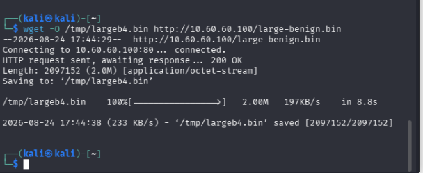

### 11.2 Deliberately restrictive test profile

Custom profile `L05-PROTO-1MB` used:

| Setting | Value | Security purpose |
| --- | --- | --- |
| Log Oversized Files | Enabled | Create an auditable event |
| HTTP mapping | TCP/80 | Apply correct HTTP parsing to the lab service |
| Block Oversized File/Email | Enabled | Prevent content from bypassing full inspection |
| Threshold | `1 MB` | Intentionally below the 2 MiB control file |
| Comfort Clients | Disabled | Avoid unrelated pacing behavior |
| Chunked Bypass | Disabled | Do not exempt chunked HTTP content |

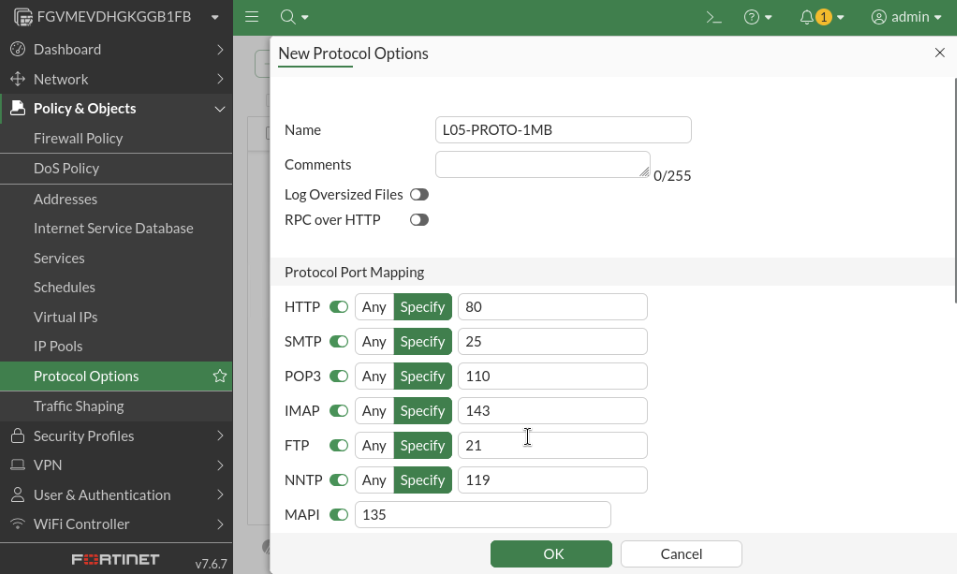

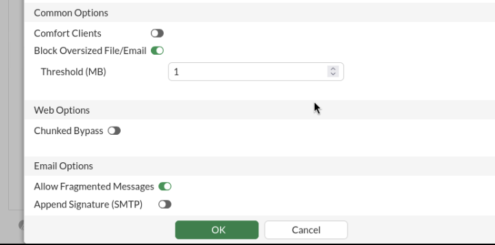

### 11.3 Observed flow and proxy outcomes

With flow inspection, Wget received approximately 1 MiB and then the connection was reset:

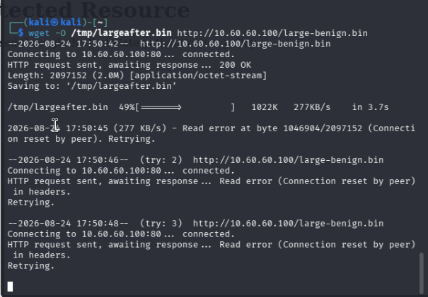

With proxy inspection, the same request received a FortiGate-generated `403 Forbidden` before the file was delivered:

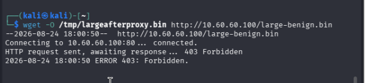

The security event recorded `Event Type: oversize`, file `large-benign.bin`, and profile `L05-PROTO-1MB`:

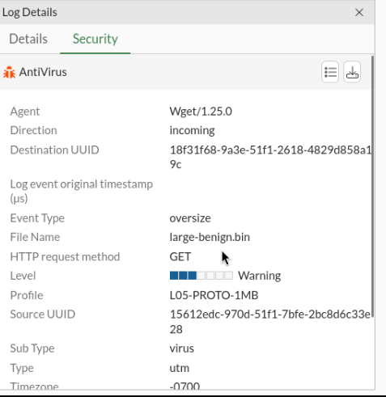

Although the event appears under the Antivirus/UTM log family, the file was not infected. `Event Type: oversize` is the reason it was blocked.

## 12. Protocol Options: compressed archives

Two small ZIP controls were created without installing another package:

```sh
cd /var/www/lesson04
python3 -m zipfile -c benign.zip benign.txt
python3 -m zipfile -c eicar.zip eicar.com.txt

python3 -m zipfile -l benign.zip
python3 -m zipfile -l eicar.zip
```

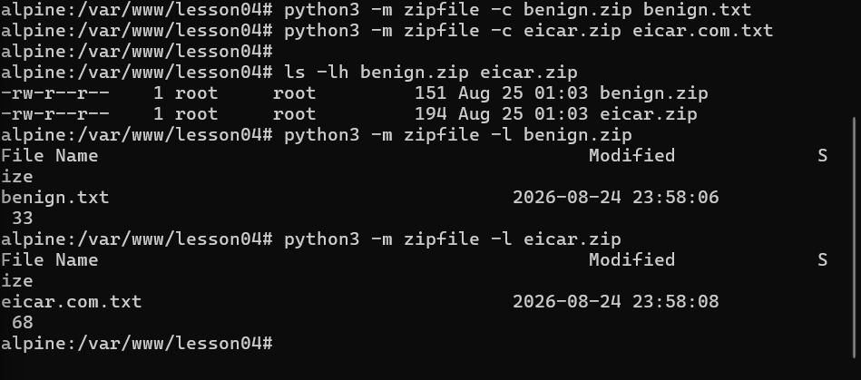

Both archives were below 1 MiB, so the oversized-file control could not explain either outcome:

```sh
wget -t 1 -O /tmp/benign-av.zip \
  http://10.60.60.100/benign.zip

wget -t 1 -O /tmp/eicar-av.zip \
  http://10.60.60.100/eicar.zip
```

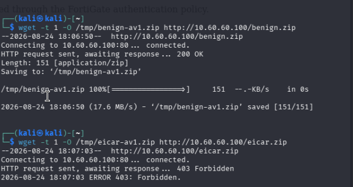

- `benign.zip`: HTTP `200`, `151/151` bytes
- `eicar.zip`: `403 Forbidden`

The paired result proves content-aware archive inspection: FortiGate did not block all ZIP files, but it decompressed/inspected the EICAR archive and denied the detected content.

## 13. Troubleshooting matrix

| Symptom | Likely cause | Verification/correction |
| --- | --- | --- |
| PING/HTTP fails before AV testing | Alpine volatile addresses/routes or server process missing | Restore interface/route state; verify listener and FortiGate-local ping |
| Small HTML file downloaded instead of requested artifact | Authentication mapping expired | Inspect content/type, reauthenticate in browser, verify expected byte count |
| EICAR downloads successfully | AV profile not attached, wrong policy match, wrong protocol enabled, or unusable signatures | Check Policy ID `3`, AV profile, HTTP toggle, `diagnose autoupdate versions`, and logs |
| HTTPS malware passes | FortiGate cannot see encrypted payload with `no-inspection` | Use properly deployed certificate/deep inspection; not implemented here |
| Large harmless file blocked | Custom `L05-PROTO-1MB` profile still attached | Check `Event Type: oversize`; restore `default` for normal continuation |
| ZIP behavior differs from raw file | Archive depth/size/format or protocol-option limits | Compare benign ZIP, EICAR ZIP, size limits, and AV event fields |
| Policy log says accept but client sees denial | Policy authorized the session; UTM later blocked content | Correlate Forward Traffic and Antivirus logs |
| Proxy profile expected to buffer entire file | Proxy architecture confused with legacy AV mode | Check `scan-mode`; `default` is not a claim of legacy full-file buffering |

## 14. Verification matrix

| Test | Expected | Observed |
| --- | --- | --- |
| AV engine/signature query | Signed engine/database present | Pass; definitions old |
| Pre-AV benign file | Full download | Pass |
| Pre-AV EICAR file | Full download | Pass |
| Flow AV benign file | Full download | Pass |
| Flow AV EICAR file | Block/reset | Pass |
| Proxy AV benign file | Full download | Pass |
| Proxy AV EICAR file | FortiGate denial/block page | Pass |
| AV security log | EICAR/file/profile visible | Pass |
| Forward Traffic log | User, policy path, and selected ECMP egress visible | Pass |
| Default Protocol Options, 2 MiB benign file | Full download | Pass |
| 1 MiB blocking profile, 2 MiB file | Oversize denial | Pass in flow and proxy states |
| Benign ZIP | Full download | Pass |
| EICAR ZIP | AV denial | Pass |
| FortiSandbox/current cloud services | Cloud verdict/submission | Theory only / unavailable |

## 15. Final state and continuation boundary

The last fully evidenced test checkpoint used:

- Policy ID `3`, `auth-lan-to-alpine`
- proxy-based policy inspection
- AV profile `L05-AV-PROXY`
- Protocol Options profile `L05-PROTO-1MB`
- NAT disabled
- HTTP service on `10.60.60.100:80`

That 1 MiB threshold was intentionally artificial. Before continuing to another lesson, the recommended operational cleanup is:

1. return Protocol Options to `default`;
2. use flow-based inspection with `L05-AV-FLOW` on the constrained `1 vCPU / 2 GiB` evaluation VM;
3. retain `L05-AV-PROXY` and `L05-PROTO-1MB` as validated lesson objects, but leave the restrictive test profile unattached.

The repository records this as a recommendation rather than claiming an uncaptured saved state.

## 16. Persistence, safety, and sanitization

- Alpine's addresses, multipath routes, generated files, and Python HTTP process may require restoration after reboot.
- EICAR is harmless, but local security software can quarantine it. Generate it only inside the isolated lab and delete it when no longer needed.
- Do not substitute live malware for EICAR.
- The old base definitions prove deterministic EICAR handling only, not current threat coverage.
- Plain HTTP made payload inspection observable. A production HTTPS deployment requires trusted deep inspection and careful privacy/legal scoping.
- Never commit credentials, cookies, raw configuration backups, license material, private keys, EICAR artifacts, or captured user data.

## 17. Engineering takeaways

1. Policy acceptance and antivirus enforcement are separate decisions in one session.
2. A benign and malicious pair is stronger evidence than a malicious sample alone.
3. Flow and proxy inspection can reach the same security verdict while producing different client-visible behavior.
4. Proxy-based inspection does not automatically mean legacy full-file AV.
5. Protocol Options define inspection boundaries; an oversized denial does not mean the file is malware.
6. Archive inspection must be proven with both a benign archive and an infected archive.
7. Security events explain the content verdict; Forward Traffic logs explain identity, policy, NAT, and path context.
8. Evaluation-license and outdated-signature limitations must remain part of the conclusion.

## 18. Evidence

See [`evidence/README.md`](evidence/README.md) for the curated evidence index. The directory contains configuration, data-plane, security-event, and troubleshooting proof while excluding secrets and the EICAR artifacts themselves.
