# Lesson 06 - Web Filtering

Lesson 06 adds URL-aware access control to the authenticated and antivirus-inspected HTTP path built in Lessons 04 and 05. Kali remains the authenticated client, Alpine remains the routed server, and Policy ID `3` remains the single authorization and security-profile attachment point.

The implementation uses a local static URL filter because it is deterministic and does not require a FortiGuard subscription. Three harmless pages provide an unmatched allow control, an explicitly monitored URL, and an explicitly blocked URL. The same decisions are validated with flow-based and proxy-based profiles, then explained through Web Filter logs.

> Implementation boundary: local HTTP URL filtering, flow/proxy profiles, Block, Monitor, replacement pages, logging, and troubleshooting were implemented. FortiGuard category filtering and its category actions, web rating overrides, SSL certificate inspection, HTTPS deep inspection, and HTTPS inspection order remain theory only under the evaluation environment.

## 1. Scope

### Objective

Prove that Policy ID `3` can authorize an authenticated HTTP session while an attached Web Filter profile independently allows, logs, or blocks a requested URL.

### Implemented and validated

- recovery of Alpine's volatile dual-path addresses, return ECMP, loopback, and HTTP listener
- cleanup of the intentionally restrictive Lesson 05 Protocol Options state
- harmless `allowed.html`, `monitored.html`, and `blocked.html` controls
- flow-based profile `L06-WF-FLOW`
- proxy-based profile `L06-WF-PROXY`
- local static URL actions `Block` and `Monitor`
- an unmatched allowed negative control
- FortiGate replacement page for the blocked URL
- Web Filter event correlation with `lab-local-user`
- exact-URL troubleshooting for `/lesson6/` versus `/lesson06/`
- FortiGuard rating-service status checks

### Theory only

- SSL certificate inspection configuration
- HTTPS deep inspection and trusted-CA deployment
- HTTPS inspection order beyond conceptual analysis
- FortiGuard category filtering
- category actions `Allow`, `Block`, `Monitor`, `Warning`, `Authenticate`, and `Quota`
- web rating overrides and custom category enforcement
- production FortiGuard connectivity remediation

## 2. Methodology and design intent

The course is used as a curriculum, not as a checklist of screens. Lesson 06 follows the repository's cumulative method:

1. Restore and validate the inherited network and application state.
2. Remove the deliberately restrictive Lesson 05 test setting before blaming a new control.
3. Use local, harmless, deterministic URLs instead of depending on changing public sites.
4. Keep the client, server, identity, route, policy, and antivirus intent constant.
5. Add the Web Filter as the new variable.
6. Use an allow control, a monitor control, and a block control.
7. Compare flow and proxy profiles with identical rules and requests.
8. Correlate client behavior with the FortiGate URL-filter event.
9. Preserve a useful failure when it teaches how matching actually works.
10. Label subscription- and TLS-dependent features as theory instead of simulating them without meaningful proof.

The resulting decision chain is:

```text
route to 10.60.60.100 exists
  -> Policy ID 3 matches source, authenticated group, destination, and HTTP
  -> firewall policy accepts the session
  -> antivirus inspects allowed HTTP content
  -> Web Filter evaluates the requested URL
  -> unmatched URL passes, Monitor passes and logs, or Block denies
```

Authentication still answers **who the user is**. Policy ID `3` still answers **whether that identity may reach the server**. Web Filtering adds **which web resource that authorized session may request**.

## 3. Starting state and recovery

### 3.1 Inherited topology

| Component | Address / role |
| --- | --- |
| Kali | `10.10.10.100/24`; authenticated client on `LAB-LAN` |
| FortiGate port2 | `10.10.10.1/24`; policy ingress and management path |
| FortiGate port3 / R1 | lower ECMP member through next hop `10.30.30.2` |
| FortiGate port1 / R2 | upper ECMP member through next hop `10.50.50.2` |
| Alpine eth1 | `10.20.20.100/24` |
| Alpine eth2 | `10.40.40.100/24` |
| Alpine loopback | `10.60.60.100/32`; shared HTTP destination |
| Policy ID `3` | `auth-lan-to-alpine`; `KALI-CLIENT` plus `LAB-AUTH-USERS`; HTTP/PING; NAT disabled |

Alpine rebooted with only its separate DHCP-connected `eth0`. Both lab interfaces were down, the loopback address and routes were absent, and nothing listened on TCP/80.

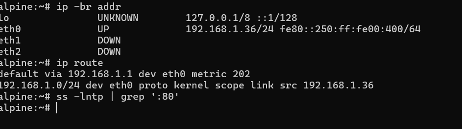

The live network was restored without changing `eth0` or its default route:

```sh
ip link set eth1 up
ip addr replace 10.20.20.100/24 dev eth1

ip link set eth2 up
ip addr replace 10.40.40.100/24 dev eth2

ip link set lo up
ip addr replace 10.60.60.100/32 dev lo

ip route replace 10.30.30.0/24 via 10.20.20.1 dev eth1
ip route replace 10.50.50.0/24 via 10.40.40.1 dev eth2
ip route replace 10.10.10.0/24 \
  nexthop via 10.20.20.1 dev eth1 weight 1 \
  nexthop via 10.40.40.1 dev eth2 weight 1
```

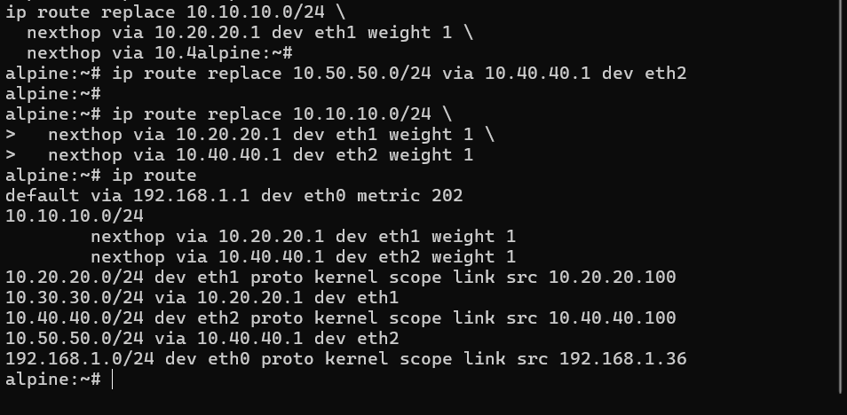

The inherited Python HTTP service was restarted on `10.60.60.100:80`.

```sh
nohup python3 -m http.server 80 \
  --bind 10.60.60.100 \
  --directory /var/www/lesson04 \
  >/tmp/lesson04-http.log 2>&1 &

ss -lntp | grep ':80'
```

### 3.2 Normalize the Lesson 05 policy

The last captured Lesson 05 experiment used proxy inspection with `L05-AV-PROXY` and the deliberately restrictive `L05-PROTO-1MB` profile. Before starting Web Filtering, Policy ID `3` was returned to:

- flow-based inspection
- `L05-AV-FLOW`
- `default` Protocol Options
- `no-inspection` for the plain-HTTP target
- NAT disabled
- Web Filter initially disabled

This prevented a one-MiB size decision or prior proxy experiment from being misdiagnosed as URL filtering.

## 4. Web Filtering foundations

### 4.1 When filtering activates for HTTP

For unencrypted HTTP, FortiGate can read the request line and `Host` header directly. Web Filtering becomes relevant after routing and the firewall policy have selected an allowed session and a Web Filter profile is attached to that policy.

A reachable server does not prove the URL will be allowed. The policy can accept the TCP/HTTP session and the Web Filter can still deny the requested resource. The resulting `Deny (UTM)` or `Blocked` event is therefore different from an implicit-deny or firewall-policy deny.

### 4.2 Flow-based and proxy-based profiles

| Mode | Processing model | Lesson 06 observation |
| --- | --- | --- |
| Flow-based | Inspects the original traffic stream as it passes | Monitor returned HTTP `200`; Block returned the FortiGate denial page |
| Proxy-based | FortiGate terminates/intermediates application processing | The same Monitor and Block decisions were enforced with a proxy-feature-set profile |

The tests do not claim that one mode is always faster or more secure. They prove that profile feature sets must match the policy inspection architecture and that the same security intention can produce the same visible result in both modes.

### 4.3 Web Filter techniques

| Technique | Decision source | Lab status |
| --- | --- | --- |
| Local static URL filter | Administrator-defined URL pattern and action | Implemented |
| FortiGuard category filter | Cloud rating maps a site to a category; profile action handles the category | Theory only |
| Web rating override | Administrator changes the category assigned to a specific URL | Theory only |
| Search/safe-search controls | Search-engine-specific enforcement and keyword logging | Studied; not separately implemented |

## 5. Controlled HTTP targets

Three small pages were created under the inherited document root:

```sh
mkdir -p /var/www/lesson04/lesson06

printf '%s\n' '<h1>Lesson 06 - Allowed Control</h1>' \
  > /var/www/lesson04/lesson06/allowed.html

printf '%s\n' '<h1>Lesson 06 - Blocked Control</h1>' \
  > /var/www/lesson04/lesson06/blocked.html

printf '%s\n' '<h1>Lesson 06 - Monitored Control</h1>' \
  > /var/www/lesson04/lesson06/monitored.html
```

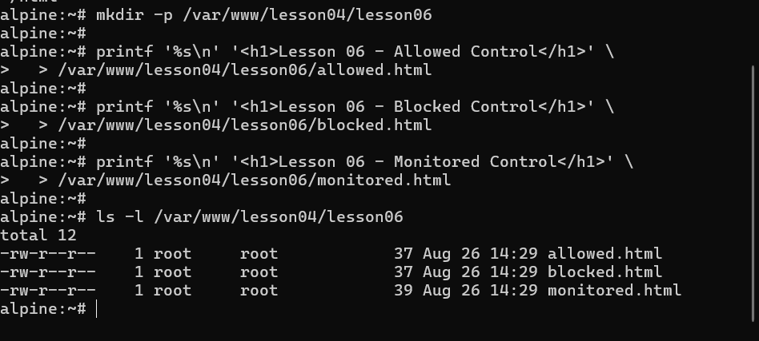

| URL | Role | Expected result after filtering |
| --- | --- | --- |
| `http://10.60.60.100/lesson06/allowed.html` | Unmatched negative control | HTTP `200`; no explicit local URL-filter event required |
| `http://10.60.60.100/lesson06/monitored.html` | Monitor control | HTTP `200`; Web Filter event recorded |
| `http://10.60.60.100/lesson06/blocked.html` | Block control | HTTP `403` / FortiGate replacement page |

The harmless files are included in [`lab-files/`](lab-files/README.md) for reproduction.

## 6. Flow-based Web Filtering

Profile `L06-WF-FLOW` used the flow feature set. FortiGuard category filtering remained disabled and the local URL-filter table contained:

| Order | URL | Type | Action |
| ---: | --- | --- | --- |
| 1 | `10.60.60.100/lesson06/blocked.html` | Simple | Block |
| 2 | `10.60.60.100/lesson06/monitored.html` | Simple | Monitor |

No explicit rule was created for `allowed.html`; leaving it unmatched provides the negative control.

Policy ID `3` reused the inherited identity, addresses, services, routes, and AV profile. The new attachment was `L06-WF-FLOW`:

```fortios
config firewall policy
    edit 3
        set name "auth-lan-to-alpine"
        set srcintf "port2"
        set dstintf "port1" "port3"
        set srcaddr "KALI-CLIENT"
        set dstaddr "ALPINE-LOOPBACK"
        set service "HTTP" "PING"
        set utm-status enable
        set av-profile "L05-AV-FLOW"
        set webfilter-profile "L06-WF-FLOW"
        set groups "LAB-AUTH-USERS"
    next
end
```

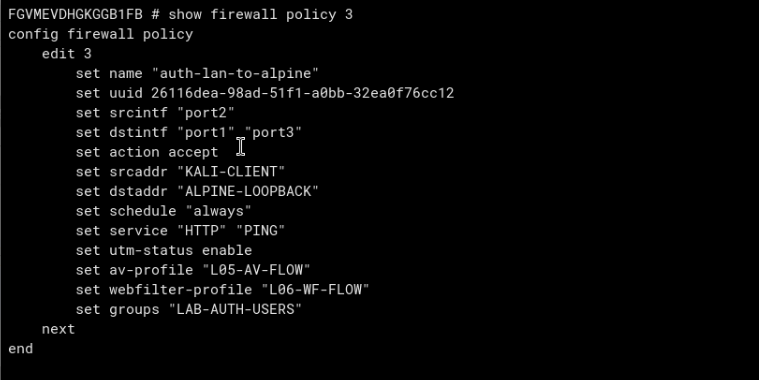

Observed results:

- `allowed.html`: passed normally because no local URL-filter entry matched it
- `monitored.html`: HTTP `200`; action was logged as passthrough/UTM allowed
- `blocked.html`: FortiGate returned a block page and identified `Local URLfilter Block` as the source

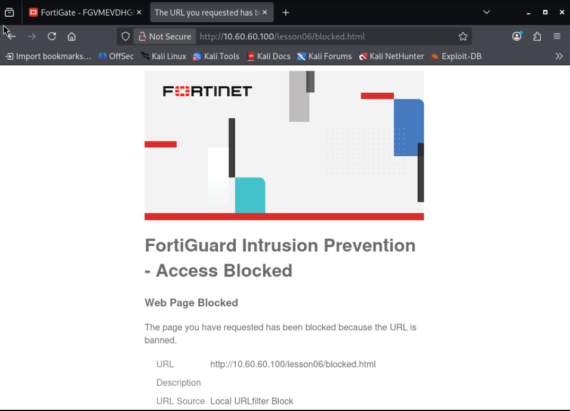

## 7. Logs explain Block and Monitor

The flow Block event recorded:

- event type `urlfilter`
- profile `L06-WF-FLOW`
- URL-filter index `1`
- exact `blocked.html` URL
- source `Local URLfilter Block`
- warning/security severity

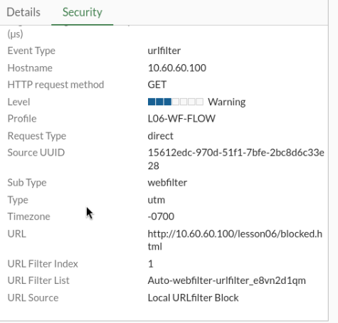

The Monitor event recorded:

- event type `urlfilter`
- profile `L06-WF-FLOW`
- URL-filter index `2`
- exact `monitored.html` URL
- informational severity
- allowed/passthrough result

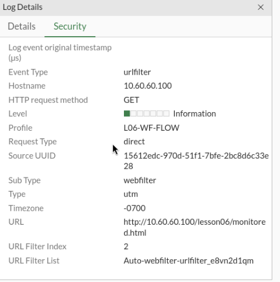

This is the practical difference between the two implemented actions: **Block denies**, while **Monitor permits and creates an audit trail**.

## 8. Troubleshooting: exact `Simple` URL matching

The initial block entry was accidentally stored as:

```text
10.60.60.100/lesson6/blocked.html
```

The actual request used:

```text
10.60.60.100/lesson06/blocked.html
```

The firewall policy and Web Filter profile were both attached correctly, but the page still loaded from Alpine.

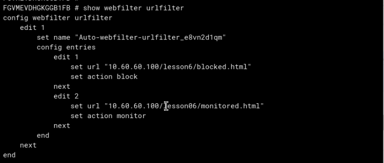

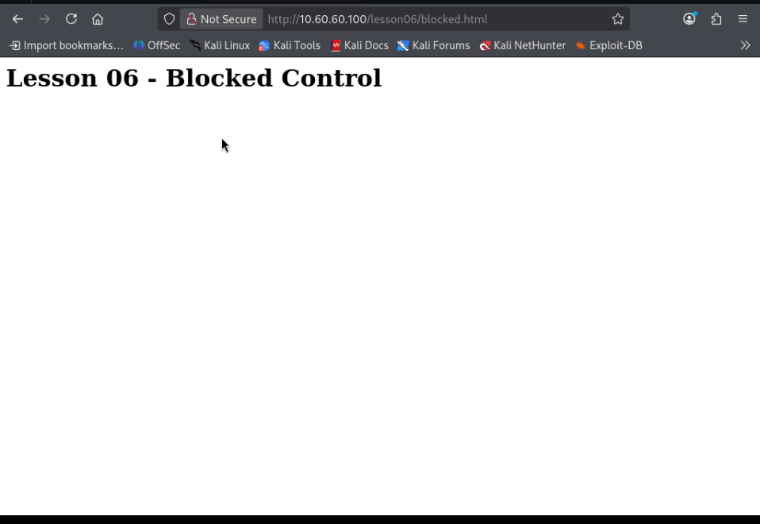

The diagnostic sequence was:

1. confirm Policy ID `3` contains `set utm-status enable`;
2. confirm it references `L06-WF-FLOW`;
3. inspect `show webfilter urlfilter`;
4. compare the stored pattern character-for-character with the browser URL;
5. correct `lesson6` to `lesson06`;
6. retest and receive the FortiGate block page.

This failure demonstrates the purpose of the `Simple` type: it gives predictable literal matching, but a one-character path difference means the rule does not match. `Wildcard` or regular-expression entries can cover broader URL sets, but they should be used only when the intended scope is understood.

## 9. Proxy-based Web Filtering

`L06-WF-PROXY` reproduced the same two entries with the proxy feature set.

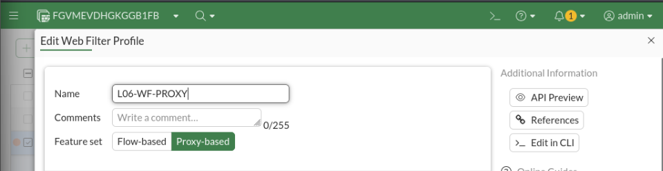

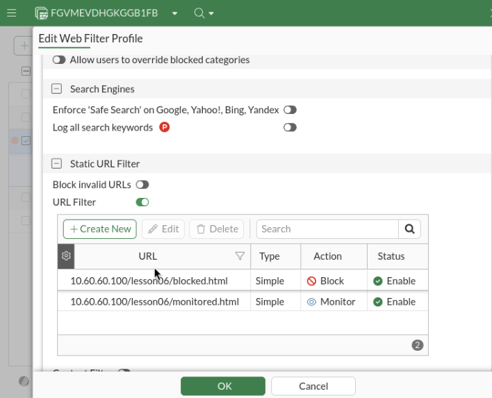

Policy ID `3` was changed sequentially, not duplicated:

- inspection mode `Proxy-based`
- AV profile `L05-AV-PROXY`
- Web Filter profile `L06-WF-PROXY`
- Protocol Options `default`
- NAT disabled

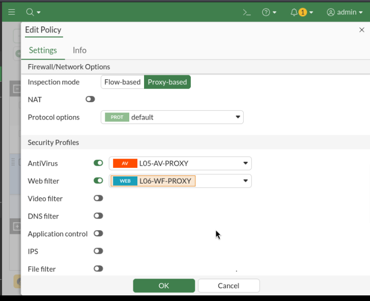

The same requests produced:

- monitored URL: HTTP `200`, 39-byte control downloaded
- blocked URL: HTTP `403 Forbidden`

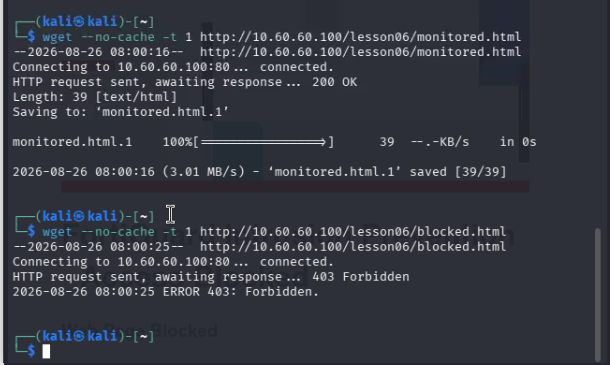

The visible result matched the flow test. The lesson records that observation rather than inventing a difference: both inspection architectures enforced the same local URL-filter intention.

## 10. Theory: FortiGuard category filtering

Static URL filters answer, "What should happen to this administrator-defined URL pattern?" FortiGuard category filtering instead asks a rating service which category a URL belongs to, then applies the action configured for that category.

Examples of categories include business, social networking, malicious websites, adult content, and search engines. A category policy scales better than manually listing every site, but it depends on current ratings, an applicable subscription, and connectivity to the rating service.

### 10.1 Category actions

| Action | Meaning | Security/operational need |
| --- | --- | --- |
| Allow | Permit the rated category | Used for approved categories; separate logging settings determine visibility |
| Block | Deny the category and normally show a replacement page | Prevent access to disallowed or dangerous categories |
| Monitor | Permit access and create category visibility in logs | Measure usage before enforcing or audit an allowed category |
| Warning | Show an interstitial warning and allow the user to continue | Add user awareness without an absolute deny |
| Authenticate | Require user authentication before category access | Tie sensitive-category access to a known identity |
| Quota | Allow an authenticated user a limited amount of category usage time | Control time spent in selected categories instead of always allowing or blocking |

The `Authenticate` action is not the same as the identity-aware firewall policy used in this lab. Policy authentication establishes an identity before the traffic is authorized. A category action adds a category-specific requirement within an otherwise permitted web session.

A quota also needs a reliable user identity so usage can be attributed and counted. It is not simply a bandwidth cap; it is a configured time allowance for a category during a defined period.

### 10.2 Why category actions remained theory only

The permanent evaluation has no FortiGuard Web Filtering service. Enabling category actions without a working rating source would demonstrate GUI configuration, not reliable category enforcement. Local static filtering provided a meaningful implementation while the category model remained study material.

## 11. Theory: web rating overrides

A web rating override changes the category FortiGate uses for a particular URL. It does **not** directly define allow or block behavior.

The decision sequence is:

```text
URL receives FortiGuard category
  -> local override replaces that category when configured
  -> Web Filter profile reads the resulting category
  -> category action allows, monitors, warns, authenticates, quotas, or blocks
```

An override is useful when an organization disagrees with a public rating or wants to place an internal/specific site into a local category. It should be narrow and documented because it changes how every referencing profile interprets that URL.

No rating override was implemented because the lab had no active category-rating baseline to override meaningfully.

## 12. Theory: SSL inspection and HTTPS order

HTTP exposed the complete URL to FortiGate. HTTPS encrypts the HTTP request, including the path after the hostname. The amount Web Filtering can evaluate therefore depends on SSL inspection.

| Inspection state | What FortiGate can use | Limitation |
| --- | --- | --- |
| No inspection | Routing/session metadata; limited observable TLS information | Cannot inspect encrypted HTTP path or content |
| Certificate inspection | TLS handshake, server certificate, and normally hostname/SNI metadata | Does not decrypt the HTTP request path or page content |
| Deep inspection | Decrypts, inspects, then re-encrypts the session | Requires a trusted FortiGate CA on clients and careful privacy/legal scoping |

Conceptually, HTTPS processing must establish what TLS information or decrypted content is visible before Web Filtering can evaluate it. Certificate inspection may support hostname-level decisions, while a rule for an encrypted path such as `/lesson06/blocked.html` requires deep inspection to see that path.

This portion remained theory only. Building a local CA, HTTPS server, and endpoint trust deployment would have expanded the lab primarily to reproduce a course screen rather than strengthen the controlled HTTP result.

## 13. FortiGuard status and troubleshooting boundary

The course covers FortiGuard connection troubleshooting. The lab recorded the read-only status:

```fortios
diagnose debug rating
get webfilter status
```

Both commands reported:

```text
Service : Web-filter
Status  : Disable
```

Antispam and Virus Outbreak Prevention were also disabled.

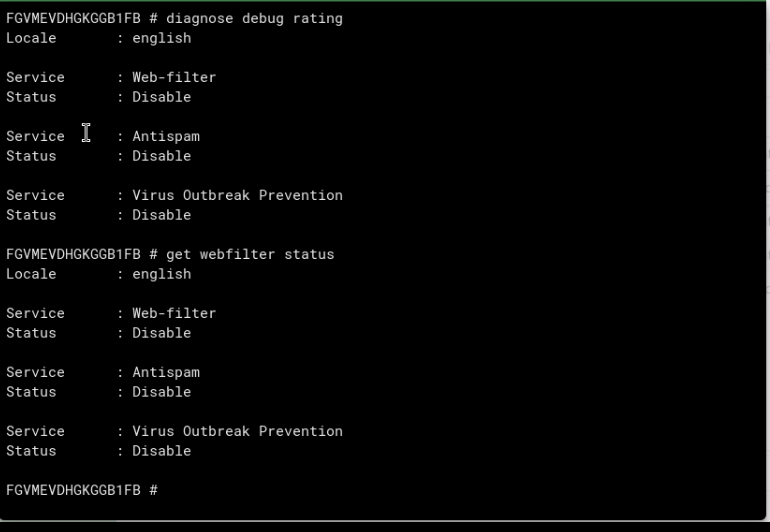

This output does not invalidate the local URL-filter result. The local table already proved Block and Monitor without a cloud rating query.

In a licensed deployment, a practical rating-troubleshooting order is:

1. verify entitlement and service status;
2. verify FortiGate time, DNS, default route, and Internet reachability;
3. inspect `diagnose debug rating` or `get webfilter status` for available servers, loss, and response state;
4. verify the correct Web Filter profile and category filter are enabled on the matching policy;
5. inspect Web Filter logs for rating errors or unrated behavior;
6. change FortiGuard transport/server settings only when evidence identifies that layer.

The evaluation was not modified to imitate a licensed connection.

## 14. Troubleshooting matrix

| Symptom | Likely cause | Verification/correction |
| --- | --- | --- |
| No HTTP before filtering | Alpine volatile addresses/routes or HTTP process missing | Restore the inherited state and listener first |
| Login page or small HTML returned instead of control | Five-minute authentication mapping expired | Reauthenticate as `lab-local-user` and retry |
| Blocked URL still loads | Profile not saved/attached, existing cache/session, or URL mismatch | Reopen policy; use `show firewall policy 3`; inspect URL table; retry without cache |
| Block rule misses by one character | `Simple` entry differs from requested host/path | Compare exact stored URL and correct the pattern |
| Monitor URL is allowed | Expected behavior | Confirm a passthrough/UTM-allowed Web Filter event exists |
| Profile unavailable in policy | Feature set does not match policy inspection mode | Use flow profile with flow policy or proxy profile with proxy policy |
| FortiGuard category is unrated/unavailable | Disabled/unlicensed service or connectivity issue | Separate category-service status from local static URL behavior |
| HTTPS path rule does not match | Path remains encrypted under no/certificate inspection | Use properly deployed deep inspection; theory only here |

## 15. Verification matrix

| Test | Expected | Observed |
| --- | --- | --- |
| Inherited Alpine recovery | Both paths, loopback, and equal-weight LAN return route present | Pass |
| Allowed control | HTTP `200` | Pass |
| Flow Monitor | HTTP `200` plus Web Filter event | Pass |
| Flow Block | FortiGate denial/replacement page | Pass |
| Exact-URL typo | Intended page passes because `Simple` rule does not match | Reproduced and fixed |
| Flow event details | Profile, URL, index, and local source visible | Pass |
| Proxy Monitor | HTTP `200` | Pass |
| Proxy Block | HTTP `403` | Pass |
| FortiGuard rating status | Record actual service boundary | Disabled |
| Category actions, override, SSL/HTTPS inspection | Deployed enforcement | Theory only |

## 16. Final state and continuation boundary

After the sequential proxy comparison, the intended continuation state is:

- Policy ID `3`, `auth-lan-to-alpine`
- flow-based inspection
- AV profile `L05-AV-FLOW`
- Web Filter profile `L06-WF-FLOW`
- Protocol Options `default`
- SSL inspection `no-inspection`
- NAT disabled
- HTTP and PING services
- authenticated group `LAB-AUTH-USERS`

`L06-WF-PROXY` remains as a validated object, but the constrained VM returns to flow mode for normal continuation. `L05-PROTO-1MB` remains unattached.

## 17. Persistence and sanitization

- Alpine addresses, return ECMP, loopback state, and Python processes may require restoration after reboot.
- The three harmless HTML controls are committed for reproducibility.
- Do not commit administrator/firewall-user passwords, cookies, VM license data, private keys, raw FortiGate backups, or FortiGuard account material.
- The HTTPS certificate/private-key experiment was not performed and no key material is included.
- Evidence is limited to configuration, client behavior, logs, the exact-match failure, and service-boundary proof.

## 18. Engineering takeaways

1. Web Filtering acts after route and policy selection; a UTM block is not a firewall-policy deny.
2. Local static URL filtering remains useful when FortiGuard category ratings are unavailable.
3. Monitor is an allow-and-log decision, not a soft block.
4. `Simple` matching is deterministic but exact path details matter.
5. Flow and proxy profiles must match the policy architecture; both can enforce the same URL decision.
6. A rating override changes category assignment; the profile's category action makes the enforcement decision.
7. Certificate inspection does not expose encrypted URL paths; deep inspection is a separate trust and privacy design.
8. Disabled FortiGuard rating status and successful local URL filtering can coexist without contradiction.

## 19. Evidence

See [`evidence/README.md`](evidence/README.md) for the curated evidence index.

