# Lesson 08 - Intrusion Prevention and Application Control

This lesson adds payload-aware IPS and Application Control to the existing authenticated, dual-path lab. It uses deterministic local traffic to prove the difference between firewall authorization, signature enforcement, application identification, and protocol/port expectations.

> The test traffic is confined to the isolated EVE-NG lab. EICAR is harmless but intentionally detected by security products; the raw test file is generated only inside the lab and is not committed.

## 1. Scope

### Objective

Extend Policy ID `3` without adding another firewall policy, then validate:

- IPS Monitor versus Block behavior for one known signature;
- packet logging and security-event correlation;
- a narrowly scoped, packet-direction-aware IPS exemption;
- botnet C&C monitoring as a negative control;
- application identification independently of the TCP service/port;
- category action, exact application override, and replacement-message behavior;
- non-default-port enforcement and its relationship to Network Protocol Enforcement;
- IPS process health and the configured fail-open decision.

### Implemented and validated

- `L08-IPS-MONITOR`, reused sequentially for EICAR Monitor and Block states;
- exact `Eicar.Virus.Test.File` signature ID `29844` with packet logging;
- EICAR allow/log, deny/log, exemption, and post-exemption blocking controls;
- `L08-APP-MONITOR` with all categories normalized to Monitor;
- Firefox and synthetic BitTorrent identification;
- BitTorrent identification on TCP/80 and exact-application blocking;
- HTTP application replacement page;
- temporary non-default-port blocking;
- system/process baseline and IPS global fail-open review.

### Intentionally bounded

- The installed IPS/Application databases are old, so this lab proves deterministic mechanics rather than current production coverage.
- No live botnet C&C destination was contacted.
- IPS malicious-URL blocking remained disabled; Lesson 06 already owns local URL-filter validation.
- Network Protocol Enforcement was correlated to the BitTorrent-over-HTTP mismatch but was not left enabled as a separate enforcement variable.
- No deliberate IPS engine failure was induced.

## 2. Methodology and design intent

The lesson follows the repository's established control pattern:

1. restore the inherited network and HTTP service;
2. record the database and subscription boundary before making security claims;
3. establish a harmless negative control;
4. observe traffic before blocking it;
5. change one enforcement variable at a time;
6. correlate the client result with the FortiGate event;
7. remove temporary exemptions and overrides;
8. preserve a documented continuation state.

Two distinctions drive the design:

- **Policy acceptance is not the final verdict.** Policy ID `3` can authorize TCP/80 while IPS or Application Control later denies the payload.
- **Port is not application identity.** A session accepted as service `HTTP` because it uses TCP/80 can still be identified as BitTorrent by its payload.

## 3. Inherited state and recovery

The lesson reuses the cumulative topology instead of rebuilding routing or identity:

| Component | Inherited state |
| --- | --- |
| Kali | `10.10.10.100/24`; authenticated as `lab-local-user` |
| Group | `LAB-AUTH-USERS` |
| Ingress | `LAB-LAN (port2)` |
| Protected server | Alpine loopback `10.60.60.100/32` |
| Routed members | R1 through `port3`; R2 through `port1` |
| Firewall policy | ID `3`, `auth-lan-to-alpine`; HTTP/PING; NAT disabled |
| Existing profiles | `L05-AV-FLOW`, `L06-WF-FLOW`, default Protocol Options |

Alpine's volatile interfaces, loopback, return routes, and HTTP service were restored before testing:

```sh
ip link set eth1 up
ip addr replace 10.20.20.100/24 dev eth1
ip link set eth2 up
ip addr replace 10.40.40.100/24 dev eth2
ip link set lo up
ip addr replace 10.60.60.100/32 dev lo

ip route replace 10.30.30.0/24 via 10.20.20.1 dev eth1
ip route replace 10.50.50.0/24 via 10.40.40.1 dev eth2
ip route replace 10.10.10.0/24 \
  nexthop via 10.20.20.1 dev eth1 weight 1 \
  nexthop via 10.40.40.1 dev eth2 weight 1

nohup python3 -m http.server 80 \
  --bind 10.60.60.100 \
  --directory /var/www/lesson08 \
  >/tmp/lesson08-http.log 2>&1 &
```

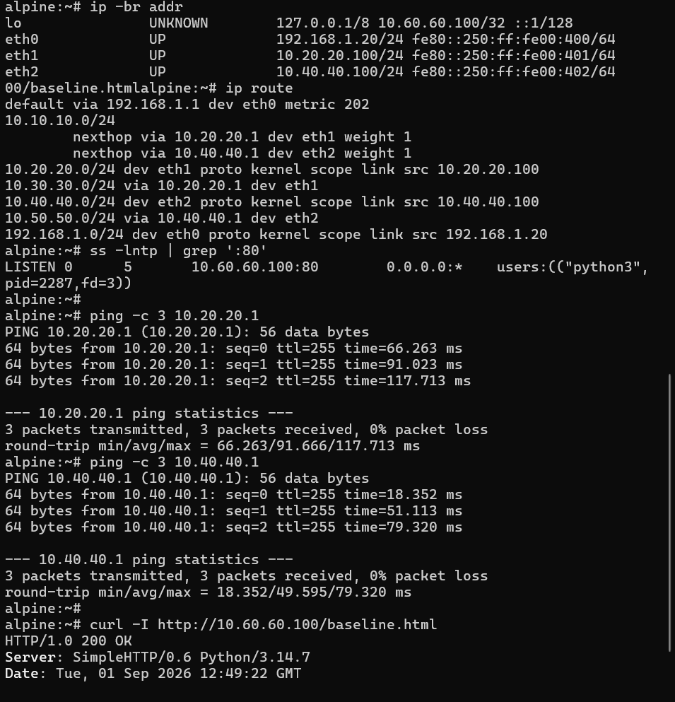

The reproducible HTTP control and one-shot BitTorrent responder are in [`lab-files/`](lab-files/README.md).

## 4. Security database boundary

The VM ran FortiOS `7.6.7 build 3704`, but its application and intrusion databases were not current:

| Database | Observed state |
| --- | --- |
| IPS | `6.00741`, dated 2015-12-01 |
| Application | `6.00741`, dated 2015-12-01 |
| Proxy Application | `6.00741`, dated 2015-12-01 |
| IPS malicious URL | `1.00001`, dated 2015-01-01 |

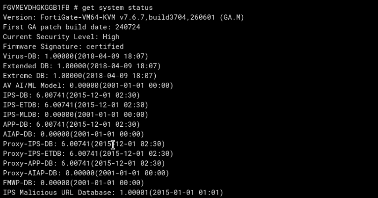

These signatures are sufficient for the fixed EICAR and BitTorrent controls used here. They do not support a claim that the evaluation VM provides current threat coverage.

## 5. IPS foundations tied to the lab

IPS evaluates traffic after the firewall policy has authorized the session. A signature entry can inherit its default action or explicitly Pass, Monitor, Block, or Reset traffic. Monitor is useful for discovery because the payload continues while FortiGate records the match; Block/Reset actively prevents completion.

The test sensor was named `L08-IPS-MONITOR`. The same sensor was deliberately reused through sequential states. Its name is an operator label; the configured entry action determines enforcement.

The exact signature was selected instead of a broad production filter:

| Setting | Test value |
| --- | --- |
| Signature | `Eicar.Virus.Test.File` |
| Signature ID | `29844` |
| Status | Enabled |
| Packet logging | Enabled |
| Exemptions | None initially |
| Botnet C&C | Configured later as Monitor |

This narrow selection made the comparison attributable to one known payload rather than an unknown set of old signatures.

## 6. IPS Monitor: detect without preventing delivery

The EICAR entry was first set to Monitor. Kali received the complete 68-byte file while FortiGate recorded the signature:

- profile `L08-IPS-MONITOR`;
- `Eicar.Virus.Test.File` / reference `29844`;
- HTTP `GET` for `/eicar.com.txt`;
- result Accept;
- informational signature severity and alert-notification log level.

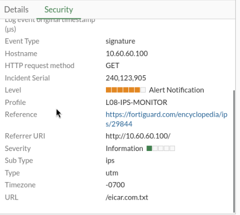

The detailed event also preserves the identity and routed path: Kali `10.10.10.100`, `lab-local-user`, group `LAB-AUTH-USERS`, ingress `LAB-LAN (port2)`, destination `10.60.60.100:80`, and egress `TRANSIT-R1 (port3)`.

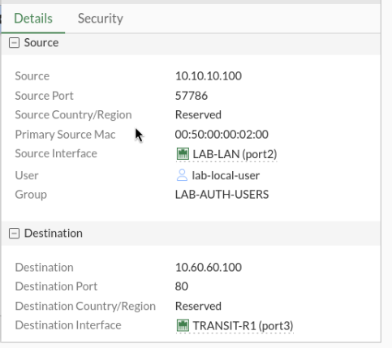

Severity and log level answer different questions: severity describes the signature's security impact, while the log level controls event priority. EICAR is a harmless test pattern, so an informational signature can still generate an alert notification.

## 7. IPS Block: same traffic, different entry action

Only the EICAR entry action was changed from Monitor to Block. The next EICAR request timed out/terminated and the security event changed from Accept to Deny.

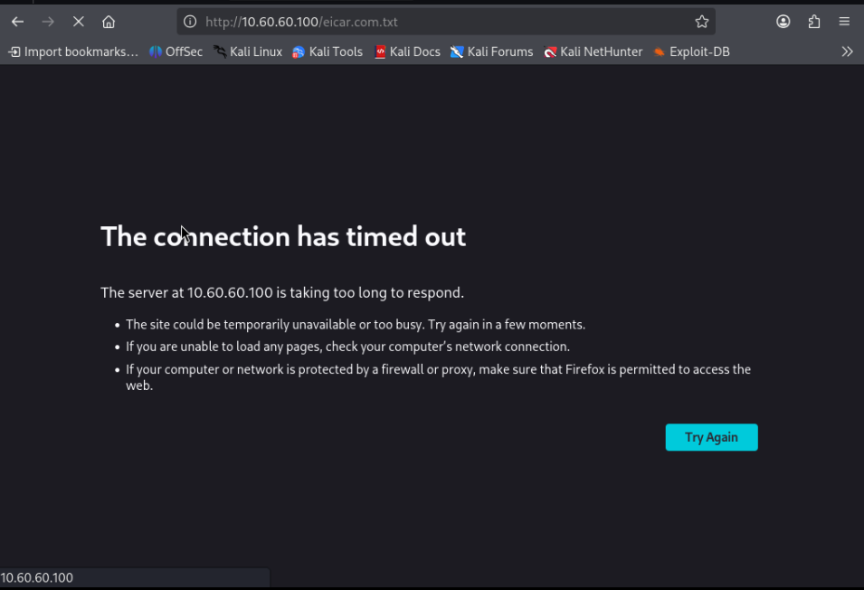

A benign request still returned `200 OK`:

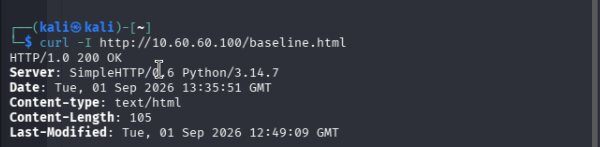

The comparison therefore holds the client, server, route, policy, authentication, service, and sensor constant. The payload match and entry action explain the different result.

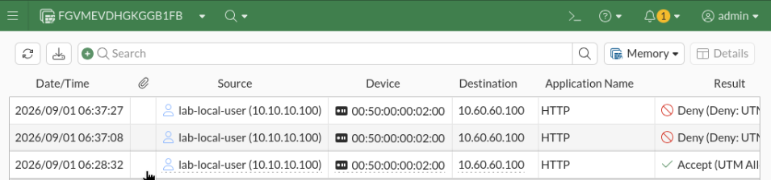

The event continued to display profile `L08-IPS-MONITOR` after blocking. This is expected: FortiGate enforces the entry's current action, not the descriptive object name.

## 8. IPS exemption and packet direction

The exemption was deliberately limited to one source/destination pair rather than a subnet. The first attempt used the initiating request direction:

```text
10.10.10.100/32 -> 10.60.60.100/32
```

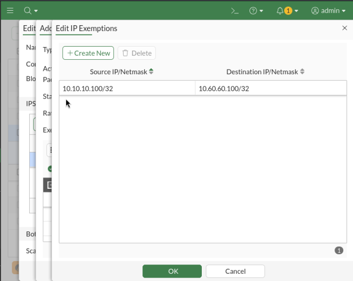

It did not exempt the match because the EICAR pattern is carried in the server response. At the point the signature matches, the packet direction is:

```text
10.60.60.100/32 -> 10.10.10.100/32
```

After correcting the pair and committing every nested editor, Kali received HTTP `200` and the complete 68-byte file:

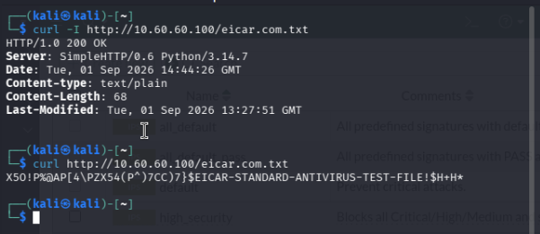

The exemption bypassed only signature `29844` for that address pair. It did not bypass authentication, Policy ID `3`, routing, other IPS entries, AV, Web Filter, or Application Control. The exemption was then removed and blocking was revalidated.

## 9. Final IPS state and auxiliary controls

The final sensor intentionally contains the exact EICAR entry only; a temporary dynamic filter used during study was removed. Botnet C&C checking is set to Monitor, the EICAR entry is Block with packet logging, and no exemption remains.

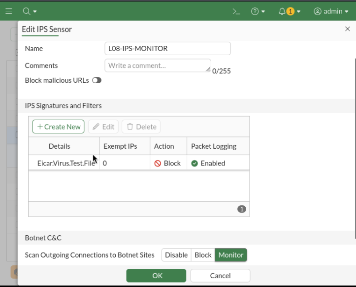

The corresponding CLI checkpoint is:

```fortios
config ips sensor
    edit "L08-IPS-MONITOR"
        set scan-botnet-connections monitor
        config entries
            edit 1
                set rule 29844
                set status enable
                set log-packet enable
                set action block
            next
        end
    next
end
```

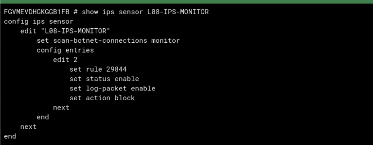

Botnet C&C Monitor was validated only with harmless traffic as a negative control. No real C&C endpoint was contacted. IPS malicious-URL blocking remained disabled because its installed database is stale and it is a separate mechanism from Lesson 06 local Web Filtering.

## 10. Application Control baseline

Application Control classifies behavior rather than trusting the destination port. Categories group signatures by function, while exact application and dynamic filter overrides provide more specific decisions.

The initial profile was normalized so every category, including P2P and Proxy, used Monitor. The baseline `L08-APP-MONITOR` state was:

| Setting | Baseline/final state |
| --- | --- |
| All categories | Monitor |
| Application/filter overrides | Empty |
| Network Protocol Enforcement | Disabled |
| Block applications on non-default ports | Disabled |
| Allow and log DNS traffic | Enabled |
| HTTP replacement messages | Enabled |

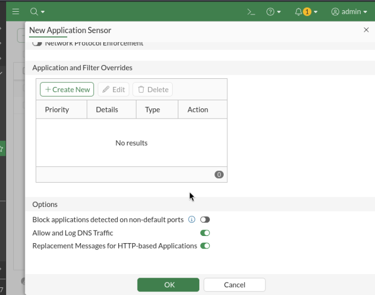

The profile was attached to Policy ID `3` alongside `L08-IPS-MONITOR`, using flow inspection, `no-inspection` for SSL, all-session logging, and the existing AV/Web Filter profiles.

A normal Firefox request was accepted and identified as `HTTP.BROWSER_Firefox`, proving that the sensor could classify allowed application behavior without changing the firewall service.

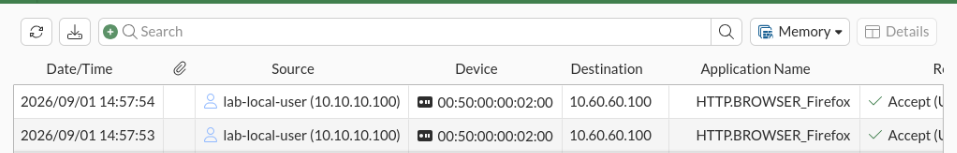

## 11. BitTorrent identification on TCP/80

To separate application identity from port identity, the Alpine HTTP process was stopped temporarily and replaced by a one-shot responder on `10.60.60.100:80`. Kali sent a deterministic 68-byte BitTorrent handshake:

```bash
perl -e 'print "\x13BitTorrent protocol","\0"x48' \
  | nc -w2 10.60.60.100 80
```

Alpine received exactly 68 bytes:

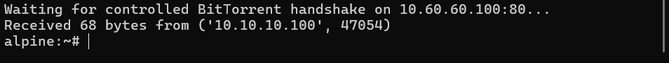

FortiGate accepted the session under the HTTP service but identified the payload as BitTorrent:

- application `BitTorrent`, ID `6`;
- category `P2P`;
- protocol `6` (TCP);
- service `HTTP`;
- control action `detected` and result Accept.

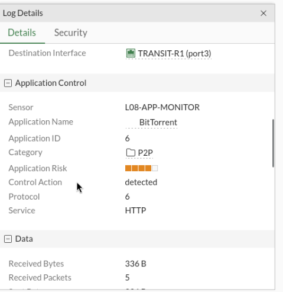

This is the central Application Control proof: TCP/80 satisfied the firewall service, but the payload signature established the actual application.

## 12. Override precedence and replacement behavior

The P2P category remained Monitor while an exact BitTorrent application override was set to Block. The same handshake was then denied. An exact `HTTP.BROWSER_Firefox` Block override was also tested.

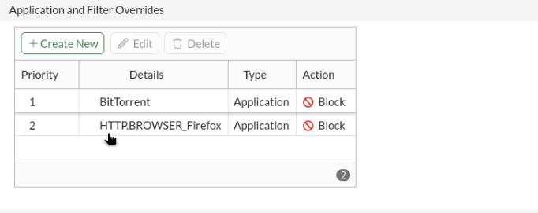

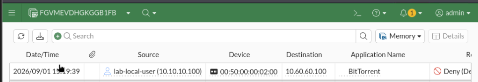

This demonstrates the effective specificity order used in the profile:

```text
exact application override > filter override > category action
```

Firefox received the FortiGate Application Control replacement page because the blocked application was valid HTTP:

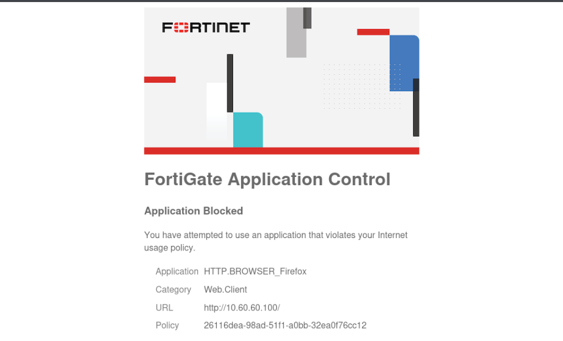

BitTorrent did not receive a friendly HTTP page merely because it used TCP/80. Replacement messages require an actual HTTP application transaction, not only an HTTP port number.

## 13. Non-default ports and Network Protocol Enforcement

`Block applications detected on non-default ports` was enabled temporarily. BitTorrent on TCP/80 was again denied because TCP/80 is not its expected application port context.

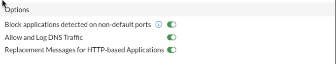

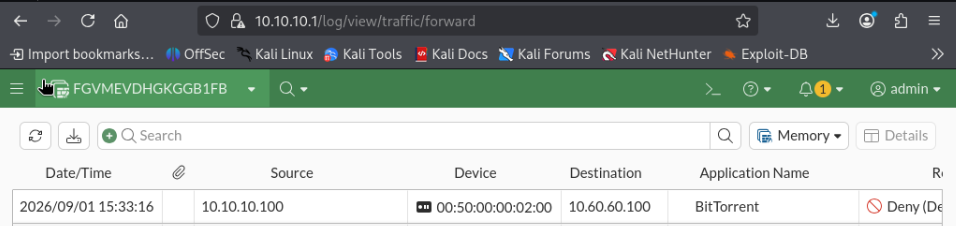

The same experiment also provides the correct conceptual anchor for Network Protocol Enforcement:

| Control | Question answered by the BitTorrent/TCP-80 case |
| --- | --- |
| Application identification | What application does the payload look like? `BitTorrent`. |
| Non-default-port blocking | Is that application operating on an expected port? No. |
| Network Protocol Enforcement | Does traffic conform to the protocol expected for the selected service? A BitTorrent handshake conflicts with an HTTP service expectation. |

Network Protocol Enforcement remained disabled in the final profile, so the recorded Deny events are not presented as NPE verdicts. The packet experiment proves the service/payload mismatch that NPE is designed to evaluate; exact application and non-default-port controls supplied the actual enforcement evidence.

## 14. Performance and fail-open decision

Security inspection was evaluated under a very light lab load. `get system performance status` showed 100% idle CPU, approximately 53.2% memory use, and only a few sessions.

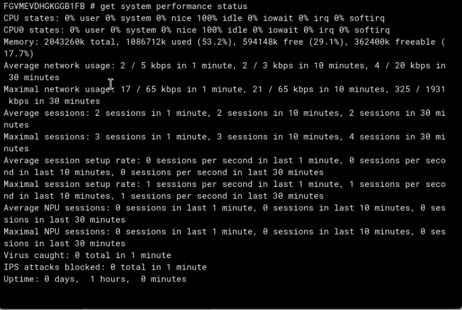

`diagnose sys top` showed `ipsengine` and `ipshelper` sleeping at 0% CPU during the sample. Their memory presence is normal and is not evidence of a performance problem.

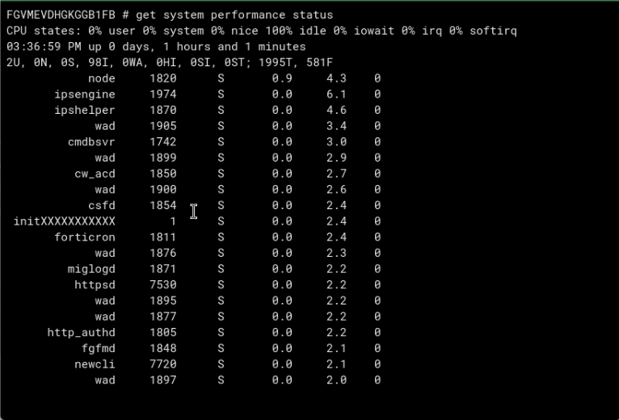

The operational troubleshooting order is:

1. record CPU, memory, sessions, and traffic before changing profiles;
2. identify the policy and source responsible for load;
3. review sensor breadth, packet logging, SSL inspection, and Application Control;
4. watch `ipsengine`/`ipshelper` while reproducing the workload;
5. change one inspection variable during a maintenance window and retest.

The global IPS state records `set fail-open disable`:

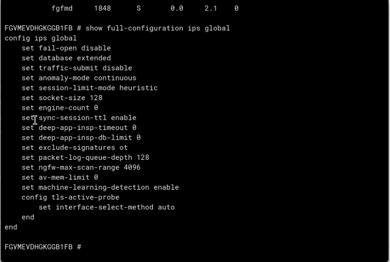

With fail-open disabled, an IPS engine failure favors inspection integrity instead of silently forwarding uninspected traffic. Enabling fail-open would favor availability but create a documented inspection gap. The lab reviewed this tradeoff without deliberately crashing the engine.

## 15. Troubleshooting decisions

| Symptom | Cause | Resolution |
| --- | --- | --- |
| EICAR still blocked after adding an exemption | Pair described the client request, but the signature matched the server response | Reverse the exemption to Alpine source and Kali destination |
| Exemption appeared configured but had no effect | Nested IPS editors had not all been committed | Save the exemption, entry, and sensor levels, then reopen to verify |
| Sensor named `MONITOR` produced Deny | Entry action had been changed to Block | Read the configured action and event; treat the name as a label |
| One-shot responder received unexpected traffic | A browser session reached port 80 first | Restart the one-shot server and send only the controlled handshake |
| BitTorrent on TCP/80 was logged as service HTTP | Firewall service is port-based; application identity is payload-based | Use the App Control name/category as the application verdict |
| BitTorrent block had no replacement page | The payload was not HTTP | Expect reset/drop/deny; replacement pages require HTTP behavior |

## 16. Verification matrix

| Test | Expected | Observed |
| --- | --- | --- |
| Benign `baseline.html` | HTTP `200` | Pass |
| EICAR entry on Monitor | 68 bytes delivered; IPS Accept event | Pass |
| EICAR entry on Block | Transfer fails; IPS Deny event | Pass |
| Corrected narrow exemption | 68 bytes delivered | Pass |
| Exemption removed | Blocking returns | Pass |
| Firefox category Monitor | Accepted and identified | Pass |
| BitTorrent handshake on TCP/80 | Accepted and identified as BitTorrent | Pass |
| Exact BitTorrent override Block | Deny event | Pass |
| Exact Firefox override Block | HTTP replacement page and Deny | Pass |
| Non-default-port blocking | BitTorrent/TCP-80 denied | Pass |
| IPS process baseline | No inspection-related CPU pressure | Pass under light lab load |
| IPS fail-open | Disabled in configuration | Confirmed |

## 17. Final validated state

| Component | Retained state |
| --- | --- |
| Policy ID `3` | Identity-aware HTTP/PING; flow inspection; all-session logging; NAT disabled |
| Existing UTM | `L05-AV-FLOW`, `L06-WF-FLOW`, default Protocol Options |
| SSL inspection | `no-inspection` for this deterministic HTTP lesson |
| IPS | `L08-IPS-MONITOR`; EICAR Block; packet logging; no exemptions; botnet C&C Monitor |
| IPS malicious URLs | Disabled |
| Application Control | `L08-APP-MONITOR`; all categories Monitor; no temporary overrides |
| Non-default-port block | Disabled after the experiment |
| Network Protocol Enforcement | Disabled |
| DNS logging / HTTP replacement messages | Enabled |
| IPS fail-open | Disabled |

The temporary BitTorrent/Firefox overrides, the non-default-port switch, and the IPS exemption were removed. The normal Python HTTP service can then be restored from [`lab-files/`](lab-files/README.md).

## 18. Engineering takeaways

- Firewall authorization, IPS enforcement, and Application Control are separate decisions in one session.
- Monitor-before-Block isolates enforcement effects and produces a useful comparison.
- An object's name does not override its configured action.
- Signature exemptions must follow the packet direction in which the signature actually matches.
- A TCP service/port does not prove application identity.
- Exact application overrides can be more specific than category policy.
- HTTP replacement pages depend on HTTP semantics, not TCP/80 alone.
- The BitTorrent-over-HTTP control gives one packet experiment three meanings: application identity, non-default-port use, and protocol/service mismatch.
- Old databases can prove deterministic mechanics but not current threat coverage.
- Performance conclusions must be tied to the observed workload, and fail-open is an explicit availability-versus-integrity decision.

## 19. Evidence

The curated index is in [`evidence/README.md`](evidence/README.md). The screenshots embedded above provide configuration proof, data-plane behavior, and FortiGate security/control-plane explanation for each material claim.
