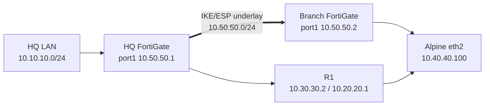
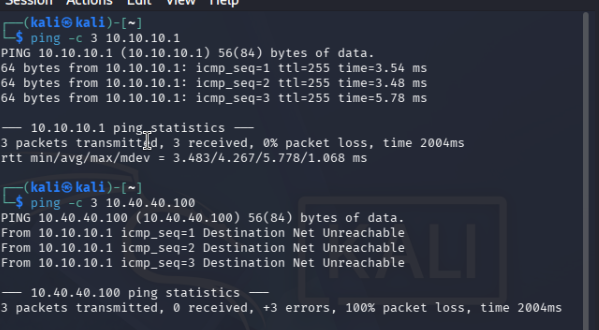
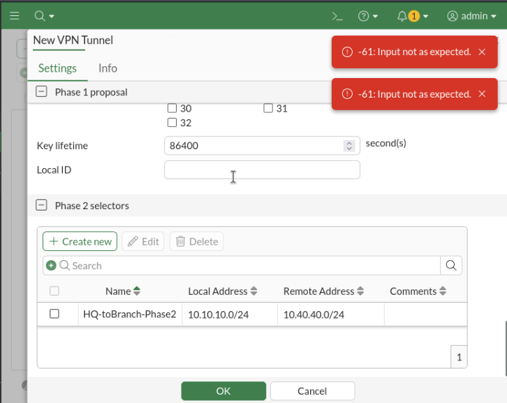
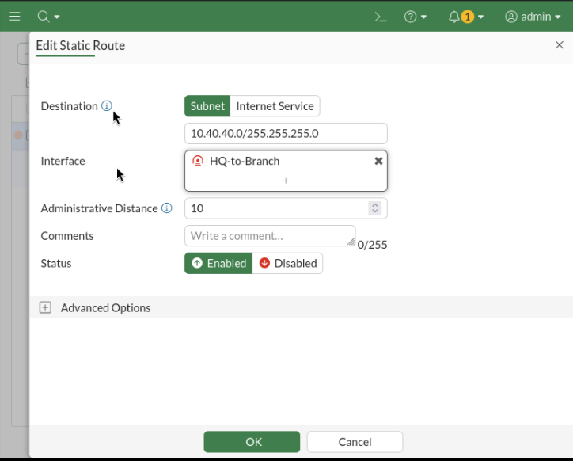
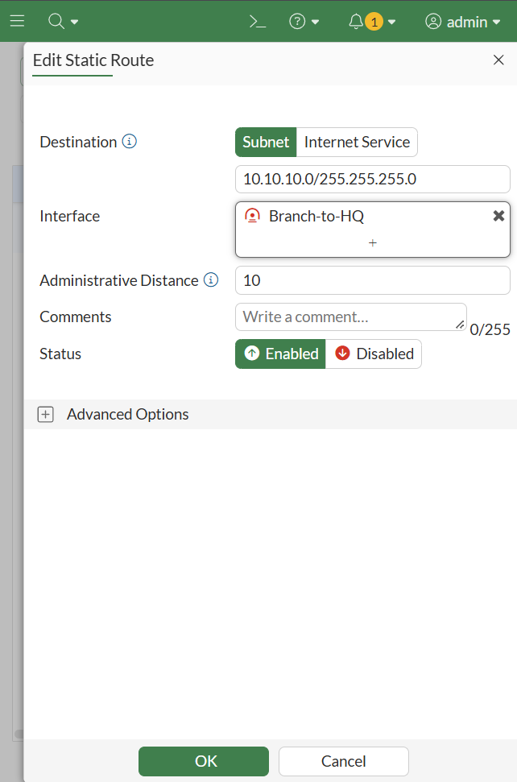
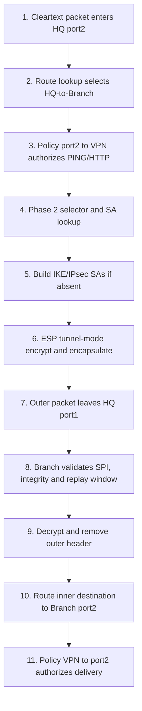
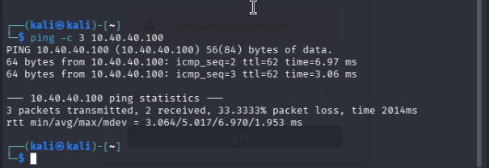
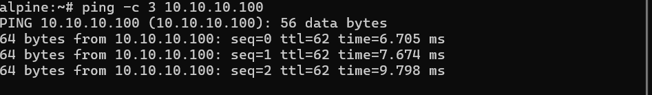

# Lesson 09 - Route-Based Site-to-Site IPsec VPN

This lesson replaces the Lesson 03 upper-path router with a second FortiGate and builds a route-based IPsec VPN between the established HQ LAN and a Branch LAN. The result is a bidirectional, traffic-triggered tunnel whose routing, policies, IKE Phase 1, IPsec Phase 2, and endpoint behavior were all validated.

> This is an isolated EVE-NG lab. IKEv1 and `DES-SHA1` were selected deliberately for course study and compatibility with the low-encryption permanent evaluation; they are not production recommendations.

## 1. Scope and outcome

### Objective

- preserve the existing HQ LAN and R1 path while introducing a Branch FortiGate;
- replace the old upper ECMP path with a protected site-to-site path;
- configure mirrored IKEv1 Phase 1 and Phase 2 parameters;
- route protected subnets through IPsec virtual interfaces rather than physical `port1`;
- permit only PING and HTTP, without NAT, in both initiation directions;
- prove on-demand negotiation and bidirectional data-plane forwarding.

### Validated result

| Layer | Result |
| --- | --- |
| Underlay | `10.50.50.1/24` and `10.50.50.2/24` reached each other directly |
| Phase 1 | IKEv1 Main Mode IKE SA established with PSK, `DES-SHA1`, and DH14 |
| Phase 2 | Mirrored `/24` selectors established; summary reported `1/1` selector up |
| Routing | HQ `10.40.40.0/24` -> `HQ-to-Branch`; Branch `10.10.10.0/24` -> `Branch-to-HQ` |
| Authorization | Two directional policies per FortiGate; PING/HTTP; NAT disabled |
| Data plane | Kali -> Alpine and Alpine -> Kali both succeeded |
| Initiation behavior | First Kali packet was lost while the disabled Auto-negotiate state built the SAs; later packets succeeded |

## 2. Architecture change

Lesson 08 ended on the Lesson 03 ECMP topology. Lesson 09 intentionally changes the current integrated state:

- R2 was replaced by a Branch FortiGate.
- HQ `port1` retained `10.50.50.1/24` and became the VPN underlay interface.
- Branch `port1` uses `10.50.50.2/24`; Branch `port2` uses `10.40.40.1/24`.
- Alpine `eth2` remains `10.40.40.100/24` and now uses the Branch FortiGate for HQ traffic.
- The shared ECMP loopback `10.60.60.100/32` and associated R1 route were removed.
- R1 remains attached to HQ `port3` and Alpine `eth1`, but it is no longer an ECMP member for `10.10.10.0/24`.
- Branch `port3` uses the EVE network/cloud only for evaluation registration and its default route; it is not part of the protected path.



The lower R1 link remains useful for inherited routing study, but the explicit Alpine route to `10.10.10.0/24` selects Branch `10.40.40.1`. The protected test therefore has one deterministic path.

## 3. Network preparation and negative control

The supporting changes are recorded in [`configs/supporting-routing.txt`](configs/supporting-routing.txt). Important decisions were:

1. remove the old `/32` ECMP target and R1 route;
2. replace Alpine's equal-weight return route with a single route through Branch;
3. retain R1's return route to HQ LAN and HQ's route to the R1-side subnet;
4. prove both FortiGate underlay addresses before configuring IPsec;
5. remove the temporary plaintext HQ-to-Branch-LAN route so the later success could not bypass encryption.

Before IPsec routing existed, Kali reached its HQ gateway but `10.40.40.100` returned `Destination Net Unreachable` from `10.10.10.1`.



This establishes the required before/after control: Branch LAN was not reachable through an accidental plaintext route.

## 4. IPsec model used by the lab

IPsec is a suite of IP-layer protocols rather than one encryption algorithm. It can provide peer/data-origin authentication, integrity, confidentiality, and anti-replay protection.

| Component | Role in this lesson |
| --- | --- |
| IKE | Negotiates security associations and keys; normally UDP/500, or UDP/4500 with NAT traversal |
| ESP | Protects the actual user traffic with encryption/integrity; this is the data-plane protocol used here |
| AH | Integrity/authentication without encryption; studied only and not used |
| Tunnel mode | Protects the complete original IP packet and adds a new outer IP header; appropriate for gateway-to-gateway VPNs |
| Transport mode | Protects the IP payload while retaining the original IP header; most appropriate to host-to-host designs |

Remote-access VPNs connect an individual client to a gateway and commonly use mode configuration/address assignment. Site-to-site VPNs join networks behind gateways. Site-to-site designs can be simple point-to-point, hub-and-spoke, partial mesh, or full mesh; this lab implements one point-to-point tunnel.

The FortiGate design is **route-based**. Each VPN is represented by a virtual interface, the routing table chooses it, and firewall policies use it as an ingress or egress interface. Policy-based VPNs combine traffic matching and encryption decisions in the policy and are not the design used here.

## 5. Phase 1 and Phase 2 process

### Phase 1: create the protected IKE control channel

IKE Phase 1 authenticates the peers, agrees how to protect IKE exchanges, performs Diffie-Hellman key agreement, and creates one bidirectional **IKE SA**. That protected control channel is then used to negotiate Phase 2.

The lab used:

| Setting | Value and reason |
| --- | --- |
| IKE version/mode | IKEv1 Main Mode, deliberately selected for study; Main Mode protects peer identities better than Aggressive Mode |
| Authentication | Pre-shared key; the reusable value is excluded from the repository |
| Proposal | `DES-SHA1`, forced by low-encryption evaluation compatibility; use modern AES/SHA-2 or AEAD in production |
| DH group | 14, for Phase 1 key agreement |
| Peer addresses | HQ `10.50.50.1`, Branch `10.50.50.2` |
| DPD | On-idle, so an idle peer can be checked for liveness |
| NAT-T | Disabled because no NAT exists between the directly connected peers |
| Lifetime | `86400` seconds |

In simplified IKEv1 terms, Main Mode uses six messages and protects identities; Aggressive Mode uses three messages but exposes more identity information and is commonly associated with peer-ID/dynamic-peer requirements.

### Phase 2: create the data-plane IPsec SAs

IKE Phase 2 uses the protected Phase 1 channel to negotiate the ESP proposal, traffic selectors, mode, lifetimes, anti-replay behavior, and optional PFS. Its output is an IPsec SA for each direction: outbound and inbound ESP are separate unidirectional SAs.

| Setting | HQ | Branch |
| --- | --- | --- |
| Local selector | `10.10.10.0/24` | `10.40.40.0/24` |
| Remote selector | `10.40.40.0/24` | `10.10.10.0/24` |
| Proposal | `DES-SHA1` | `DES-SHA1` |
| Encapsulation | Tunnel mode | Tunnel mode |
| PFS / DH | Enabled / group 14 | Enabled / group 14 |
| Replay detection | Enabled | Enabled |
| Lifetime | `43200` seconds | `43200` seconds |
| Auto-negotiate / keepalive | Disabled / disabled | Disabled / disabled |

The selectors are mirrored because they define the encryption domain. If a packet does not match a negotiated selector, it is not carried by that Phase 2 SA. One Phase 1 can support multiple Phase 2 selectors when several protected traffic domains are required.

PFS performs a new Phase 2 DH exchange so the IPsec keys are not derived only from the Phase 1 keying material. Replay detection rejects duplicated/out-of-window protected packets. An IPsec SA can expire by time, protected data volume, or the configured combination.

Auto-negotiate proactively establishes the Phase 2 SA; Autokey Keep Alive attempts to restore a down SA so it remains available. Both were disabled here so interesting traffic would initiate negotiation. The first lost echo request and subsequent success demonstrated that behavior directly.

## 6. Implemented FortiGate configuration

Sanitized, reproducible CLI checkpoints are provided separately:

- [`hq-fortigate.conf`](configs/hq-fortigate.conf)
- [`branch-fortigate.conf`](configs/branch-fortigate.conf)

They include the relevant interfaces, address objects, static routes, Phase 1, Phase 2, and policies. Policy IDs may be assigned differently when reproduced; names and match conditions are authoritative. The PSK is a placeholder.

The first GUI custom-tunnel submission failed with `-61: Input not as expected` and created no Phase 1 or Phase 2 object. `diagnose debug config-error-log read` showed unrelated built-in DLP/FortiGuard parsing history rather than a useful VPN cause, so the same intended settings were committed through CLI.



This is an implementation-path failure, not an IPsec protocol failure: once the CLI objects existed, negotiation succeeded.

## 7. Routing and firewall-policy design

The remote protected subnet must point to the **VPN interface**, not to the peer's physical underlay address:





A route via physical `port1` and gateway `10.50.50.x` would forward the inner packet as plaintext on the underlay and bypass the intended VPN. The correct route has no next-hop gateway; the Phase 1 `remote-gw` separately identifies the IKE peer.

Before negotiation, FortiGate knew the static route but displayed it as inactive because the virtual tunnel interface/SA was down. That observed intermediate state is recorded in the validation table without retaining the CLI screenshot, whose prompt contained the appliance's serial-derived default hostname.

Each FortiGate has two policies:

| FortiGate | New-session direction | Policy path |
| --- | --- | --- |
| HQ | HQ initiates | `port2 -> HQ-to-Branch`; HQ-LAN -> Branch-LAN |
| HQ | Branch initiates | `HQ-to-Branch -> port2`; Branch-LAN -> HQ-LAN |
| Branch | Branch initiates | `port2 -> Branch-to-HQ`; Branch-LAN -> HQ-LAN |
| Branch | HQ initiates | `Branch-to-HQ -> port2`; HQ-LAN -> Branch-LAN |

All four allow PING and HTTP, log all sessions, and disable NAT and security profiles for this transport-focused test. FortiGate remains stateful: return packets for an existing session follow its session entry. The reverse-direction policy is required only so the other site can initiate a new session.

## 8. Complete packet cycle

The first HQ-to-Branch packet follows this order:



In detail:

1. Kali sends an inner packet such as `10.10.10.100 -> 10.40.40.100` to HQ `10.10.10.1`.
2. HQ performs session lookup and a destination route lookup. The route selects virtual interface `HQ-to-Branch`.
3. That route supplies the egress interface used by firewall-policy matching. The packet must match source, destination, service, schedule, and `port2 -> HQ-to-Branch`; NAT remains disabled.
4. The Phase 2 selector confirms the inner addresses belong to `10.10.10.0/24 <-> 10.40.40.0/24`.
5. If the required SAs are absent, IKE Phase 1 creates the protected IKE SA and Phase 2 creates the two ESP SAs. The triggering packet may time out during this work.
6. HQ encrypts the complete original packet, adds ESP and a new outer header `10.50.50.1 -> 10.50.50.2`, and sends it through physical `port1` using underlay reachability.
7. Branch receives ESP on `port1`, selects the inbound SA by SPI, checks integrity and the replay window, decrypts, and decapsulates the original packet.
8. The clear inner packet is now associated with incoming VPN interface `Branch-to-HQ`. Branch routes `10.40.40.100` to `port2`, matches `Branch-to-HQ -> port2`, and forwards it to Alpine.
9. Alpine's echo reply is associated with the established stateful session and follows the reverse forwarding/encryption path. A separate Alpine-initiated session requires the explicit `port2 -> Branch-to-HQ` and corresponding HQ reverse policy.

The important distinction is that the physical interfaces carry IKE/ESP between peers, while the virtual VPN interfaces participate in inner-packet routing and policy matching.

## 9. Validation and result

Kali generated the first interesting traffic. Echo sequence 1 timed out during negotiation; sequences 2 and 3 succeeded:



HQ then reported the tunnel and its only Phase 2 selector up:

```text
get vpn ipsec tunnel summary
'HQ-to-Branch' 10.50.50.2:0 selectors(total,up): 1/1
```

The committed [`sanitized tunnel-summary excerpt`](evidence/07-tunnel-summary-sanitized.txt) omits the appliance prompt and nonessential counters.

Alpine initiated a separate reverse-direction test and received all replies from Kali:



The Branch GUI independently showed the tunnel `Up`; that screenshot is not retained because the page header exposed the appliance's serial-derived default hostname.

| Test | Expected | Observed |
| --- | --- | --- |
| Kali before VPN -> Alpine | No protected route; fail | Destination Net Unreachable |
| Underlay peer ping | Direct reachability | Pass in both directions |
| First interesting packet | May be lost during negotiation | First echo lost |
| Later Kali -> Alpine packets | Protected forwarding | Pass |
| Tunnel summary | One configured selector up | `1/1` |
| Alpine -> Kali new session | Reverse policies permit initiation | 3/3 replies |
| GUI monitor | Tunnel operational | `Up` |

## 10. Troubleshooting decisions

| Symptom | Cause or interpretation | Resolution |
| --- | --- | --- |
| GUI returned `-61` twice | Custom editor rejected input and created no VPN objects | Verify empty Phase 1/2 tables, then create the sanitized design through CLI |
| R1 could not ping HQ `10.30.30.1` | PING was not enabled as administrative access on HQ `port3` | Prove adjacency from HQ to R1 instead; do not confuse local-in ICMP control with routing failure |
| Remote route pointed to physical `port1` | That would be plaintext next-hop routing | Select the named IPsec virtual interface and remove the gateway |
| Correct VPN route displayed inactive | Tunnel/SA had not been negotiated yet | Generate interesting traffic; then verify the selector and route become active |
| First end-to-end ping lost | Expected on-demand IKE/Phase 2 setup with Auto-negotiate disabled | Continue the test and correlate later replies with tunnel status |

Useful operational commands:

```fortios
get vpn ipsec tunnel summary
diagnose vpn tunnel list
diagnose vpn tunnel list name HQ-to-Branch
get router info routing-table details 10.40.40.100
```

If Phase 1 fails, check underlay reachability, IKE version/mode, peer address, PSK, proposal, and DH group. If Phase 1 is up but Phase 2 is down, check mirrored selectors, Phase 2 proposal, PFS/DH, and lifetime compatibility. If both SAs are up but traffic fails, return to route lookup, policy direction, service, NAT, endpoint route, and host firewall checks.

## 11. Theory retained without extra implementation

- Dynamic DNS can identify a peer whose public IP changes; static peer addresses were sufficient here.
- Mode configuration and DHCP over IKE can supply addressing to dial-up clients; this site-to-site lab has fixed subnets and no FortiClient.
- DPD also supports on-demand and disabled initiation behavior; only on-idle was configured.
- NAT-T would encapsulate ESP in UDP/4500 if NAT were present; it was unnecessary on the direct underlay.
- Multiple Phase 2 selectors, redundant tunnels, hub-and-spoke, partial mesh, and full mesh remain design options, not deployed claims.
- Hardware offloading, certificate authentication, IKEv2, AH, transport mode, and policy-based VPNs were studied but not implemented.

## 12. Final state and engineering takeaways

- Route-based IPsec keeps route selection, policy authorization, and encryption-domain selection as distinct decisions.
- The Phase 1 proposal protects IKE negotiation; the Phase 2 proposal protects user data through ESP.
- One bidirectional IKE SA protects control-plane negotiation; a pair of unidirectional IPsec SAs protects the two data directions.
- Selectors must mirror and match the traffic that should enter the encryption domain.
- Static protected-subnet routes point to the VPN interface, while `remote-gw` identifies the underlay peer.
- Stateful inspection handles replies, but each site needs an initiating policy if both sites may start connections.
- The pre-VPN failure, on-demand first-packet loss, later bidirectional success, `1/1` selector, and GUI `Up` state form a complete configuration/data-plane/control-plane proof chain.
- The low-encryption evaluation explains `DES-SHA1`; it does not make that proposal suitable for production.

The curated evidence index is in [`evidence/README.md`](evidence/README.md). The final configuration contains no real PSK or license material.
