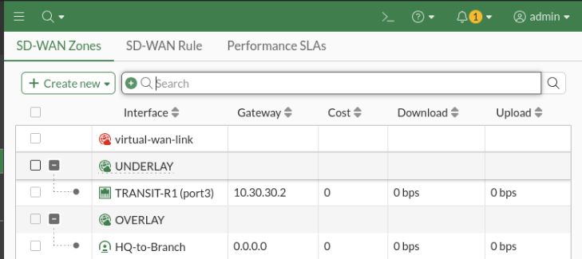
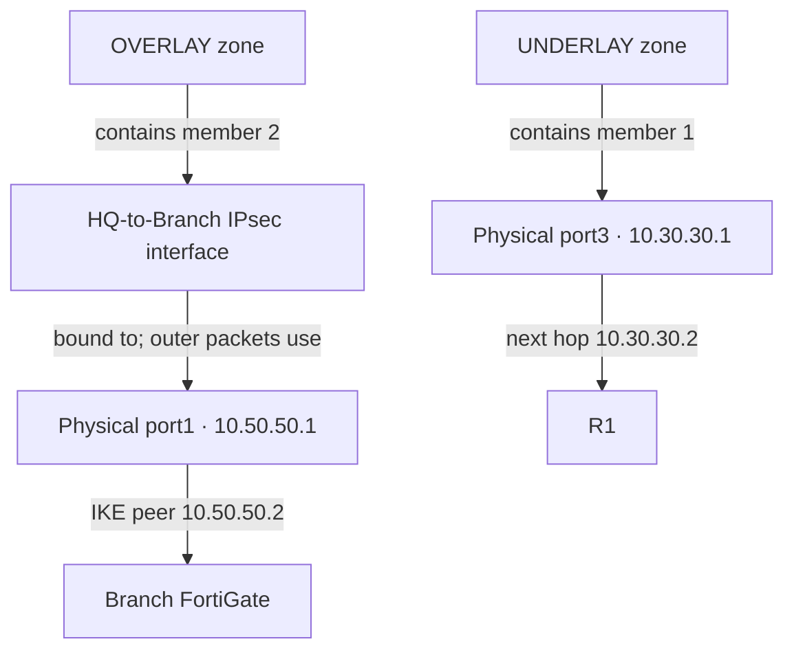
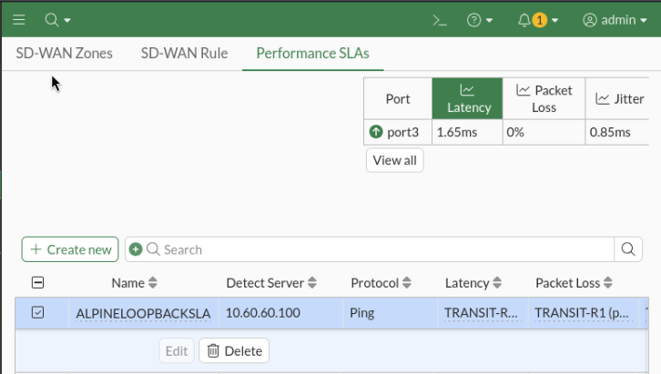

# Lesson 10 — SD-WAN: Two Paths, One Destination

[Project](../../README.md) · [Previous: IPsec](../09-site-to-site-ipsec-vpn/README.md) · [Configurations](configs/README.md) · [Evidence](evidence/README.md)

## Outcome and purpose

This final lesson puts the routing and IPsec work together: HQ reaches Alpine's `10.60.60.100/32` loopback through either **R1's routed path** or **the Branch IPsec overlay**. A manual SD-WAN rule controls preference. Packet captures explain the selected interface and NAT behavior; an active performance SLA adds path measurements.

Keeping the destination identical makes this a path-selection experiment rather than a comparison of two different servers.

## 1. The network we used

| Component | Address and role |
| --- | --- |
| Kali | `10.10.10.100/24`, gateway `10.10.10.1` |
| HQ `port2` — LAB-LAN | `10.10.10.1/24`, client and management ingress |
| HQ `port3` — TRANSIT-R1 | `10.30.30.1/24`, next hop R1 `10.30.30.2` |
| R1 | Gi0/1 `10.30.30.2/24`; Gi0/0 `10.20.20.1/24` |
| HQ / Branch `port1` | `10.50.50.1/24` / `10.50.50.2/24`, physical IPsec transport |
| Branch `port2` | `10.40.40.1/24`, Alpine's Branch-side gateway |
| Alpine | eth1 `10.20.20.100/24`; eth2 `10.40.40.100/24`; lo `10.60.60.100/32` |

Alpine owns all three addresses. Reaching its loopback through eth1 or eth2 delivers traffic to the same host; Alpine is not forwarding between those interfaces for this test. Its separate management/default route was left outside the lab path.

## 2. Make both paths reach the loopback

We restored the loopback and R1's host route from the earlier routing design, while retaining the two-FortiGate VPN from Lesson 09.

| Device | Destination | Forwarding decision |
| --- | --- | --- |
| R1 | `10.60.60.100/32` | Via Alpine `10.20.20.100` |
| Branch | `10.60.60.100/32` | Via Alpine `10.40.40.100`, port2 |
| Branch | `10.10.10.0/24` | Via `Branch-to-HQ` |
| Alpine | `10.10.10.0/24` | Via Branch `10.40.40.1`, eth2 |
| Alpine | `10.30.30.0/24` | Via R1 `10.20.20.1`, eth1 |
| HQ | `10.60.60.100/32` | One static-route object referencing `UNDERLAY` and `OVERLAY` |
| HQ | `10.40.40.0/24` | Static route referencing `OVERLAY` |

The HQ route to Alpine's eth1 subnet was retired from this continuation: the experiment targets the `/32`. Using both zones in one host-route object keeps the route configuration compact while producing two usable forwarding candidates. The recorded route lookup shows distance `1`, metric `0`, with both port3/R1 and `HQ-to-Branch` listed. [Route evidence](evidence/03-route-lookup-sanitized.txt).

The existing VPN protected the Branch `/24`; the loopback needed **an additional mirrored Phase 2 pair**:

| Peer / selector | Local subnet | Remote subnet |
| --- | --- | --- |
| HQ — `HQ-BR-LO-P2` | `10.10.10.0/24` | `10.60.60.100/32` |
| Branch — `BR-HQ-LO-P2` | `10.60.60.100/32` | `10.10.10.0/24` |

Both reuse their existing Phase 1, with tunnel mode, PFS/DH14, replay protection, a 43,200-second lifetime, and Auto-negotiate/Autokey Keep Alive disabled. The original Branch-LAN selectors remain separate.

> The inherited evaluation VPN uses `DES-SHA1`. This is an isolated low-encryption lab configuration, not a production cryptographic recommendation.

We added `ALPINE-LOOPBACK` to the relevant VPN-policy address lists on both firewalls. A route establishes reachability, a policy permits the session, and a Phase 2 selector defines traffic eligible for that IPsec SA: none replaces the others.

## 3. Turn the paths into SD-WAN members

On HQ, **Network → SD-WAN** was used to create two zones and assign the members:

| Member | Interface | Zone | Member gateway | Probe source |
| --- | --- | --- | --- | --- |
| 1 | `port3` / TRANSIT-R1 | `UNDERLAY` | `10.30.30.2` | `10.30.30.1` |
| 2 | `HQ-to-Branch` | `OVERLAY` | `0.0.0.0` | `10.10.10.1` |

Both members had cost `0`. The unused default `virtual-wan-link` zone was left empty.

The tunnel's zero member gateway is intentional: this route-based tunnel has no numbered inner next hop. Its outer peer is already defined by Phase 1 `remote-gw 10.50.50.2`. That peer address is not a substitute for an inner tunnel gateway.

Migration involved dependencies, not just adding interfaces: create the zones, replace direct policy/route references, then assign the released interfaces as members and verify the resulting routes. HQ management remained on port2.

| HQ policy | Ingress → egress | Purpose | NAT |
| --- | --- | --- | --- |
| `HQtoBRANCH` (3) | port2 → OVERLAY | HQ to Branch-LAN/loopback | Off |
| `Branch-to-HQ` (2) | OVERLAY → port2 | Branch-LAN/loopback initiating toward HQ | Off |
| `FG-To-R1` (4) | port2 → UNDERLAY | HQ to loopback through R1 | Outgoing-interface SNAT |

The reverse VPN policy permits a **new Branch-initiated session**. Replies to an already permitted session are handled statefully; they do not require a second policy just because their direction reverses.



## 4. Interface relationships — not nested physical ports



A physical interface is **not inside** the IPsec interface. The virtual IPsec interface is bound to a physical transport interface. SD-WAN enrolls an interface as a member and groups that member into a zone; firewall policies can reference the zone.

Here, port1 carries the VPN but is not itself a separate SD-WAN member. Also distinguish the zone named `UNDERLAY` (our R1 alternative) from the generic term *VPN underlay* (the port1 network carrying IPsec). An SD-WAN zone adds neither an IP header nor encryption.

## Packet lifecycle

For a new Kali session, the useful model is **ingress/session checks → route-aware SD-WAN member selection → firewall policy/NAT → chosen egress processing**. This is a logical explanation, not a complete FortiOS processing-stage trace. Existing sessions retain forwarding state.

Routing and SD-WAN selection cooperate: with the default route checks, SD-WAN needs a valid route through the candidate member. It does not encrypt a packet first and choose its transport afterwards. [Fortinet routing reference](https://docs.fortinet.com/document/fortigate/7.6.0/sd-wan-deployment-for-mssps/511005/sd-wan-routing-logic).

| Stage | OVERLAY selected | UNDERLAY selected |
| --- | --- | --- |
| HQ ingress | port2 receives `10.10.10.100 → 10.60.60.100` | Same original packet |
| Member and policy | `HQ-to-Branch`; port2 → OVERLAY; no NAT | port3; port2 → UNDERLAY; SNAT to `10.30.30.1` |
| Transmission | Matching Phase 2 SA protects the inner packet; outer IPs `10.50.50.1 → 10.50.50.2` leave port1 | R1 receives `10.30.30.1 → 10.60.60.100`; no IPsec encapsulation |
| Remote delivery | Branch receives on port1, decrypts into `Branch-to-HQ`, then routes/policy-checks toward Alpine through port2 | R1's `/32` route delivers to Alpine through eth1 |
| Return | Alpine routes `10.10.10.0/24` through Branch; the return traverses the VPN | Alpine routes `10.30.30.0/24` through R1; HQ reverses SNAT and delivers to Kali |

With NAT-T disabled in this lab, encrypted data uses ESP over the physical peer network. A capture on the virtual tunnel can display the **inner ICMP packet**; seeing those inner addresses does not mean it crossed the physical link unencrypted.

### Why NAT was useful on only one path

Without source translation, Alpine would see the same HQ source on both paths and use its single HQ-subnet return route through Branch. On the R1 path, translating the source to `10.30.30.1` gives Alpine a distinct return destination whose route points through R1. This deliberately aligns each request/reply path without introducing Alpine ECMP. NAT here is a return-routing tool, not an SD-WAN requirement or a security boundary.

## 5. Select a path and prove it

In **Network → SD-WAN → SD-WAN Rule**, we matched source `HQ-LAN` and destination `ALPINE-LOOPBACK`, selected **Manual**, and tested both interface orders:

| Test | Interface preference | Client result | Path proof |
| --- | --- | --- | --- |
| Overlay first | `HQ-to-Branch`, then port3 | 5 sent, 4 received; replies start at sequence 2 | GUI selected-route marker and tunnel-interface ICMP capture |
| Routed path first | port3, then `HQ-to-Branch` | 5 sent, 5 received; 0% loss | port3 capture shows SNAT and the reverse translation |

The rule's member order is the operative setting, not its descriptive name. Manual preference is not “pick the lowest measured latency.” The GUI's implicit Source-IP rule is fallback behavior, not an override of a matching usable explicit rule. [Manual strategy reference](https://docs2.fortinet.com/document/fortigate/7.4.0/administration-guide/723448).

The paired checks were a fresh `ping -c 5 10.60.60.100` from Kali and a FortiGate capture. Selected lines from the recorded captures:

```text
Overlay:
port2 in          10.10.10.100 -> 10.60.60.100: icmp: echo request
HQ-to-Branch out  10.10.10.100 -> 10.60.60.100: icmp: echo request
HQ-to-Branch in   10.60.60.100 -> 10.10.10.100: icmp: echo reply
port2 out         10.60.60.100 -> 10.10.10.100: icmp: echo reply

Routed path:
port2 in          10.10.10.100 -> 10.60.60.100: icmp: echo request
port3 out         10.30.30.1   -> 10.60.60.100: icmp: echo request
port3 in          10.60.60.100 -> 10.30.30.1: icmp: echo reply
port2 out         10.60.60.100 -> 10.10.10.100: icmp: echo reply
```

[Overlay transcript](evidence/06-overlay-capture-sanitized.txt) · [Routed-path transcript](evidence/09-underlay-capture-sanitized.txt)

### Engineering observation: the missing first echo

I noticed that the first echo was lost when traffic brought up the on-demand VPN, while later echoes succeeded. The loopback test reproduced that pattern: sequence 1 is absent, sequences 2–5 return.

This is **consistent with SA establishment when Phase 2 auto-negotiate is disabled**, not proof that the first packet of every ping must be lost. If the relevant SA already exists, another ping need not incur that startup delay; a ping alone cannot exclude other startup effects such as ARP. [Phase 2 behavior](https://docs.fortinet.com/document/fortigate/7.0.11/administration-guide/604285/phase-2-configuration).

Similarly, `selectors(total,up): 2/1` means two configured selectors with one up—not “Phase 1 up, Phase 2 down.” On-demand traffic can activate one protected subnet's SA independently of another.

### Engineering observation: the filter hid the routed leg

The initial filter required **both** `10.10.10.100` and `10.60.60.100`. It displayed the port2 request/reply but excluded the port3 packets because SNAT had replaced the client address. That was a visibility issue, not packet loss.

We broadened the filter to retain the unchanged destination:

```shell
diagnose sniffer packet any 'host 10.60.60.100 and icmp' 4 0
```

Verbosity `4` displays interface names; count `0` continues until Ctrl+C. The corrected filter exposed all four routed-path observations above. Interfaces and address transformations proved the path more directly than TTL, ping timing, or the absence of loss.

## 6. Add performance measurements

In **Network → SD-WAN → Performance SLAs**, we created `ALPINELOOPBACKSLA`:

| Setting | Value |
| --- | --- |
| Probe mode / protocol / server | Active / Ping / `10.60.60.100` |
| Participants | Specify: `HQ-to-Branch` and `TRANSIT-R1 (port3)` |
| SLA target | Latency `30 ms`; jitter `10 ms`; packet loss `10%` |
| Link checks | Every `500 ms`; inactive after `5` failed checks; restore after `5` successful checks |
| Action when inactive | Update static route enabled |

Explicit member sources make the probes' return paths meaningful: `10.30.30.1` returns through R1; `10.10.10.1` belongs to the protected HQ selector and returns through Branch. These are **FortiGate-generated probe sources**, not changes to Kali's address or a replacement for policy SNAT. [Probe-source reference](https://docs.fortinet.com/document/fortigate/7.4.0/sd-wan-new-features/184807).

Latency measures round-trip delay, jitter its variation, and loss the percentage of unanswered probes. Quality thresholds and consecutive link-state checks answer different questions; the configured static-route action belongs to reachability handling.



The saved SLA view recorded **port3: 1.65 ms latency, 0% packet loss, 0.85 ms jitter**. These are that member's measurements at that sample, not aggregate results for both paths. They are below the configured quality thresholds. [Target/participants](evidence/10-sla-target-participants.png) · [Thresholds and timers](evidence/11-sla-thresholds-timers.png).

## Takeaway

SD-WAN makes a forwarding choice; routing makes the choice reachable, policies make it permissible, and IPsec protects the selected overlay. The decisive evidence is the complete request/reply path—including source translation and return routing—not merely a green interface or a successful ping.
